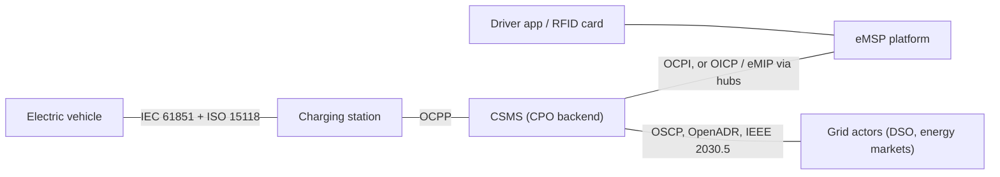

# Module 0: Orientation

The map of the whole system, the conventions used everywhere else, and where to get the source documents. Every later module assumes this one.

## What you'll learn

- What the handbook covers, and what it deliberately doesn't
- The protocol map from the EV to the grid, and the single link OCPP owns
- The terminology defaults the rest of the handbook relies on
- Where to get the specifications and how they're cited here

## What this handbook is, and isn't

This is a course, not a reference. Modules build on each other, spend most of their length on the ideas that make the details fall into place, and push exhaustive listings out to the specifications where they belong. Expect mental models, worked examples, and pointers into the primary sources, not a rewritten spec.

It isn't a replacement for the specifications. The specs stay authoritative; when the handbook and a spec disagree, the spec wins and the handbook has a bug. It also isn't certification guidance, legal advice, or a buyer's guide for chargers.

One honest note on perspective: I build open-source OCPP debugging tools. That shapes what this handbook is good at (the wire, the failure modes, the tooling) and it's why Part IV exists at all. Where my own tools show up, alternatives are named too.

## The map

Almost everything in this industry is some flavor of one picture: a car, a charging station, the operator's backend, the driver's service provider, and the grid, with a named protocol on each link.

| Link | Protocols | Maintained by | Covered in |
| --- | --- | --- | --- |
| EV to charging station | IEC 61851, ISO 15118 | IEC, ISO | Modules 2 and 12 |
| Charging station to CSMS | OCPP | Open Charge Alliance | Modules 5 to 11 |
| CSMS to eMSP | OCPI (peer to peer), OICP and eMIP (via hubs) | EVRoaming Foundation, Hubject, Gireve | Module 4 |
| CSMS to grid actors | OSCP, OpenADR, IEEE 2030.5 | OCA and others | Modules 4 and 9 |

Over the cable, IEC 61851 handles the low-level electrical signaling: whether a car is connected, whether it's ready, how much current it may draw. ISO 15118 adds a high-level digital session on top: identification, Plug and Charge, and, in its newer edition, bidirectional power. Many stations in the field run only the basic signaling.

Between the station and the backend sits OCPP, the subject of Parts III and IV. In the versions that matter today it's JSON over a WebSocket; an older SOAP transport survives in legacy corners.

Between operators and driver-facing services, OCPI (maintained by the EVRoaming Foundation) carries locations, tariffs, sessions, billing records, and authorization tokens, either peer to peer or through roaming hubs. The big hubs, Hubject and Gireve, also speak protocols of their own, OICP and eMIP.

Toward the grid, protocols like OSCP, OpenADR, and IEEE 2030.5 coordinate how much power a site may draw and when. They only get named here; Modules 4 and 9 pick them up.

## One rule worth memorizing

OCPP covers exactly one link: charging station to CSMS. Nothing else.

Half the confused questions in this domain are category errors, asking OCPP for something that lives on a different link. Three examples:

- "How does the driver get billed?" That's the CSMS-to-eMSP side (OCPI and friends). OCPP delivers meter values; it doesn't price anything.
- "Why won't the cable lock?" That's IEC 61851 and the hardware. OCPP only reports the symptom upstream.
- "How does the car prove who it is?" That's ISO 15118. OCPP 2.0.1 can carry those messages between station and backend, but the conversation is the car's.

When you're lost, place the question on the map first. It usually answers itself.

## How the handbook is organized

- Part 0 is this module.
- Part I is the world around the protocols: who pays whom, what the hardware is, who writes the rules.
- Part II is the protocol map in detail, one level deeper than the diagram above.
- Part III is OCPP proper: framing, transactions, operations, smart charging, security, 2.0.1, and the ISO 15118 boundary.
- Part IV is the field: how charging breaks in practice, how to capture and read traces, and the open-source ecosystem.
- Part V is mastery: reading specifications efficiently, tracking the frontier, and a capstone that runs the whole stack end to end.

If you're new to the industry, read in order. If you already run charging infrastructure for a living, you can start at Module 4. If you've implemented 1.6 and want depth, Modules 6 and 13 are the ones that will surprise you soonest.

## Conventions

### Terminology defaults

The industry renamed things between OCPP versions, so the handbook picks defaults and sticks to them:

- **Charging station** is the default word for the physical box. OCPP 1.6 calls it a charge point, and that term appears whenever the 1.6 context matters.
- **CSMS** (charging station management system) is the default for the operator's backend. OCPP 1.6 says Central System; plenty of people say backend or CPMS. Same thing.
- "OCPP 1.6J" means OCPP 1.6 using JSON over WebSocket, as opposed to the older SOAP transport.

### The station, the EVSE, and the connector

The word EVSE deserves special care. In common speech it means the whole charger. In OCPP 2.0.1 it means the part of a charging station that can power one EV at a time: a station contains one or more EVSEs, and each EVSE has one or more connectors, of which one can be active. OCPP 1.6 flattens this into a charge point with numbered connectors, where connector 0 means the station itself. The distinction sounds pedantic until you debug a dual-cable station; Modules 6 and 11 return to it.

### Citing the specifications

Protocol claims cite the document and section, for example "OCPP 1.6, section 4.9" or "OCPP 2.0.1, Part 2". Quotes are kept short. The handbook never reproduces spec text at length: the documents are free to obtain (below), and editions plus errata matter, so you should read the originals rather than someone's copy. For the same reason, be wary of stray OCPP PDFs floating around the web; get your own from the source.

### Module skeleton

Each module opens with what you'll learn, closes with key takeaways, and, where something can be done hands-on, includes a "Try it" block. New terms land in the [glossary](../GLOSSARY.md) as they appear.

## Getting the specifications

The Open Charge Alliance distributes all OCPP specifications free of charge after a registration step on [openchargealliance.org](https://openchargealliance.org/). Worth downloading before Part III:

- OCPP 1.6, plus its errata sheets
- The OCPP 1.6 security whitepaper
- The OCPP 2.0.1 specification bundle
- OCPP 2.1, if you want to follow the frontier modules closely

OCPI documents are available from the [EVRoaming Foundation](https://evroaming.org/), and the roaming hub protocols are published by their operators. None of this is needed until the modules that use it, and each module says what it assumes.

## Tools, briefly

Every hands-on part of this handbook runs on open-source software: charge point simulators, open CSMS implementations, protocol libraries, and trace analyzers. No charger hardware is required at any point. Specific tools are introduced by the modules that use them, and [awesome-ev-charging](https://github.com/juherr/awesome-ev-charging) is the community directory when you want the full menu. Disclosure, repeated from the introduction: some of the analysis tooling used in Part IV is mine.

## Key takeaways

- This is a course built on top of the specifications, not a substitute for them.
- One picture organizes the domain: EV, station, CSMS, eMSP, grid, with a named protocol per link.
- OCPP owns exactly the station-to-CSMS link. Placing a question on the map is the fastest way to route it.
- The handbook says charging station and CSMS, and reserves EVSE for its precise 2.0.1 meaning.
- The specifications are free from OCA after registration; read originals, mind the errata.

---

[Contents](../README.md) | Next: [Module 1: The industry](01-the-industry.md)
