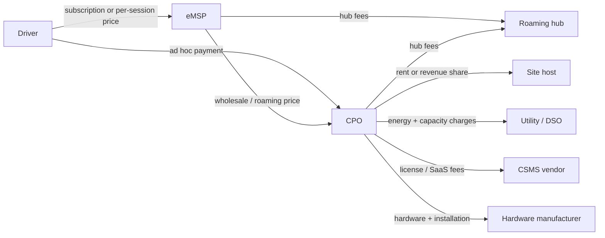

# Module 1: The industry, who's who and how the money flows

A charging station looks like a vending machine for electricity. It's closer to a small bank branch: regulated hardware on someone else's land, operated by one company, selling through intermediaries to customers it doesn't know, with settlement flowing through several parties after every session. This module is the cast list and the money trail. Nothing here is protocol yet, and that's deliberate: every protocol in this handbook exists because two of these parties needed a contract, and the protocols only make sense once you know who they are.

## What you'll learn

- The roles: driver, site host, CPO, eMSP, roaming hub, CSMS vendor, hardware manufacturer, vehicle OEM, utility
- Why the CPO and the eMSP are different jobs even when one company does both
- How a single charging session turns into several payments
- Why the economics make reliability the industry's obsession, and where software sits in that
- What roaming is and why your one charging app works on many networks, mostly

## Home charging is the easy case

Most EV charging is boring. A car parked at home on a private charger, often overnight, on the owner's own electricity contract. One party, one meter, no billing intermediaries. If all charging looked like that, this industry would be a hardware business and this handbook would be three modules long.

Public charging is the hard case, and it's hard for structural reasons:

- The land, the hardware, the operation, and the customer relationship usually belong to four different parties.
- A driver shows up expecting any charger to work with their car and their app, the way any card terminal takes their card.
- Fast chargers are expensive machines that earn money only while a car is actually plugged in and drawing power.
- Electricity isn't a shelf product: price varies by time and place, and the grid connection itself can be the scarcest resource on the site.

Everything else in this module follows from those four facts.

## The cast

| Role | Runs | Money in | Examples |
| --- | --- | --- | --- |
| Driver | a car that needs energy | none; the source of everyone else's | you, eventually |
| Site host | the location: parking, retail, fuel stations | rent or revenue share from the CPO; or foot traffic from happy drivers | supermarkets, parking operators, hotels |
| CPO (charge point operator) | the stations: uptime, maintenance, pricing, the backend connection | session revenue, roaming settlement, sometimes public funding | Ionity, Fastned, Electrify America, EVgo, Tesla's network |
| eMSP (e-mobility service provider) | the driver relationship: app, card, billing, support | driver payments, minus what it owes CPOs | Plugsurfing, Chargemap, car makers' services such as Mercedes me Charge or BMW Charging |
| Roaming hub | many-to-many connectivity between CPOs and eMSPs | connection and transaction fees from both sides | Hubject, Gireve |
| CSMS vendor | the software platform CPOs run on | license or SaaS fees per station | AMPECO, Driivz, Monta; open source: SteVe, CitrineOS |
| Hardware manufacturer | design and production of the stations | hardware sales, service contracts, spare parts | ABB E-mobility, Alpitronic, Kempower, Autel, Wallbox |
| Vehicle OEM | the cars, and increasingly an eMSP of their own | car sales; charging services as retention | every car maker; Tesla is also a CPO and eMSP |
| Utility / DSO | the wires and the energy | energy sales, grid connection fees, capacity tariffs | your local utility and grid operator |

Examples are for orientation, not endorsement, and the corporate map shifts often. The roles are the stable part; treat them as functions, not company names.

Two of these deserve a closer look, because the industry's whole shape hangs on their separation.

## The split that matters most: CPO versus eMSP

The CPO operates chargers. The eMSP owns drivers. Read that again, because nearly every business arrangement and half the protocol stack exists to connect those two facts.

The CPO's job is physical and operational: build or buy stations, get them installed and grid-connected, keep them online, set the price at the plug, and run (or rent) the backend they report to. The CPO often doesn't know who the driver is. It knows a session started, energy flowed, and somebody's credential authorized it.

The eMSP's job is commercial: sign up drivers, hand them an app or an RFID card, show them a map of chargers they can use, bill them at the end of the month, and answer the phone when something fails. The eMSP often owns no chargers at all. Its product is access.

If you know telecom, this is network operator versus MVNO. If you know card payments, the eMSP resembles the card issuer, the CPO resembles the merchant side, and the roaming hubs play the role of the network in the middle. Both analogies are loose, but they orient you correctly: this is a two-sided market with settlement in between.

### Roaming, in one paragraph

Roaming is the arrangement that lets an eMSP's customer charge on a CPO's network without a direct contract between driver and CPO. It takes a data exchange (which chargers exist, where, at what price, is this token allowed to charge) and a money exchange (the CPO gets paid for the session, the eMSP bills the driver). The plumbing is either peer to peer between CPO and eMSP, which is what the OCPI protocol is for, or through a hub that both sides connect to once, which is Hubject or Gireve territory. Module 4 does the protocols; here it's enough that "your app works on a stranger's charger" is a built thing, not a default.

## Follow the money

One common configuration, a CPO that owns its stations on rented ground:

Walking the arrows:

- The driver pays the eMSP, per session or by subscription, at the eMSP's retail price. Or the driver pays the CPO directly at the plug, called ad hoc payment; several jurisdictions now require new public fast chargers to support it (Module 3 covers the rules).
- The eMSP pays the CPO a wholesale or roaming price for each session its customers charged. The margin between retail and wholesale is the eMSP's business.
- If a hub sits in the middle, both sides pay it connection and transaction fees.
- The CPO pays the site host rent or a revenue share, pays the utility for energy plus, on bigger sites, capacity charges for peak draw, pays its CSMS vendor per station, and paid the hardware manufacturer up front.

The configuration varies. Sometimes the host owns the hardware and pays the CPO to operate it as a service. Sometimes the utility is the CPO. Sometimes the "hub" is a bilateral OCPI link and nobody takes a middle fee. The arrows move; the roles don't.

### The uncomfortable arithmetic

Now the part that explains the industry's mood. A public fast-charging site carries heavy fixed costs: the hardware, the civil works, and the grid connection, which on a large site can rival the hardware itself. Then come fixed running costs: rent, maintenance, backend fees, payment processing. Revenue, though, arrives only while a car is plugged in and drawing power. The share of time that happens is called utilization, and at low utilization a site simply cannot cover its own fixed costs, no matter the price per kWh.

That single ratio drives more industry behavior than any technology choice: where sites get built, why operators chase fleets and taxis (predictable utilization), why idle fees exist (a car occupying a working charger without drawing power is blocking the only revenue source), and why public subsidy programs exist for locations the arithmetic doesn't yet support.

There's a rare public window into these economics: [Fastned](https://www.fastnedcharging.com/en/for-business/investor-relations/financial-reports), a fast-charging operator listed in Amsterdam, publishes annual and interim reports that discuss network utilization openly. When you want real numbers behind this section, take them from there.

It's also why reliability is not a nice-to-have. A broken charger has the cost structure of a working one and the revenue of a rock. Worse, drivers remember: a failed session doesn't just lose one sale, it teaches the driver to route around that site. Ask any EV driver about broken chargers; you'll get a story, usually with the charger's brand in it.

Here is where this handbook's subject enters. A large share of "broken" is not hardware. It's software and integration: a station that dropped its backend connection, an authorization that timed out, a firmware update that changed behavior, a message the CSMS didn't expect. That failure surface lives almost entirely on one link of the map from Module 0, the OCPP link, which is why Part IV of this handbook is about watching that link like a hawk.

## Segments, quickly

Public fast charging gets the attention, but the market splits into segments with different economics and different software needs:

- **Home**: private, cheap energy, no billing stack. The interesting software problem is smart charging against home solar and dynamic tariffs (Module 9).
- **Workplace and destination**: AC chargers where cars park for hours anyway. Utilization is easier; access control and cost allocation are the software problems.
- **Public DC, highway and urban**: the capital-intensive, roaming-heavy segment this module mostly described.
- **Fleet and depot**: buses, trucks, delivery vans on schedules. Charging is planned, not opportunistic, and load management across dozens of chargers against one grid connection is the core problem. Heavier trucks are also pushing a megawatt-class connector standard (Module 2).

When someone says "the charging market", ask which segment. Statements true in one are false in another.

## Same company, many hats

Vertical integration is everywhere. Tesla builds cars (OEM), builds chargers (manufacturer), operates them (CPO), and bills drivers through the car's account (eMSP). Big CPOs run their own CSMS. Car makers bundle an eMSP subscription with the vehicle. Oil majors and utilities buy their way into several boxes at once.

None of that collapses the roles. Inside an integrated company the same functions exist with the same interfaces between them, and the moment such a company wants its chargers used by outsiders, or its drivers charging on foreign networks, it's back on the map talking the same protocols as everyone else. Learn the roles and the integrated players stop being confusing.

## Why open protocols won

Early networks were walled gardens: proprietary chargers, proprietary backends, one card per network. Drivers ended up with a glovebox of RFID cards and a phone full of apps, and operators discovered the other edge of the sword: a proprietary charger fleet locks the operator to its vendor as firmly as it locks out competitors.

The industry's answer, pushed by operators who'd been burned and regulators who wanted a working market, was standardization at the seams. OCPP's specific promise is charger-to-backend portability: the station you buy today shouldn't dictate the backend you run tomorrow. OCPI's promise is that CPO and eMSP can interconnect without a bespoke integration per pair. Regulation increasingly points the same direction (Module 3).

Keep a healthy skepticism, though. "Supports OCPP" on a datasheet is the beginning of interoperability, not the end. Two certified implementations can still disagree in the field, which is a preview of Part IV and half the reason debugging tools exist.

## One session, end to end

Time to run the whole cast through a single charge. A driver, an eMSP app, a supermarket car park, a CPO's fast charger, and a hub in the middle.

1. The driver parks and plugs in. Cable and car negotiate electrically (IEC 61851, Module 2): connection confirmed, maximum current agreed. The station notices and tells its CSMS over OCPP that the connector is now occupied; in 1.6 that's a message literally named StatusNotification.
2. The driver opens the eMSP app and picks the charger, or scans the QR code on it. The app knows this charger exists, where it is, and what it costs because the CPO published that data down the roaming pipe (OCPI's location and tariff modules, Module 4).
3. The driver taps start. The request travels eMSP to hub to CPO, or eMSP straight to CPO, and lands in the CPO's CSMS as: this token wants to charge on your connector 2.
4. The CSMS tells the station to begin, over OCPP. In 1.6 the message is RemoteStartTransaction. By Module 8 you'll be reading these frames raw.
5. The station starts the session, energy flows, and the station streams meter readings to the CSMS (MeterValues, same protocol, same link).
6. The driver returns, stops the session in the app or by unplugging. The station reports the final meter reading and the transaction's end.
7. The CSMS closes its record of the session and produces a billing record, a CDR (charge detail record), which travels back through the roaming pipe to the eMSP.
8. The eMSP prices the CDR at retail, adds it to the driver's monthly bill, and owes the CPO the wholesale amount, settled in bulk, minus hub fees if a hub carried it.
9. Off-stage, the CPO's meter with the utility is running, the host's rent is accruing, and the CSMS vendor's per-station fee covered the messages in steps 1 to 7.
10. And if step 4 never arrives, or step 5's meter values stop, or step 6's stop confirmation gets lost, the driver sees some variant of "session failed", and somebody's on-call engineer gets to find out which link broke. The whole second half of this handbook is about being able to answer that in minutes instead of days.

## Key takeaways

- Public charging splits land, operation, customer relationship, and grid across different parties. The protocols are the contracts between them.
- CPO operates chargers; eMSP owns drivers. Roaming, peer to peer or via hubs, connects the two, with settlement flowing driver to eMSP to CPO.
- A session is mostly fixed cost meeting utilization-dependent revenue. That ratio, not technology, explains most industry behavior.
- Reliability is economics: a dead charger has full costs, zero revenue, and a memory in the driver's head. Much of "dead" is software on the OCPP link.
- Roles are functions, not companies. Integrated players wear several hats but keep the same interfaces.
- Segments differ sharply. Always ask whether a claim is about home, destination, public DC, or depot charging.

## Try it

> Open any charging map: your eMSP's app if you have one, otherwise [Chargemap](https://chargemap.com/), PlugShare, or plain Google Maps. Pick one public fast charger nearby and work out: who's the site host? Who's the CPO (check the sticker on the charger in the photos, or the operator field in the app)? How many different eMSP apps claim they can start this charger? Is there an ad hoc option with a card, and does its price differ from the app price? One charger is enough to make the role split concrete, and the price gap, when you find one, is the eMSP margin from this module, visible in the wild.

## Further reading

- [Open Charge Alliance: the OCPP protocol page](https://openchargealliance.org/protocols/open-charge-point-protocol/), the official home of the protocol this handbook orbits.
- [EVRoaming Foundation](https://evroaming.org/), publisher of OCPI, with good introductory material on roaming.
- [Open Charge Point Protocol on Wikipedia](https://en.wikipedia.org/wiki/Open_Charge_Point_Protocol), a serviceable version history at a glance.
- [IEA Global EV Outlook 2026](https://www.iea.org/reports/global-ev-outlook-2026), the standard annual reference for market numbers, free. This handbook deliberately quotes no market figures; when you need them, take them from here rather than from a vendor deck.
- [awesome-ev-charging](https://github.com/juherr/awesome-ev-charging), the community directory of specifications, tools, and implementations.

---

Previous: [Module 0: Orientation](00-orientation.md) | [Contents](../README.md) | Next: Module 2, The hardware (not yet written)
