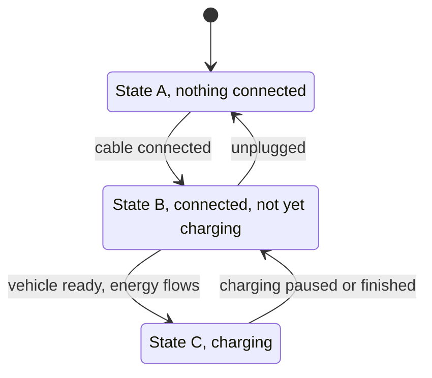

# Module 2: The hardware, connectors, power, and the physical layer

Before any protocol, there's a plug, a cable, and a short conversation held entirely in analog voltages. This module is that physical layer, the copper everything else rides on. You'll rarely touch it directly as a software person, but the protocol you'll spend Part III on mostly reports this layer's state upstream, and a large share of "the charger is broken" begins here, one level below anything a message can express. Knowing what the plug is doing is what lets you tell a hardware fault from a software one.

## What you'll learn

- The one distinction that organizes charging hardware: AC versus DC
- How charging speed is set, and why the car, not just the charger, caps it
- The connector families, why the world has several, and how they map to regions
- What physically happens when a cable clicks in, in terms of IEC 61851 signaling
- Why fast charging slows down as the battery fills, and what 800-volt cars change
- Where this hands off to OCPP, so Part III has something to stand on

## The split that organizes everything: AC versus DC

A battery stores direct current. The grid delivers alternating current. Somewhere between the two, a converter has to turn AC into DC. The single most useful question about any charging setup is: which side of the cable is that converter on?

**AC charging** puts the converter inside the car. The station is, roughly, a smart switch: it delivers grid AC to the vehicle, and the car's own onboard charger rectifies it to charge the battery. The station stays cheap and simple. The catch is that the onboard charger is a compromise built into a car, sized and weighted for a vehicle, so its power is modest.

**DC charging** puts the converter inside the station. Big, heavy, expensive power electronics live in the cabinet on the ground, feed DC straight to the battery, and bypass the onboard charger entirely. That's how a station reaches tens or hundreds of kilowatts. It's also why DC hardware costs what a small building's electrical fit-out costs, which loops straight back to the utilization arithmetic from Module 1.

Almost everything else about the hardware follows from this. AC is home, workplace, and destination charging: slow, cheap, everywhere. DC is the highway and the urban fast site: quick, dear, capital-heavy. The connectors differ because the pins differ. The failure modes differ. Even the protocol differs later on, because DC sessions carry a running negotiation between car and station that AC sessions don't need.

## How fast: power, and who sets the ceiling

Charging power is just volts times amps, but the number of parties that can each cap it is what trips people up. The delivered power is the lowest ceiling among all of them:

- the station's rating
- the cable's rating
- for AC, the car's onboard charger
- the battery's willingness at this moment (more below)
- and, invisibly, whatever the site's grid connection allows, which smart charging in Module 9 exists to manage

That third one surprises people. Park a car with a 7.4 kW onboard charger at a 22 kW AC station and it charges at 7.4 kW. The station has power to spare; the car can't take it. Nothing is broken, and no error is raised, because from IEC 61851's point of view everything is behaving. This is a routine "why is it slow" support call, and the answer lives entirely in the hardware.

Rough tiers, worth holding loosely because exact figures vary by market and equipment:

| Tier | Current type | Typical power | Where |
| --- | --- | --- | --- |
| Level 1 | AC, ordinary wall socket | around 1 to 2 kW | homes, mostly North America |
| Level 2 | AC, dedicated circuit, single or three phase | up to about 22 kW | homes, workplaces, destinations |
| DC fast | DC | tens to hundreds of kW | public, highway, urban hubs |

"Level 1, 2, 3" is North American phrasing, and "Level 3" is loose slang for DC fast charging that the standards don't really endorse, so this handbook says AC and DC and states the power. Three-phase is worth a note for readers from single-phase countries: much of the world wires premises with three phases, and an AC station on three phases reaches perhaps 11 or 22 kW where a single phase tops out far lower. It's the same AC charging, with three live conductors instead of one.

## The connectors

Newcomers expect one plug and find a wall of them. The reason is history plus geography: different regions standardized at different times around different bodies, and DC fast charging bolted onto those AC choices rather than replacing them. The families:

| Connector | Current | Region, roughly | Notes |
| --- | --- | --- | --- |
| Type 1 (SAE J1772) | AC, single phase | North America, Japan | the older AC standard there |
| Type 2 (IEC 62196-2) | AC, single or three phase | Europe and much of the world | the European AC default; also the base for CCS2 |
| CCS1 (Combo 1) | AC + DC | North America | Type 1 with two DC pins added below |
| CCS2 (Combo 2) | AC + DC | Europe | Type 2 with two DC pins added below |
| CHAdeMO | DC | Japanese origin, now niche outside it | a separate DC connector, an early fast-charging standard |
| GB/T | AC and DC (separate plugs) | China | its own national standards |
| NACS (SAE J3400) | AC + DC | North America | Tesla's connector, now standardized and being adopted more widely |
| MCS | DC, megawatt class | emerging, heavy trucks | for vehicles the car connectors can't feed |

A few patterns make the wall legible. CCS is the clever trick that quietly unified things for years: take the region's AC connector and add two big DC pins, so one port on the car handles both, "combined" being the C in CCS. That's why North America built on Type 1 and Europe on Type 2, and their DC standards inherited that split. CHAdeMO was early and technically capable but stayed a separate port, and momentum moved to CCS outside Japan. China's GB/T is its own world at a scale that makes it the largest by sheer connector count. NACS, standardized as SAE J3400, folds AC and DC into one smaller connector and is in the middle of a North American transition whose end state isn't settled yet, so treat any specific claim about who has adopted it as something to check against a current source rather than memorize. And MCS exists because a long-haul electric truck needs power a car connector physically cannot carry, so heavy-duty is standardizing its own thing (Module 1's depot and fleet segment).

For a software person the practical takeaway is smaller than the table looks: the connector shapes which physical sessions are possible, and the OCPP layer mostly refers to a connector abstractly, by number and status, not by its plug shape. You need to recognize the names and know AC-versus-DC and region, not memorize pinouts.

## The plug-in handshake

Here's the part worth slowing down on, because it's where "connected" and "charging" become precise instead of vague, and those precise states are exactly what the station will report over OCPP.

When a cable clicks into a car, before any digital protocol wakes up, an analog negotiation runs over a dedicated wire called the **control pilot**, standardized in IEC 61851. It does two jobs at once: it tracks what stage the connection is in, and it tells the car how much current it's allowed to draw.

The stage tracking works through voltage levels on that pilot line. The station holds the line at a nominal level; when the car connects, and then when it's ready to charge, resistors inside the car pull that level down in defined steps. The classic progression:

State A is an idle station with nothing plugged in. State B is a cable seated and a car present but not drawing power, the "ready when you are" state. State C is energy actually flowing. There's a further state for vehicles that need ventilation while charging, a legacy of certain battery chemistries, which you'll almost never meet. The value of knowing these is that the physical world has only a few honest states, and the digital status the station sends upstream is a translation of exactly this. When Module 7 shows a station announcing that connector 2 went from Available to Charging, this pilot line is the ground truth underneath that message.

The current limit rides on the same wire by a different mechanism. Instead of a steady level, the station puts a square wave on the pilot, and the width of that pulse encodes the maximum current the car may draw: a wider pulse means more amps available. The car reads it and obeys. This is the humble mechanism behind a lot of what feels like intelligence later. When smart charging in Module 9 throttles a car to protect a grid connection, the instruction ultimately comes out here, as a narrower pulse on the pilot line. The exact pulse-to-amps mapping is specified in IEC 61851-1; the concept, wider pulse means more current, is what to carry forward.

A second, simpler wire often accompanies it, the **proximity** connection, which lets the car know a plug is physically seated (many cars won't move while charging) and, in some cables, encodes how much current the cable itself can handle, so a thin cable can't be pushed past its rating. Cable as another ceiling, from the power section, made physical.

Two things to keep straight. First, all of this is analog and happens whether or not any higher protocol is present; a basic AC session is essentially just this handshake. Second, the richer digital conversation, the ISO 15118 world of Module 12 with identification and Plug and Charge, is layered on top of this same pilot line as a high-frequency signal, not a replacement for it. The analog floor is always there.

## Why fast charging slows down, and the 800-volt shift

One more hardware reality that shapes the software above it. A battery does not accept charge at a constant rate. It takes high power while relatively empty and then tapers, often sharply, as it fills, because pushing hard into a full battery degrades or damages it. The battery management system inside the car governs this and is the final authority on power, sitting above every other ceiling in the earlier list. It's why fast-charging marketing quotes something like "10 to 80 percent" rather than to 100: that last stretch crawls by design. In DC charging the station and the car hold a continuous conversation, with the car effectively asking for a current target that changes second by second as the battery fills. AC charging has no equivalent running negotiation, which is part of why DC needs a richer protocol.

You'll also hear cars described as **400-volt** or **800-volt** architectures, referring to the battery pack's voltage. Since power is volts times amps, a higher-voltage pack reaches a given power at lower current, and lower current means less heat and thinner cables for the same delivered kilowatts, which is how newer cars charge faster without the cable becoming unmanageable. It matters here only so the terms aren't mysterious when a spec sheet or a station mentions them.

## From copper to protocol

Now the handoff that sets up the rest of the handbook. Picture the layers stacked at a single charging station:

- At the bottom, power electronics and contactors: the switches that actually connect the car to energy.
- Just above, the IEC 61851 control pilot: the analog handshake, the states, the current limit.
- Optionally above that, ISO 15118 high-level communication over the same pilot line, for identification and Plug and Charge (Module 12).
- And in the station's controller, a piece of software watching all of the above and reporting it, plus taking commands, over a network link to the backend. That link is OCPP.

OCPP is the top of this stack and the subject of Part III. It does not deliver electricity or negotiate current directly; it observes the physical layer and narrates it to the CSMS ("connector 1 is now charging", "here are the meter readings", "a fault occurred"), and it relays the backend's intentions back down ("start a transaction here", "limit this connector"). The crisp mental model to carry forward: the hardware and IEC 61851 are the truth, and OCPP is how that truth reaches the operator and how the operator answers. Every OCPP status you'll read in Part III is a report about the physical world this module just described.

## Key takeaways

- The organizing question is where the AC-to-DC converter sits. In the car means AC charging, cheap and slow; in the station means DC, fast and expensive.
- Delivered power is the lowest of several ceilings: station, cable, onboard charger for AC, the battery's momentary willingness, and the site's grid limit. A slow session is often no fault at all.
- The connector zoo is regional history plus the CCS trick of adding DC pins to an existing AC plug. Recognize the names and their AC-or-DC and region; skip the pinouts.
- The control pilot (IEC 61851) runs an analog handshake before any protocol: a few honest connection states, and a current limit encoded in a pulse width. OCPP status is a translation of these states.
- Batteries taper as they fill, and DC charging is a continuous car-to-station negotiation because of it. 800-volt packs hit high power at lower current.
- OCPP sits at the top of the station's stack, reporting the physical layer upward and relaying commands down. It is narration and control, not electricity.

## Try it

> No hardware needed, just look closely. Find photos of a public DC fast charger and a home or workplace AC unit (your eMSP's app, a manufacturer's product page, or PlugShare photos). On the DC connector, find the two larger DC pins sitting below the familiar AC connector shape: that's the CCS "combo" trick in the metal. Then identify, for one charger near you, its connector family and whether it's AC or DC. If you drive an EV, find your car's onboard charger power in its spec sheet (a number like 7.4 or 11 kW) and notice that no AC station on earth will charge it faster than that, which is the "lowest ceiling" rule made personal.

## Further reading

- [CharIN](https://www.charin.global/), the industry association behind CCS and the megawatt charging system, with primers on both.
- [CHAdeMO Association](https://www.chademo.com/), the body behind the CHAdeMO connector, for that side of the history.
- [SAE J1772 on Wikipedia](https://en.wikipedia.org/wiki/SAE_J1772) and [Combined Charging System on Wikipedia](https://en.wikipedia.org/wiki/Combined_Charging_System), serviceable overviews of the connectors and the control-pilot states, with pointers to the underlying standards.
- The IEC 61851 and IEC 62196 standards themselves are the authorities on signaling and connectors, available from IEC (paid). You do not need them for this handbook, but that is where the precise numbers live.

---

Previous: [Module 1: The industry](01-the-industry.md) | [Contents](../README.md) | Next: [Module 3: Standards bodies and regulation](03-standards-and-regulation.md)
