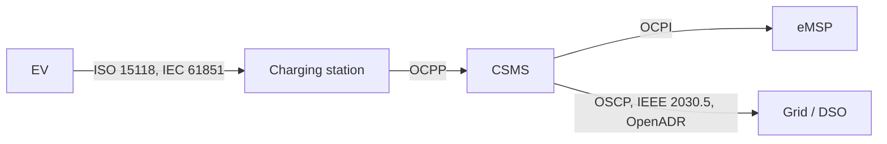

# Module 3: Standards bodies and regulation

Modules 1 and 2 kept arriving at the same word: interoperability. A driver has to charge at a station they have never seen. An operator has to buy hardware from one vendor and run it with software from another. A roaming network has to span companies that compete. None of that happens by good intentions. It happens because a relatively small set of organizations write down the rules, and, increasingly, because governments require those rules by law. This module maps who writes the rulebook and who enforces it. It is the least technical module in Part I and one of the most useful, because every protocol in Parts II and III has an owner, a politics, and a reason it looks the way it does.

## What you'll learn

- Why interoperability is a business and legal necessity, not an engineering nicety
- The organizations that own each protocol, and the difference between a formal standards body and an industry alliance
- What the two big regulatory regimes (EU AFIR and US NEVI) actually require, and why they name specific protocols
- How certification works, and just as important, what it does not prove
- A first map of body to protocol to interface, which Part II turns into the full stack

## Why standards are the whole game

Picture the counterfactual. If every carmaker used its own plug, every station spoke its own protocol to its own backend, and every network kept its own private roaming deals, the result would be the early mobile-phone era: chargers that work for one brand only, drivers carrying adapters and a wallet of memberships, operators locked to a single vendor forever. That is not hypothetical. It is roughly where this industry started, and the fragmentation still shows in the connector zoo from Module 2.

Standards are the agreement that turns that mess into a market. They let a driver's account work across networks, let an operator combine a charger from one company with software from another, and let a roaming hub settle a session between two businesses that have never spoken. The entire value chain from Module 1 rests on them. When people in this industry argue, they are usually arguing about a standard: which version, whose extension, which body should own it. Learning the protocols in Part III is, in a real sense, learning the settled outcomes of those arguments.

## Who writes the rules

Two kinds of organization produce the standards you will meet. Formal standards bodies (ISO, IEC, SAE, IEEE) publish through national and international consensus processes; their documents are numbered, versioned, and usually sold. Industry alliances and consortia (the Open Charge Alliance, CharIN, the EVRoaming Foundation, the CHAdeMO Association) are groups of companies that publish de facto standards, often for free, and tend to move faster than the formal bodies. Both matter, and they hand work to each other constantly.

| Organization | Type | Owns | Sits at |
| --- | --- | --- | --- |
| Open Charge Alliance (OCA) | Alliance | OCPP (station to CSMS), OSCP (CSMS to grid), the OCPP certification program | the backend link |
| EVRoaming Foundation | Foundation | OCPI (CPO to eMSP roaming) | the roaming link |
| ISO and IEC (jointly) | Formal | ISO 15118 (EV to station, Plug and Charge) | the plug conversation |
| IEC | Formal | IEC 61851 (charging system, the control pilot), IEC 62196 (connectors); newer IEC 63110 and 63119 | the physical layer and emerging management |
| SAE International | Formal | SAE J1772 (Type 1), SAE J3400 (NACS), the J2836 and J2847 communication series | connectors and North American comms |
| CharIN | Alliance | the Combined Charging System (CCS) and the Megawatt Charging System (MCS), plus interoperability testing | connectors and DC fast charging |
| CHAdeMO Association | Alliance | the CHAdeMO connector and the next-generation ChaoJi | DC fast charging |
| IEEE and the OpenADR Alliance | Formal / Alliance | IEEE 2030.5 and OpenADR (grid and demand-response interfaces) | the grid link |

A few things are worth pulling out of that table. The Open Charge Alliance is the name you will say most in this handbook, because it owns OCPP, the protocol Part III is built around, and OSCP, its grid-facing sibling. The EVRoaming Foundation owns OCPI, which is what makes the roaming from Module 1 actually settle. ISO 15118 is jointly an ISO and IEC standard, which is why you will see it written both ways; it is the rich digital conversation between the car and the station, and the home of Plug and Charge (Module 12). And CharIN is not a formal standards body at all, yet it effectively steers CCS and now megawatt truck charging, a good reminder that in this field an alliance can carry more weight than a numbered specification.

That is the same interface chain from Module 0, now labelled with who owns each link. Part II turns it into the full protocol map; for now the point is only that every arrow has an owner.

## The other forcing function: regulation

For years these standards spread by market pressure alone. That has changed. Two regulatory regimes now require interoperability by law, and, tellingly, they do it by naming the exact protocols in this handbook. If you work in this industry, the specifications stopped being optional the moment regulators wrote them into the rules.

**The European Union: AFIR.** The Alternative Fuels Infrastructure Regulation, Regulation (EU) 2023/1804, adopted in 2023 and applying from 2024, is the most consequential single document in European charging. Because it is a Regulation rather than a Directive, it binds every member state directly, with no national transposition. Among its requirements: new public charging points of 50 kW or more must offer ad hoc payment through a card reader or a contactless device that reads bank cards, so a QR code or an app alone is not sufficient; at those same points pricing must be per kilowatt-hour; prices must be transparent, reasonable, comparable, and shown before a session begins; and older high-power points face a retrofit obligation from 2027. AFIR also sets deployment targets along the trans-European transport corridors and pushes standardized data exchange, which is part of why OCPI matters at the policy level and not only the commercial one.

**The United States: NEVI.** The National Electric Vehicle Infrastructure program funds charging along US corridors, and the funding carries strings codified in 23 CFR Part 680. Those strings name protocols directly: chargers must speak OCPP, with the rule requiring a move to OCPP 2.0.1; they must support ISO 15118 and Plug and Charge; every DC fast-charging port must carry a permanently attached CCS1 connector, with the NACS/J3400 connector allowed alongside rather than instead; and each port must maintain an average annual uptime above 97 percent. One caution: NEVI has been through funding pauses and policy revisions since 2025, so treat the program's specifics as a moving target and check the current rule text rather than trusting any single summary, this one included.

**The connector transition and the rest of the world.** North America is mid-shift from CCS1 to NACS/J3400 (Module 2), a change driven by a mix of market adoption and standards work rather than one mandate. China runs its own large standards world around GB/T, with the ChaoJi effort aiming at a next-generation connector shared with the CHAdeMO lineage. The through-line is the same everywhere: regulators and large markets are converging on a short list of protocols and connectors, and that list is the syllabus for Part III.

## Certification, and what it does not prove

If a standard is a written agreement, certification is the attempt to prove a product actually honors it. The Open Charge Alliance runs an OCPP certification program, backed by a compliance testing tool and a set of accredited test labs, so that a station or a CSMS can carry a certificate saying it passed a defined profile. CharIN runs interoperability events, sometimes called testivals, where vendors bring equipment and test it against each other directly. ISO 15118 has its own interoperability testing culture around Plug and Charge.

Here is the part worth internalizing. Certification proves conformance to a specific profile, with specific test cases, at a specific moment. It does not prove that two certified products from two vendors will behave correctly together across every message, every edge case, and every firmware revision in the field. Real deployments surface disagreements that no certification suite fully covers: an optional field one side sends and the other ignores, a timing assumption that holds in the lab and fails on a flaky cellular link, a status transition that is legal on paper but surprising in practice. That gap between certified and correct is exactly why observing real traffic is its own discipline, which is where Part IV goes. For now, hold the nuance: certification is necessary and reassuring, and it is not the same as proven-correct-in-the-wild.

## How this maps to the stack

You now have the org chart. Part II hands you the architecture. The compact version to carry forward: the car talks to the station under ISO 15118 and IEC 61851; the station talks to its backend under OCPP, owned by the OCA; the backend talks to other operators' service providers under OCPI, owned by the EVRoaming Foundation; and the backend talks to the grid under OSCP or IEEE 2030.5 or OpenADR. Every one of those links has an owner from the table above and, increasingly, a regulation pointing at it. Module 4 draws the whole thing as one picture and explains why each interface exists.

## Key takeaways

- Interoperability is a market and legal necessity. Standards are the agreement that turns incompatible equipment into a functioning market, and most industry disputes are really disputes about a standard.
- Ownership matters. The OCA owns OCPP and OSCP; the EVRoaming Foundation owns OCPI; ISO and IEC jointly own ISO 15118; IEC owns 61851 and 62196; SAE owns J1772 and J3400; CharIN steers CCS and MCS.
- Formal bodies (ISO, IEC, SAE, IEEE) and industry alliances (OCA, CharIN, EVRoaming, CHAdeMO) both produce standards; an alliance can carry more real-world weight than a numbered specification.
- Regulation now forces interoperability and names the protocols. EU AFIR (Regulation (EU) 2023/1804) mandates open payment, per-kWh pricing, and transparency at public fast chargers; US NEVI (23 CFR Part 680) mandates OCPP, ISO 15118 Plug and Charge, CCS1, and above 97 percent uptime.
- Certification proves conformance to a profile at a point in time. It does not prove two products work correctly together in the field, which is why traffic-level observability is its own discipline.

## Try it

> Spend fifteen minutes on source documents, not summaries. Open the Open Charge Alliance site and notice that OCPP and OSCP live under the same roof, and that certification is a real program with named test labs. Then open the current text of 23 CFR Part 680 (linked below) and search it for "OCPP" and "15118": seeing a US federal regulation name these protocols directly makes the point of this module better than any explanation. If you are in Europe, find a public fast charger's pricing in its operator's app and check whether it is quoted per kilowatt-hour; if it is, you are looking at AFIR in effect.

## Further reading

- [Open Charge Alliance](https://openchargealliance.org/), home of OCPP and OSCP and the OCPP certification program.
- [EVRoaming Foundation](https://evroaming.org/), which stewards OCPI.
- [CharIN](https://www.charin.global/), the alliance behind CCS and the Megawatt Charging System.
- [European Commission, Alternative Fuels Infrastructure](https://transport.ec.europa.eu/transport-themes/clean-transport/alternative-fuels-sustainable-mobility-europe/alternative-fuels-infrastructure_en), the official hub for AFIR.
- [23 CFR Part 680](https://www.ecfr.gov/current/title-23/chapter-I/subchapter-G/part-680) on the eCFR, the current text of the US NEVI minimum standards.

---

Previous: [Module 2: The hardware](02-the-hardware.md) | [Contents](../README.md) | Next: Module 4, The protocol landscape (not yet written)
