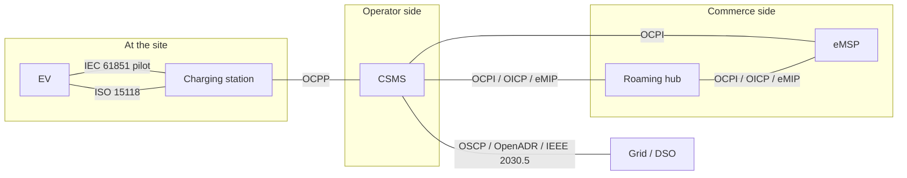

# Module 4: The protocol map, from the EV to the grid

Module 3 ended with an org chart: every interface in this industry has an owner. This module walks the interfaces themselves. It is the hinge of the handbook: Part I gave you the business and the physics, and Part III will spend eight modules inside a single protocol. Before that descent, you need the whole map in your head, because no protocol in this stack makes sense in isolation. Each one exists to carry exactly one kind of conversation between exactly two kinds of party, and the seams between them are where real systems misbehave.

## What you'll learn

- The five conversations that happen during one ordinary charging session
- The full protocol map, from the cable to the roaming hub to the grid
- What each protocol owns, and just as important, what it refuses to own
- Why protocol boundaries track the business boundaries from Module 1
- The north-south versus east-west way of reading the stack
- Why the seams between protocols are where field problems concentrate

## One session, five conversations

Picture the roaming session from Module 1 again: a driver with one eMSP's app charges on another company's station. From the driver's side it is one action, plug in and walk away. On the wire it is at least five distinct conversations running at once, in different protocols, between different parties, at different speeds.

At the cable, the car and the station hold the analog IEC 61851 conversation from Module 2: presence, readiness, allowed current, signaled on the control pilot. On newer DC hardware a second, digital conversation may run over that same pilot line under ISO 15118: identity, certificates, an energy plan. Between the station and its operator's backend, OCPP carries the session narrative: connector states, the transaction start, meter samples, the stop. Between that operator's CSMS and the driver's eMSP, OCPI carries the commercial exchange: is this token valid, here is the session in progress, here is the CDR to settle. And in the background, on a slower clock, the site may be talking to the grid side under OSCP or a demand-response protocol, negotiating how much power the whole site may draw this hour.

No single party sees all five. The CPO cannot see the pilot line. The eMSP sees none of the wire at all, only what OCPI relays. The driver sees a light turn green. Holding all five in your head at once is what this handbook means by knowing the territory.

## The map

Walk it link by link, with the owners from Module 3 attached.

**EV to station, analog: IEC 61851.** Always present, under everything, whether or not any digital protocol runs. States A through C, current limit as a pulse width. Module 2 covered it; nothing above works without it.

**EV to station, digital: ISO 15118.** Optional, layered over the same pilot wire as a high-frequency signal. Identity, Plug and Charge, charging schedules, and in its newer generation bidirectional power. Owned jointly by ISO and IEC. Module 12 is devoted to it.

**Station to backend: OCPP.** The operational trunk. Boot, status, transactions, meter values, remote commands, firmware, diagnostics. Owned by the Open Charge Alliance. Part III of this handbook lives here.

**Backend to eMSP, directly or via hubs: OCPI, OICP, eMIP.** The commercial mesh. Locations, tariffs, tokens, sessions, CDRs. OCPI is the EVRoaming Foundation's open standard, developed publicly on GitHub, and works both peer to peer and through hubs. OICP is Hubject's hub protocol; eMIP is Gireve's. A CPO of any size typically speaks more than one of these at once, which is its own source of fun.

**Backend to grid: OSCP, OpenADR, IEEE 2030.5.** The constraint channel. Capacity budgets flowing down from a DSO or an energy manager, so that Module 9's smart charging has a number to respect. OSCP is the Open Charge Alliance's grid-facing sibling to OCPP; OpenADR and IEEE 2030.5 come from the wider energy world and predate EV charging.

Two smaller threads complete the picture. IEC is developing its own standards in this space, IEC 63110 for charging infrastructure management and IEC 63119 for roaming, which you will meet in standards discussions long before you meet them in the field. And everything in the commerce layer eventually touches ordinary payment infrastructure, which is its own universe and stays out of scope for this handbook.

## What each protocol owns, and refuses to own

The fastest way to misread this stack is to assume some protocol does more than it does. Each one is deliberately narrow, and the narrowness is the design.

OCPP owns the relationship between one station and one backend: state, transactions, commands, maintenance. It does not know what anything costs, who the driver's provider is, or that roaming exists. There is no tariff object in OCPP 1.6 and no driver-facing anything. People meeting OCPP for the first time keep looking for the billing; it is not there, and that is on purpose. Billing is a CPO-to-eMSP concern, so it lives in OCPI.

OCPI owns the business exchange between operators and service providers: what exists where, what it costs, whose token is valid, what happened, who owes whom. It does not control stations. An eMSP cannot reboot a charger through OCPI, and when a station misbehaves, OCPI can only report the resulting session weirdness, not explain it.

ISO 15118 owns the conversation across the cable: who this car is, what contract it carries, how much energy it wants and when. It stops at the station. The station relays what matters upstream over OCPP, and the two protocols meet in the certificate and token machinery that Module 12 unpacks.

IEC 61851 owns electrons and safety. It has no opinion about money, identity, or backends, and it will happily run a full charging session with zero digital protocols present, which is exactly what most home charging is.

The grid protocols own capacity and time: how much the site may draw, when the grid would like less. They know nothing of individual sessions.

Look at the pattern: every protocol boundary sits exactly on a business boundary from Module 1. Station-to-CSMS is the boundary of the CPO's operational responsibility. CSMS-to-eMSP is the boundary between operating hardware and owning drivers. CSMS-to-DSO is the boundary between consuming power and delivering it. Protocols are frozen org charts. When you wonder why some capability lives where it does, the answer is almost always about which party needed it, not which layer was technically convenient.

## North-south and east-west

A reading habit that pays off: split the map into two axes.

The north-south axis runs EV to station to CSMS. It carries the session itself, in something close to real time. Its data is stateful and ordered: a transaction starts, accumulates meter values, and stops. When the north-south axis breaks, charging breaks: a session that will not start, a connector stuck in a state, a station gone dark mid-charge. This axis is where Part III and Part IV of this handbook concentrate, because it is where a software engineer with a trace can actually see the truth.

The east-west axis runs CPO to hub to eMSP. It carries commerce, on a slower, retrying, eventually-consistent clock: catalog updates, token authorizations, sessions mirrored after the fact, CDRs that may arrive minutes or days later. When east-west breaks, charging often still works, but money and visibility break: the driver's app shows a phantom price, the session never appears in their history, a CDR gets disputed weeks on.

The grid links are their own quiet third axis, slower still, whose failures look like nothing at all until a site trips a breaker or a capacity contract is breached.

The axes fail differently, are debugged differently, and are staffed differently inside companies. Knowing which axis a symptom belongs to is half of diagnosis.

## Where the bugs live

If protocols were used one at a time, this industry would be easy. The trouble is translation. A charging session exists simultaneously as an IEC 61851 state at the cable, an OCPP transaction at the backend, and an OCPI session in the commerce mesh, and those three representations are maintained by different systems that must continuously translate between them.

The same physical fact wears three names. A connector's pilot state maps to an OCPP status value, which maps again to an OCPI EVSE status, and the mappings are lossy in both directions. One session carries an OCPP transactionId assigned by the CSMS, an OCPI session id assigned elsewhere, and possibly a hub identifier on top; reconciling them is a real job that real systems get wrong. Clocks differ across the layers, so the same event can appear to happen at three different times depending on who you ask. And each translation point is a different vendor's code, certified separately, meeting for the first time in production, which is how the certified-versus-correct gap from Module 3 becomes a lived experience.

Hold this section loosely for now. Part IV returns to it with traces in hand, and by then you will have Part III's vocabulary to name exactly what went wrong and where.

## How this handbook walks the map

From here the handbook goes deep and narrow. Part III spends eight modules on OCPP, because station-to-backend is where most software engineers in this industry actually work, and because OCPP fluency transfers: once you can read one wire protocol frame by frame, the others stop being intimidating. ISO 15118 gets Module 12, at the depth a backend engineer needs rather than a firmware implementer. OCPI, the hub protocols, and the grid links stay at survey depth in this handbook; each is a specification you can pick up later, and the OCPI specification in particular is freely available on GitHub and pleasant to read once you have the map.

One protocol at a time, starting with the one under everything the operator sees: OCPP.

## Key takeaways

- One ordinary charging session is at least five concurrent conversations: pilot signaling, optional ISO 15118, OCPP, OCPI or a hub protocol, and a grid-facing channel. No single party sees them all.
- Each protocol is deliberately narrow. OCPP has no billing, OCPI has no station control, ISO 15118 stops at the station, IEC 61851 knows only electrons. The gaps between them are by design, not omission.
- Protocol boundaries sit on business boundaries. Which party needed a capability explains where it lives far better than technical layering does.
- Read the stack on two axes: north-south (the real-time session trunk) and east-west (the eventually-consistent commerce mesh). They fail differently and are debugged differently.
- The same session exists in three representations with three identifiers and three clocks; the translation points between them are where field problems concentrate.
- OCPP gets the deep treatment because it is where the engineering jobs are and where traces make the truth visible.

## Try it

> Take the roaming money flow from Module 1's Try It (driver pays eMSP, eMSP settles with CPO, CPO pays for energy) and annotate every hop with the protocol that carries it, using the map above. Then open the OCPI specification repository at github.com/ocpi/ocpi and skim the module list in the README: you will recognize locations, tariffs, tokens, sessions, and CDRs as exactly the commercial objects Module 1 described, now wearing their protocol names. Ten minutes of that mapping and the east-west axis stops being abstract.

## Further reading

- [Open Charge Alliance, OCPP](https://openchargealliance.org/protocols/open-charge-point-protocol/), the protocol Part III unpacks, and its grid-facing sibling OSCP on the same site.
- [OCPI on GitHub](https://github.com/ocpi/ocpi), the full specification in the open, with the module structure visible from the README.
- [EVRoaming Foundation](https://evroaming.org/), OCPI's steward, with adoption and version news.
- [Hubject](https://www.hubject.com/) and [Gireve](https://www.gireve.com/), the two large roaming hubs, whose platforms are where OICP and eMIP respectively live.

---

Previous: [Module 3: Standards bodies and regulation](03-standards-and-regulation.md) | [Contents](../README.md) | Next: [Module 5: OCPP: history, governance, versions](05-ocpp-overview.md)
