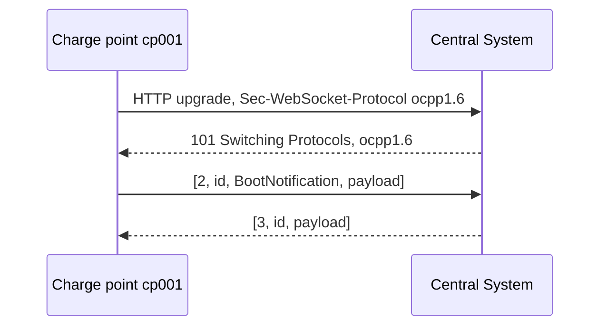

# Module 6: OCPP-J on the wire: WebSocket, framing, correlation

Module 5 closed with a practical fact: the installed base mostly speaks OCPP 1.6 over JSON, so 1.6J is where this handbook goes deep first. This module is the floor of that dialect: the WebSocket connection a station opens, the three array-shaped frames every message uses, and the correlation rule holding each request to its response. The defining document, the OCPP-J 1.6 specification, runs about twenty pages; by the end of this module you will have met nearly every rule in it.

Nothing at this layer knows anything about charging: no connectors, no energy, no money. Yet duplicated message ids, missed timeouts, and reconnect storms produce a healthy share of real-world tickets. Once you can read a raw frame comfortably, the rest of Part III becomes traffic you can follow by eye.

## What you'll learn

- How a charge point connects: the URL convention, the handshake, and subprotocol negotiation
- The three frame shapes, CALL, CALLRESULT, and CALLERROR, and why a rejection is not an error
- How message ids tie requests to responses, and what breaks when they repeat
- The one-call-in-flight rule and its exact strength in the spec
- The ten error codes, including two misspellings that are now permanent
- What 1.6J says, and pointedly does not say, about timeouts and retries
- Why the connection and the registration are two different lifecycles

## How a station connects

In OCPP-J the charge point is always the WebSocket client and the Central System always the server; every connection opens from the station outward, with a standard RFC 6455 handshake (OCPP-J 1.6 specification, sections 2, 3, and 3.1). Because the station dials out and keeps the TCP connection open, the Central System sends its own requests down the same pipe; nothing ever needs to reach the station from outside, which dissolves the NAT problem that plagued the SOAP transport (section 5.5).

The Central System publishes at least one endpoint, any ws or wss URL, and the charge point appends a slash plus its own identity, percent-encoded per RFC 3986 (section 3.1.1). Given the endpoint `wss://csms.example.net/ocpp16`, a station whose identity is `cp001` connects to `wss://csms.example.net/ocpp16/cp001`, and one calling itself `depot 7` legally connects as `depot%207`. The identity lives in the handshake and nowhere else; individual messages never say who they are from, because the connection carries that (section 4.2). SOAP addressed every envelope; OCPP-J states it once.

Version negotiation rides the same handshake. The station names the OCPP version in the Sec-WebSocket-Protocol header, for 1.6 exactly `ocpp1.6`, lowercase, and may offer several in preference order: `ocpp1.6, ocpp1.5` means it speaks both and prefers 1.6 (sections 3.1.2 and 3.1.3). These are registered names; the IANA WebSocket registry lists everything from ocpp1.2 through ocpp2.1 as of this writing. Putting the version in the endpoint path, as my example does, is considered good practice (section 3.1.2).

The server has three answers (section 3.2). Known identity, agreeable version: HTTP 101 Switching Protocols, echoing the chosen subprotocol. Unknown identity: HTTP 404 and abort, after which the station retries with a back-off (OCPP 1.6-J errata sheet 2025-04, section 3.4). No version in common: complete the handshake with no Sec-WebSocket-Protocol header, then close immediately. One security rule belongs here although Module 10 owns the topic: a Central System should not accept unencrypted OCPP-J from the public internet; the sanctioned setups are a controlled network or TLS (section 6).

## Three frame shapes

A WebSocket connection moves messages both ways but has no idea which message answers which, so OCPP-J adds a tiny RPC framework the spec says was inspired by WAMP (OCPP-J 1.6 specification, section 4.1). Every message is a JSON array encoded in UTF-8, and the first element names the frame type (sections 4.1.2 and 4.1.3). There are exactly three:

```text
[2, "<id>", "<Action>", {payload}]                    CALL, a request
[3, "<id>", {payload}]                                CALLRESULT, a response
[4, "<id>", "<code>", "<description>", {details}]     CALLERROR, a failed call
```

Each CALL has four elements (section 4.2.1). The action is a case-sensitive string such as `BootNotification`, and the payload is always a JSON object: an action with nothing to say sends `{}`, not null (section 4.2.1). The original table labeled CALL client-to-server, but either side sends CALLs; the errata relabels the three types as plain request, response, and error response (errata sheet 2025-04, section 3.6).

CALLRESULT frames have three elements and no action (section 4.2.2); the id alone connects one to its request. Here is the distinction worth reading twice: a rejection is not an error. When an operation's own response can express the failure, a BootNotification answered with status Rejected for instance, the answer is a normal CALLRESULT (section 4.2.2). Undesirable is not the same as malformed.

The CALLERROR frame has five elements, reserved for two situations: the message failed in transport, or it arrived with content that fails the requirements for a proper call; the spec's examples include missing mandatory fields, a reused id still being handled, and an overlong id (section 4.2.3). The details element is free-format but must be `{}` when empty (section 4.2.3). The 1.6J spec tells the receiving side to ignore the payload of a message whose type number it does not know (section 4.1.3); OCPP 2.0.1 instead answers with a CALLERROR, MessageTypeNotSupported (OCPP 2.0.1 Part 4, section 4.4).

## A worked exchange: BootNotification

After connecting, the first thing a station usually sends is BootNotification, which makes a clean worked example. Module 7 covers what booting means; here we care only about the wire. The opening minute of a station's life:



The station introduces itself:

```json
[2, "f2a4b8d0-3c61-4e9a-8b5f-7d2e9c0a1b34", "BootNotification", {
  "chargePointVendor": "GridWave",
  "chargePointModel": "GW-AC22"
}]
```

And the Central System accepts:

```json
[3, "f2a4b8d0-3c61-4e9a-8b5f-7d2e9c0a1b34", {
  "status": "Accepted",
  "currentTime": "2026-07-28T09:15:32Z",
  "interval": 300
}]
```

Only two request fields are required, chargePointVendor and chargePointModel, each capped at 20 characters; optional fields cover serial numbers, firmware version, SIM identifiers, and meter details (official 1.6 JSON schema, BootNotification). The response is stricter: status, currentTime, and interval are all required, status is exactly Accepted, Pending, or Rejected, and extra properties are forbidden (official 1.6 JSON schema, BootNotificationResponse). On Accepted, interval is the heartbeat interval in seconds; otherwise it is the minimum wait before trying again (OCPP 1.6 edition 2, section 6.4).

That strictness sets up a lesson worth keeping. The OCPP-J spec's own example of this response writes the field as heartbeatInterval (OCPP-J 1.6 specification, section 4.2.2); the official schema names it interval and rejects unknown properties, and the core spec's field definition agrees (OCPP 1.6 edition 2, section 6.4). Neither errata sheet corrects the example, so code written from the example fails validation. When prose and schema disagree, the schema is what implementations enforce: answer field questions from the schemas first.

None of this is abstract. Put anything that can log WebSocket traffic between a station and its backend, an off-the-shelf proxy or a few lines of your own middleware, and these arrays are exactly what appears. I maintain OCPP DebugKit, a set of open-source tools for this kind of inspection; its browser inspector at [ocppdebugkit.com/inspector](https://ocppdebugkit.com/inspector) renders captured traffic as these frames with nothing to install. Modules 13 and 14 build on that.

## Correlation and the one-in-flight rule

Every frame's second element is the message id, a string of at most 36 characters, sized so a GUID fits (OCPP-J 1.6 specification, section 4.1.4). A CALL's id must differ from every id its sender has used for CALLs before, and the response, result or error, must echo it exactly (section 4.1.4). The errata widens the uniqueness scope to any connection using the same charge point identity, with one exception: a retried message may reuse its original id (errata sheet 2025-04, section 3.1).

The strictness follows from what CALLRESULT lacks. With no action in the response, the id is the only thread tying an answer to its question. Reuse an id while the first call is still being handled and the other side cannot tell your requests apart; the spec lists exactly that among the malformed calls that draw a CALLERROR (section 4.2.3). A message counter that resets on reboot is the classic mistake; random GUIDs make the problem vanish, which is why the field is sized for one.

Flow control is one more short rule: neither side should send a new CALL until every CALL it sent before has been answered or timed out (section 4.1.1). The spec words this as a SHOULD NOT, not a MUST NOT: a strong default, not an iron law. And it cuts one way only; while you wait, a CALL from the other side can still arrive on the full-duplex pipe (section 4.1.1). The accurate summary is one outstanding CALL per direction, per connection: a Central System waiting on one station keeps talking to hundreds of others (errata sheet 2025-04, section 3.5). Within a connection, though, a slow answer stalls everything behind it.

## The ten error codes

When a CALLERROR is warranted, its code comes from a closed list of ten (OCPP-J 1.6 specification, section 4.2.3, Table 7):

| Code | Meaning |
| --- | --- |
| NotImplemented | the requested action is unknown to the receiver |
| NotSupported | the action is recognized but not supported |
| InternalError | the receiver failed internally while processing a valid action |
| ProtocolError | the payload is incomplete |
| SecurityError | a security issue blocked processing |
| FormationViolation | the payload is syntactically wrong or does not match the action's structure |
| PropertyConstraintViolation | the payload is syntactically fine but a field carries an invalid value |
| OccurenceConstraintViolation | the payload violates occurrence constraints |
| TypeConstraintViolation | a field violates its data type, a string where a number belongs |
| GenericError | anything the others do not cover |

An error response to a call that put a string where an integer belongs:

```json
[4, "c91d5e72-4a08-4b6d-b3f1-6e8a2d9c0f45", "TypeConstraintViolation", "connectorId must be an integer", {}]
```

Two of those codes are misspelled, permanently. OccurenceConstraintViolation is missing an r, and FormationViolation should have been FormatViolation; the errata lists both under known issues that will not be fixed, because the exact strings travel on the wire and correcting them would break deployed implementations (errata sheet 2025-04, sections 5.1 and 5.2). OCPP 2.0.1 spells both correctly and adds MessageTypeNotSupported and RpcFrameworkError (OCPP 2.0.1 Part 4, section 4.3). Wire protocols match exact strings: validate against what the spec says, not what it meant.

## Timeouts, retries, and staying alive

How long should you wait for an answer? OCPP-J 1.6 refuses to say: a CALL has timed out after an implementation-defined interval, with only the advice to account for the network, since mobile round trips run far longer than fixed lines (OCPP-J 1.6 specification, section 4.1.1). Any concrete number you meet in the field is a vendor's choice.

What happens next depends on the message class. Transaction-related messages, StartTransaction, StopTransaction, and periodic or clock-aligned MeterValues, must be queued while the station is offline and should be delivered in chronological order afterward; other messages may jump the queue (OCPP 1.6 edition 2, section 3.7). Retries follow the standard keys TransactionMessageAttempts and TransactionMessageRetryInterval with a growing back-off, the retry interval times the number of transmissions so far: three attempts at 60 seconds mean waits of 60 then 120 seconds before the message is dropped (sections 3.7.1, 9.1.31, and 9.1.32). A failure that counts toward those attempts means receiving a CALLERROR (errata sheet 2025-04, section 3.3).

Keeping the connection alive is a separate problem. An idle TCP connection through NAT gateways and mobile carriers can die without either end noticing. The countermeasure is the WebSocket protocol's own ping and pong frames; the key WebSocketPingInterval controls the station's pings, where zero disables them (OCPP 1.6 edition 2, section 9.1.34; OCPP-J 1.6 specification, section 7). The errata recommends a ping interval smaller than TransactionMessageAttempts times TransactionMessageRetryInterval, so a dead connection is noticed before a queued message exhausts its retries (errata sheet 2025-04, section 3.11).

Pings and Heartbeats sound alike and are not. Heartbeat is an application-level message: after a configured interval with no other OCPP traffic, the station sends Heartbeat.req to show it is alive, and the Central System's response carries its current time for clock synchronization (OCPP 1.6 edition 2, sections 4.6 and 9.1.10). Any traffic counts as life: the station may skip a heartbeat when another message went out within the interval, and the Central System should treat anything received as proof of availability (section 4.6). Over WebSocket, ping and pong already cover liveness, so what remains for Heartbeat is the clock: the spec advises at least one per 24 hours (OCPP-J 1.6 specification, section 5.3).

Two of the failure patterns Module 13 catalogs live entirely at this layer: a response that arrives suspiciously late, and a CALL never answered at all. Both are detectable with nothing but frames and timestamps.

## Two lifecycles: the socket and the registration

One connection is not one session, and one reconnect is not one boot. The WebSocket connection is plumbing: on a cellular link it may drop and reopen many times a day. Registration is protocol state: it begins when a BootNotification is answered with Accepted, and it survives reconnects. On reconnecting, a station should not send a new BootNotification unless the information in it has changed, because the server already re-learned who is calling from the connection URL (OCPP-J 1.6 specification, section 5.4).

An actual boot is different. Each time the station powers on or reboots it shall send BootNotification.req, and until that request completes with Accepted or Pending it shall not send anything else, queued offline messages included; on Accepted, it adopts the response's interval as its heartbeat interval and is advised to set its clock from currentTime (OCPP 1.6 edition 2, section 4.2).

The other two statuses put the station in a waiting room. On anything other than Accepted, interval becomes the minimum wait before the next attempt; if zero, the station picks its own non-flooding interval, and it should not retry earlier unless the Central System triggers it. Rejected means near-silence: no OCPP messages until the wait passes, no responses to Central System requests, and either side may close the channel. Pending keeps the channel open so the Central System can retrieve or change configuration, which the station should answer, but the station initiates nothing and remote start and stop are not allowed (all of this in OCPP 1.6 edition 2, section 4.2). A Central System receiving any other CALL from a not-yet-accepted station is advised to answer with CALLERROR SecurityError (errata sheet 2025-04, section 3.10).

Keep the two lifecycles separate when you read traffic. A reconnect with no BootNotification afterward is normal, correct behavior. A BootNotification every few minutes is not a lifecycle; it is a symptom, and Module 7, which owns the registration state machine, picks up there.

## Key takeaways

- The station always dials out: it is the WebSocket client, its identity rides in the connection URL, and the version is negotiated as the subprotocol, exactly `ocpp1.6`.
- Every OCPP-J message is one of three JSON arrays: CALL `[2, id, action, payload]`, CALLRESULT `[3, id, payload]`, CALLERROR `[4, id, code, description, details]`.
- A rejection is a normal CALLRESULT; CALLERROR is reserved for transport failures and malformed calls.
- The message id is the only link between request and response: unique per sender, at most 36 characters, echoed exactly. GUIDs make collisions a non-issue.
- One outstanding CALL per direction is the rule, worded as a SHOULD NOT, and calls from the two sides may legitimately cross.
- 1.6J names no timeout. Transaction messages queue offline and retry with configured back-off; WebSocket pings keep the pipe alive, and one daily Heartbeat keeps the clock honest.
- The connection and the registration are separate lifecycles: reconnecting without a new BootNotification is correct behavior, not a bug.

## Try it

> Write a complete exchange by hand, no tools required. Invent a charge point identity, build the connection URL it would use against the endpoint `wss://csms.example.net/ocpp16`, then write three frames: a BootNotification CALL with a fresh GUID as its message id, its Accepted CALLRESULT, and the CALLERROR the Central System would send instead if the request misspelled chargePointVendor. Check every frame against this module: element counts, the id echoed exactly, `{}` wherever an empty object belongs, and the exact 1.6 spelling of whichever error code you picked. Keep the exchange; Module 7 grows it into a full charging session.

## Further reading

- [Open Charge Alliance protocols page](https://openchargealliance.org/protocols/open-charge-point-protocol/), where the OCPP-J 1.6 specification and its errata sheets live, free after registration.
- [RFC 6455, The WebSocket Protocol](https://datatracker.ietf.org/doc/html/rfc6455), the transport underneath, including the opening handshake and the ping and pong frames.
- [IANA WebSocket Subprotocol Name Registry](https://www.iana.org/assignments/websocket/websocket.xhtml), the registered ocpp subprotocol names, from ocpp1.2 through ocpp2.1 as of this writing.

---

Previous: [Module 5: OCPP: history, governance, versions](05-ocpp-overview.md) | [Contents](../README.md) | Next: [Module 7: The transaction lifecycle](07-the-transaction-lifecycle.md)
