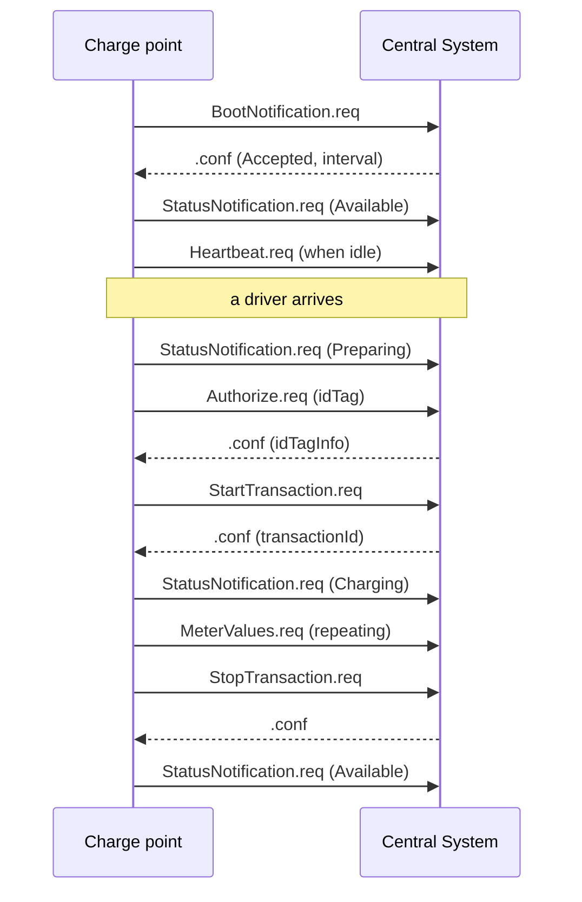
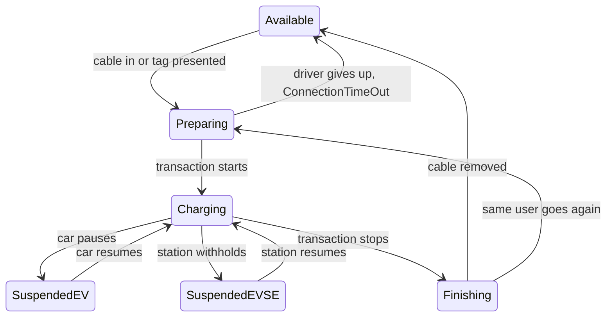

# Module 7: The transaction lifecycle

Module 6 left you able to read a single OCPP-J frame: message type, id, action, payload. A frame on its own settles almost nothing. A charging session is a conversation, a dozen or more frames in a fixed choreography, and its accountable heart is the transaction: the metered stretch between StartTransaction and StopTransaction. Billing, roaming settlement, and the utilization arithmetic from Module 1 all rest on these records, which makes this module the center of Part III.

Everything here flows in one direction: the charge point observes the physical layer from Module 2 and narrates it upstream, and the Central System mostly answers. Module 8 covers the reverse direction, where the backend gives orders. One vocabulary note: OCPP 1.6 says Charge Point and Central System where newer versions say charging station and CSMS.

## What you'll learn

- The seven charge point initiated messages that carry a session, and their order
- How a station registers with BootNotification, and what Accepted, Pending, and Rejected permit
- The nine connector statuses, and why not every transition between them is legal
- How authorization works online, from a backend-managed list, or from a self-built cache
- What StartTransaction, MeterValues, and StopTransaction carry, and who assigns the transaction id
- What happens to transactions while the connection is down
- Five failure patterns you can already spot in a trace

## The cast of messages

Chapter 4 of the 1.6 specification defines ten operations initiated by the charge point (OCPP 1.6 edition 2, chapter 4). Seven of them carry the lifecycle: BootNotification, StatusNotification, Heartbeat, Authorize, StartTransaction, MeterValues, and StopTransaction. The other three (DataTransfer and the firmware and diagnostics status notifications) belong with Module 8's topics. Each is a CALL from the station answered by a CALLRESULT, and the station's identity appears in none of them: it lives in the WebSocket connection, fixed at the handshake (OCPP-J 1.6 specification, section 4.2).

A full day at a charge point compresses into this shape:



## Boot: asking to be let in

Every time a charge point boots, it SHALL send a BootNotification.req, and until the Central System answers Accepted or Pending it may send nothing else, not even messages queued from before the reboot (OCPP 1.6 edition 2, section 4.2). The request is thin: only chargePointVendor and chargePointModel are required (OCPP 1.6 edition 2, section 6.3). The response carries a status, the server's currentTime, and an interval whose meaning depends on the status (OCPP 1.6 edition 2, section 6.4).

That status is the registration state machine (OCPP 1.6 edition 2, section 7.38). Accepted means business as usual: the interval becomes the heartbeat interval, and syncing the station's clock to currentTime is recommended (OCPP 1.6 edition 2, section 4.2). Pending is a holding pattern: the channel stays open, the Central System may inspect and configure the station, and the station answers but initiates nothing unless asked via TriggerMessage; remote starts and stops are not allowed. Rejected is silence: the station sends no OCPP message until the interval has passed, and does not respond to backend requests either (OCPP 1.6 edition 2, section 4.2).

Registration and the WebSocket connection are two different lifecycles. On a transport-level reconnect the station should not send a new BootNotification unless its contents changed; the server already knows who is on the channel (OCPP-J 1.6 specification, section 5.4). Heartbeat lives in the same gap: after HeartbeatInterval seconds of inactivity the station sends one, but any message counts as a sign of life (OCPP 1.6 edition 2, sections 4.6 and 9.1.10). On the JSON transport, WebSocket ping and pong covers liveness, so the advice is roughly one Heartbeat a day, kept because a pong cannot carry the server's clock (OCPP 1.6 edition 2, section 4.6; OCPP-J 1.6 specification, section 5.3).

## What the connector reports

StatusNotification is the station narrating Module 2's physical states upstream. It carries a connectorId, an errorCode, and a status; connectors are numbered from 1 with no gaps, and connector 0 means the station itself, its main controller, rather than any one connector (OCPP 1.6 edition 2, sections 6.47 and 3.8). The status field has nine values (OCPP 1.6 edition 2, section 7.7):

| Status | Group | Meaning |
| --- | --- | --- |
| Available | operative | free for a new user |
| Preparing | operative | occupied, no transaction yet: tag presented or cable in |
| Charging | operative | contactor closed, energy flowing |
| SuspendedEV | operative | station offers energy, the car is not taking any |
| SuspendedEVSE | operative | the station is not offering energy |
| Finishing | operative | transaction over, cable still in |
| Reserved | operative | held by a reservation |
| Unavailable | inoperative | taken out of service via Change Availability |
| Faulted | inoperative | reported error, no energy delivery |

Older OCPP versions had a single Occupied state; 1.6 split it into Preparing, Charging, SuspendedEV, SuspendedEVSE, and Finishing (OCPP 1.6 edition 2, section 4.9). The split is what makes "plugged in but not charging" a precise statement, and the two suspended states answer the diagnostic question of who is withholding energy; when both suspend, SuspendedEVSE takes precedence (OCPP 1.6 edition 2, section 4.9).

Not every hop between states is legal. Section 4.9 carries a transition table whose gaps are as informative as its entries: a connector cannot jump from Available straight to Finishing, and when a fault clears, the connector returns to its state before Faulted (OCPP 1.6 edition 2, section 4.9). The everyday subset:



Every arrow is a transition the table allows; Reserved, Unavailable, and Faulted are omitted for legibility.

## Who may charge

A charge point SHALL only supply energy after authorization (OCPP 1.6 edition 2, section 4.1). The thing authorized is an idTag: a case-insensitive string of at most 20 characters, usually an RFID card UID as 8 or 14 hex digits, though the station must not presume any format (OCPP 1.6 edition 2, sections 7.28 and 3.9). Authorize.req carries the idTag and nothing else; the response carries an idTagInfo whose status is Accepted, Blocked, Expired, Invalid, or ConcurrentTx, the last relevant only when starting a transaction (OCPP 1.6 edition 2, sections 6.1, 6.2, and 7.2). The idTagInfo may add an expiry date and a parentIdTag, which is how several cards share one account (OCPP 1.6 edition 2, sections 7.27 and 3.10).

Stations also hold local knowledge, in two structures that implementations regularly confuse. The Local Authorization List is pushed from the Central System, and the station SHALL NOT modify it by any other means (OCPP 1.6 edition 2, section 3.5.2; Module 8 covers the messages that manage it). The Authorization Cache is the opposite, built autonomously from every idTagInfo the station receives in Authorize, StartTransaction, and StopTransaction responses (OCPP 1.6 edition 2, section 3.5.1). List entries never enter the cache, and where both know a tag, the list wins (OCPP 1.6 edition 2, section 3.5.3).

The connecting rules are short. If a presented idTag is in neither structure, the station SHALL send an Authorize.req; if it is present locally, it MAY still ask (OCPP 1.6 edition 2, section 4.1). Two configuration keys tune this: LocalPreAuthorize starts a locally known tag without waiting for the online answer, and LocalAuthorizeOffline governs the same decision with the connection down (OCPP 1.6 edition 2, sections 9.1.13 and 9.1.12).

## The transaction: start, meter, stop

One distinction first. In an informative section, the spec separates the charging session, the whole visit, from the transaction, its accountable middle; energy may pause and resume within one transaction as either side suspends (OCPP 1.6 edition 2, section 3.6). Session is the driver's experience; transaction is what gets billed.

StartTransaction.req carries connectorId, idTag, meterStart in watt-hours, and a timestamp (OCPP 1.6 edition 2, section 6.45). The response MUST carry an idTagInfo and the transactionId, supplied by the Central System: the station never invents one (OCPP 1.6 edition 2, sections 4.8 and 6.46). The backend MUST verify the idTag even when the station authorized it locally, because local information can be stale (OCPP 1.6 edition 2, section 4.8).

MeterValues fills the middle, on a schedule the configuration sets (OCPP 1.6 edition 2, section 4.7). Sampled data ticks relative to the transaction start, every MeterValueSampleInterval seconds; clock-aligned data ticks at instants anchored to midnight, every ClockAlignedDataInterval seconds, the scheme typically used for fiscally certified metering (OCPP 1.6 edition 2, sections 3.16.1 and 3.16.2). The defaults matter: a bare value string means the active import energy register in watt-hours (OCPP 1.6 edition 2, section 4.7). Twenty-two measurands exist, from power and voltage to temperature, but billing runs on the energy register; its values MUST increase monotonically within a transaction and SHOULD be reported exactly as read, not re-based to zero, so the backend can audit continuity between consecutive transactions (OCPP 1.6 edition 2, section 7.31).

StopTransaction.req requires transactionId, timestamp, and meterStop; idTag is optional, omitted when the station itself ends the transaction, and reason is optional, assumed Local when absent (OCPP 1.6 edition 2, sections 6.49 and 4.10). The reason enum has eleven values: DeAuthorized, EmergencyStop, EVDisconnected, HardReset, Local, Other, PowerLoss, Reboot, Remote, SoftReset, and UnlockCommand (OCPP 1.6 edition 2, section 7.36). Optional transactionData can carry detailed usage for billing, in the same structure MeterValues uses (OCPP 1.6 edition 2, section 6.49). A normal ending also releases a detachable cable (OCPP 1.6 edition 2, section 4.10).

Notice where the power sits. The Central System cannot prevent a transaction from stopping; it can only confirm receipt, optionally attaching idTagInfo about the stopping tag (OCPP 1.6 edition 2, section 4.10). Failed sanity checks SHOULD NOT cause the backend to withhold the confirmation of a start or a stop; withholding only triggers the retry machinery below (OCPP 1.6 edition 2, sections 4.8 and 4.10).

## A full session in six exchanges

Here is a minimal session, six request-and-response pairs, constructed and checked against the official 1.6 JSON schemas. The station connected as cp001.

```text
cp001 -> csms  [2,"1001","BootNotification",{"chargePointVendor":"GridWave","chargePointModel":"GW-AC22"}]
csms -> cp001  [3,"1001",{"status":"Accepted","currentTime":"2026-05-12T07:45:00Z","interval":300}]

cp001 -> csms  [2,"1002","Authorize",{"idTag":"04AA31BB921C80"}]
csms -> cp001  [3,"1002",{"idTagInfo":{"status":"Accepted"}}]

cp001 -> csms  [2,"1003","StartTransaction",{"connectorId":1,"idTag":"04AA31BB921C80","meterStart":1250340,"timestamp":"2026-05-12T07:46:10Z"}]
csms -> cp001  [3,"1003",{"idTagInfo":{"status":"Accepted"},"transactionId":7781}]

cp001 -> csms  [2,"1004","StatusNotification",{"connectorId":1,"errorCode":"NoError","status":"Charging"}]
csms -> cp001  [3,"1004",{}]

cp001 -> csms  [2,"1005","MeterValues",{"connectorId":1,"transactionId":7781,"meterValue":[{"timestamp":"2026-05-12T08:16:10Z","sampledValue":[{"value":"1252890"}]}]}]
csms -> cp001  [3,"1005",{}]

cp001 -> csms  [2,"1006","StopTransaction",{"transactionId":7781,"timestamp":"2026-05-12T09:02:33Z","meterStop":1257420,"idTag":"04AA31BB921C80","reason":"Local"}]
csms -> cp001  [3,"1006",{"idTagInfo":{"status":"Accepted"}}]
```

Read it with this module's eyes. The transactionId 7781 is born in the StartTransaction response and threads through the MeterValues (optional there) and the StopTransaction (required). The meters are raw registers: 1257420 minus 1250340 is 7080 watt-hours, and the next transaction on this connector should start near where this one stopped (OCPP 1.6 edition 2, section 7.31). The bare "1252890" means imported energy in Wh purely by defaults (OCPP 1.6 edition 2, section 4.7). The empty response objects are correct, not lazy: StatusNotification.conf and MeterValues.conf define no fields, and an empty payload is written, per the spec's good-practice advice, as an empty object (OCPP 1.6 edition 2, sections 6.48 and 6.32; OCPP-J 1.6 specification, section 4.2.2).

## Offline, and what goes wrong

A charge point is designed to operate stand-alone; losing the backend is expected, not exceptional (OCPP 1.6 edition 2, section 3.5). Transaction-related messages are precisely StartTransaction, StopTransaction, and the periodic or clock-aligned MeterValues, and while offline the station MUST queue every one (OCPP 1.6 edition 2, section 3.7). After reconnecting it delivers the queue in chronological order; other messages may jump ahead, but new transaction-related messages wait behind the queue; the Central System sees old timestamps and SHOULD process them normally (OCPP 1.6 edition 2, section 3.7). Failed deliveries retry with linear backoff: the wait is TransactionMessageRetryInterval multiplied by the attempts already made, so a 60 second interval waits 60 then 120 seconds, up to TransactionMessageAttempts tries (OCPP 1.6 edition 2, section 3.7.1).

Authorization moves local when offline. The station may serve tags from the list or cache, per LocalAuthorizeOffline, and may accept unknown tags if AllowOfflineTxForUnknownId is enabled; expired list entries, or entries with any status other than Accepted, MUST still be rejected (OCPP 1.6 edition 2, sections 3.5.4, 9.1.12, and 9.1.1). The reckoning comes at reconnect: the queued StartTransaction goes up, and if its response is anything but Accepted while the transaction still runs, StopTransactionOnInvalidId decides between a normal stop with reason DeAuthorized and merely cutting energy while the transaction stays open (OCPP 1.6 edition 2, sections 3.5.4 and 9.1.24). Status works the same after a gap: send the current status if it changed, optionally report offline errors, do not replay history (OCPP 1.6 edition 2, section 4.9). And after a hard reset, StopTransaction for running transactions is only required if possible; queued information can be lost (OCPP 1.6 edition 2, section 7.42).

You now know enough choreography to recognize when it breaks. An Authorize answered with Invalid. A StartTransaction that never meets its StopTransaction. A transaction with no meter values between start and stop. A StartTransaction with no boot or authorization before it. A status hop the transition table forbids. Each is mechanically detectable by any script that walks a trace, and each points to a different class of root cause. Module 13 turns this instinct into a systematic failure taxonomy.

## Key takeaways

- The 1.6 lifecycle is charge point initiated: the station narrates, the Central System answers. Module 8 is the other direction.
- BootNotification gates everything: until Accepted or Pending arrives the station sends nothing else, and registration is a separate lifecycle from the WebSocket connection.
- Connector state is a nine-value model with a transition table; splitting the old Occupied state five ways makes "plugged in but not charging" precise.
- The Local Authorization List (backend-managed) and the Authorization Cache (self-built) are distinct; the list wins where they disagree.
- The Central System assigns the transactionId, meters are raw monotonic registers in watt-hours, and the backend cannot prevent a stop, only acknowledge it.
- Offline is designed in: transaction-related messages queue and replay in order, and offline authorization is re-checked when the StartTransaction arrives.
- Every rule here is a potential failure signature in a trace; Module 13 builds the taxonomy on this foundation.

## Try it

> Read a real session trace end to end. Open the normal-session fixture from the Open OCPP Trace specification, a neutral trace format I helped design: https://github.com/open-ocpp-trace/specification/blob/main/fixtures/normal-session/trace.jsonl. It is 22 lines of plain JSON, one frame per line, readable in any text editor, no tooling required; each record carries the parsed direction and payload, and on requests the action, next to the verbatim raw frame. Map the sequence onto this module: BootNotification and its Accepted, the station reporting Available on connector 0, connector 1 going Preparing, Authorize, StartTransaction and the transactionId in its response, the Charging status, a Heartbeat, two MeterValues, StopTransaction with reason EVDisconnected, and the return to Available.

## Further reading

- [Open Charge Alliance, protocols page](https://openchargealliance.org/protocols/open-charge-point-protocol/), where OCPP 1.6 edition 2 is available after free registration; chapters 3, 4, 6, 7, and 9 back the message-level claims here.
- [Open OCPP Trace specification](https://github.com/open-ocpp-trace/specification), the trace format behind the exercise, with its JSON schema and conformance fixtures.
- [mobilityhouse/ocpp](https://github.com/mobilityhouse/ocpp), a Python implementation of these messages; its 1.6 message classes are a quick way to internalize field names and enums.

---

Previous: [Module 6: OCPP-J on the wire: WebSocket, framing, correlation](06-ocpp-j-on-the-wire.md) | [Contents](../README.md) | Next: [Module 8: CSMS-initiated operations](08-csms-initiated-operations.md)
