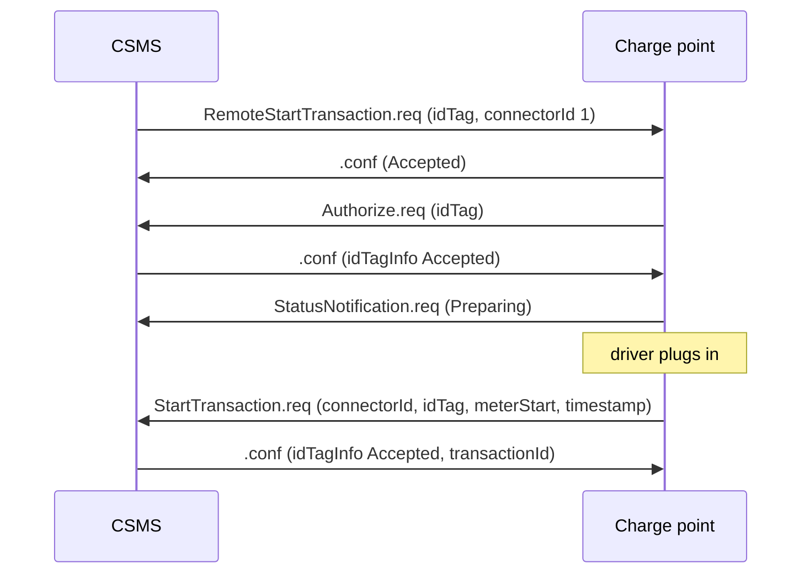

# Module 8: CSMS-initiated operations

Everything in Module 7 flowed uphill. The station booted, reported status, asked for authorization, opened and closed transactions; the CSMS mostly answered. That is half the protocol. The other half is the backend reaching down: starting a session for a stranded driver, rebooting a wedged station, changing a setting, pushing firmware, reserving a connector. OCPP 1.6 collects these in its own chapter, "Operations Initiated by Central System" (OCPP 1.6 edition 2, section 5), and this module walks through them. The satisfying part is how little new machinery they need: the remote commands do not bypass the lifecycle you just learned, they funnel into it.

## What you'll learn

- How the CSMS sends commands, and which feature profile each command belongs to
- Why a remote start is an intent, not a started transaction
- What ChangeAvailability, Reset, and UnlockConnector promise, and what they refuse to promise
- The 1.6 configuration model: string keys, string values, a few standard keys worth memorizing
- The timing problem TriggerMessage solves, and what it deliberately cannot ask for
- Reservations, the local authorization list, and why the list is not the authorization cache
- Firmware updates, diagnostics uploads, and DataTransfer as the vendor escape hatch

## The direction flips, but the wire does not

Nothing about the framing from Module 6 changes here. The CSMS sends a CALL over the same WebSocket the station opened at boot, and the charge point answers with a CALLRESULT or CALLERROR; only the sender role swaps. One detail is worth pinning down: the one-outstanding-CALL rule applies per sender, so a CSMS-initiated CALL and a charge-point-initiated CALL can legally cross on the wire (OCPP-J 1.6 specification, section 4.1.1). A trace where a RemoteStartTransaction request arrives while a MeterValues request is still unanswered is not broken; it is two conversations sharing one socket.

What organizes this side of the protocol is the feature profile system. OCPP 1.6 groups its functionality into six named profiles. Core is required, the rest are optional, compliance testing runs per profile, and a station advertises what it supports in the read-only configuration key `SupportedFeatureProfiles` (OCPP 1.6 edition 2, sections 3.3 and 9.1.29). The CSMS-initiated commands sort into the profiles like this (OCPP 1.6 edition 2, section 3.3), with the Smart Charging trio deferred wholesale to Module 9:

| Profile | CSMS-initiated operations |
| --- | --- |
| Core | ChangeAvailability, ChangeConfiguration, ClearCache, DataTransfer, GetConfiguration, RemoteStartTransaction, RemoteStopTransaction, Reset, UnlockConnector |
| Firmware Management | GetDiagnostics, UpdateFirmware |
| Local Auth List Management | GetLocalListVersion, SendLocalList |
| Reservation | ReserveNow, CancelReservation |
| Smart Charging | ClearChargingProfile, GetCompositeSchedule, SetChargingProfile |
| Remote Trigger | TriggerMessage |

## Remote start and stop

RemoteStartTransaction is the command behind the "start charging" button in a driver app. The CSMS sends an idTag and, optionally, a connectorId; the station answers Accepted or Rejected (OCPP 1.6 edition 2, section 7.39). Read that response carefully: Accepted means the station will attempt to start a transaction, not that one has started. The driver may never plug in. The real confirmation arrives through the front door: if the charge point can start, it sends a normal StartTransaction request, and in the spec's own words, "The transaction is started in the same way as described in StartTransaction" (OCPP 1.6 edition 2, section 5.11). The transactionId still comes from the CSMS in that response, exactly as in Module 7.

What happens in between depends on one boolean, the required key `AuthorizeRemoteTxRequests` (OCPP 1.6 edition 2, sections 5.11 and 9.1.3). True means the station treats the remote idTag as if a card had been presented locally, authorizing via local list, cache, or an Authorize request before starting. False means it starts immediately, and the CSMS applies its judgment when StartTransaction arrives. The flow with authorization enabled:



On the wire, the opening pair looks like this (fields per the official 1.6 JSON schemas):

```json
[2, "82a1", "RemoteStartTransaction", {"connectorId": 1, "idTag": "04AA31BB22CC33"}]
[3, "82a1", {"status": "Accepted"}]
```

Two refinements round this out. Without a connectorId the charge point chooses the connector itself, though it may also reject a request that names none; and the request may carry a charging profile of purpose TxProfile, ignored by stations without Smart Charging support (OCPP 1.6 edition 2, section 5.11). That is a Module 9 thread left hanging on purpose.

RemoteStopTransaction is simpler. The CSMS names a transactionId, and the station answers Accepted only if a transaction with that id is running and will be stopped; the stop is defined as equal to a local stop, so a StopTransaction request follows, carrying the reason `Remote` (OCPP 1.6 edition 2, sections 5.12 and 7.36). Again the remote command is a doorway into the ordinary lifecycle, not a detour around it.

## Availability, reset, and the connector lock

ChangeAvailability takes a connector, or with connectorId 0 the whole station, in and out of service, using the two states Inoperative and Operative (OCPP 1.6 edition 2, sections 5.2 and 7.4). The response has three values, and the third is the interesting one: Accepted, Rejected, or Scheduled (OCPP 1.6 edition 2, section 7.3). Scheduled is the answer while a transaction is in progress; the change waits until it finishes, and the only confirmation the deferred change ever gets is the eventual StatusNotification reporting the new state (OCPP 1.6 edition 2, section 5.2). A CSMS that treats Scheduled as done is fooling itself. Note also that a connector made Unavailable stays Unavailable across a reboot (OCPP 1.6 edition 2, section 5.2).

Reset comes in two strengths. Soft stops ongoing transactions gracefully, sends StopTransaction for each, then restarts the application software; Hard restarts all hardware, need not stop anything gracefully, and is framed by the spec as a last resort because queued messages can be lost (OCPP 1.6 edition 2, sections 5.14 and 7.42). Either way the station is required to send StopTransaction for any running transaction, queuing the message if no confirmation arrives in time; after a hard reset it sends them if possible once rebooted and accepted again via BootNotification (OCPP 1.6 edition 2, section 5.14). The stop reason enum records which happened: `SoftReset` or `HardReset` (OCPP 1.6 edition 2, section 7.36).

UnlockConnector is narrower than its name suggests. Its purpose is the stuck-cable call: a driver cannot unplug because the cable retention did not release, and a help-desk operator triggers a fresh unlock attempt (OCPP 1.6 edition 2, section 5.18). It is explicitly not the way to stop a session remotely; a running transaction is finished first, with the stop reason `UnlockCommand` (OCPP 1.6 edition 2, sections 5.18 and 7.36). The response enum is honest about hardware: Unlocked, UnlockFailed for a mechanism that tried and failed, and NotSupported for stations with no connector lock or an unknown connectorId (OCPP 1.6 edition 2, section 7.46).

## Configuration keys: the 1.6 settings model

The whole configuration system of OCPP 1.6 is a flat dictionary of string keys and string values. GetConfiguration reads it: send a list of key names, or send nothing and the station returns every setting it has, with unrecognized names coming back in a separate unknownKey list (OCPP 1.6 edition 2, section 5.8). Each entry carries the key, a readonly flag, and optionally the value (OCPP 1.6 edition 2, section 7.29).

ChangeConfiguration writes one key-value pair per request, and its response enum covers the four outcomes: Accepted, applied and effective now; RebootRequired, applied but effective after a reboot, which the station pointedly does not perform itself; NotSupported, unknown key; Rejected for the rest, such as an out-of-range value (OCPP 1.6 edition 2, sections 5.3 and 7.22). On the wire even numbers travel as strings, which tells you a lot about the model:

```json
[2, "82b7", "ChangeConfiguration", {"key": "HeartbeatInterval", "value": "300"}]
[3, "82b7", {"status": "Accepted"}]
```

Chapter 9 defines the standard keys, and three come up constantly. `HeartbeatInterval` sets how many seconds of OCPP silence pass before the station sends a Heartbeat (OCPP 1.6 edition 2, section 9.1.10). `MeterValueSampleInterval` sets the sampling period for meter values during a transaction, 0 meaning no sampled data (OCPP 1.6 edition 2, section 9.1.19). `ConnectionTimeOut` bounds how long a connector may sit in Preparing before the incipient transaction is canceled because the driver never plugged in (OCPP 1.6 edition 2, section 9.1.6). Every key is marked R or RW: readable via GetConfiguration only, or also writable via ChangeConfiguration (OCPP 1.6 edition 2, chapter 9 introduction). When Module 11 argues that 2.0.1's device model replaced something creaky, this stringly typed dictionary is the something.

## TriggerMessage: asking the station to speak

Ordinarily the charge point decides when to send its notifications, which leaves the CSMS with a timing problem: the station has current information and no way to know the backend wants it right now, a firmware status long overdue being the spec's own example (OCPP 1.6 edition 2, section 5.17). TriggerMessage, the sole member of the Remote Trigger profile, closes the gap. The CSMS names one of exactly six messages, BootNotification, DiagnosticsStatusNotification, FirmwareStatusNotification, Heartbeat, MeterValues, or StatusNotification, and asks the station to send it now (OCPP 1.6 edition 2, section 7.32).

The station answers Accepted, Rejected, or NotImplemented, and the ordering rule matters in traces: the TriggerMessage confirmation goes out first, then the triggered message follows as its own CALL (OCPP 1.6 edition 2, sections 5.17 and 7.44). Triggered messages report current state only, never history, and StartTransaction and StopTransaction are deliberately excluded from the list because they are not state related; they describe a transition (OCPP 1.6 edition 2, section 5.17).

## Reservations and the local authorization list

ReserveNow lets the backend promise a connector to a driver who has not arrived yet. The request carries a connectorId, an expiry time, the idTag reserved for, a reservationId, and optionally a parentIdTag; while the reservation holds, the station refuses charging on that connector for every identifier except the reserved one or its parent (OCPP 1.6 edition 2, section 5.13). The response enum maps onto the connector status model: Accepted, Occupied, Faulted, Unavailable, or Rejected for stations configured to refuse reservations (OCPP 1.6 edition 2, section 7.40). A reservation ends one of three ways: the reserved driver starts a transaction, and the station includes the reservationId in StartTransaction so the CSMS knows the hold is spent; the expiry passes, and the station frees the connector with a StatusNotification; or the connector drops into Faulted or Unavailable (OCPP 1.6 edition 2, section 5.13). CancelReservation is the undo, Accepted only if the reservationId matches (OCPP 1.6 edition 2, section 5.1).

Local authorization is the other piece of forward provisioning, and it is where implementations most often get confused, because OCPP 1.6 defines two different local stores of identifiers. The Local Authorization List is pushed by the CSMS: SendLocalList delivers either a Full replacement or a Differential update, each tagged with a listVersion the station must associate with the result (OCPP 1.6 edition 2, section 5.15). In a differential update, an entry with idTagInfo means add or update, and one without it means delete (OCPP 1.6 edition 2, section 7.1). The response can be Accepted, Failed, NotSupported, or VersionMismatch, the last meaning the differential's version is not newer than what the station holds, in which case the CSMS should retry with a Full update (OCPP 1.6 edition 2, sections 5.15 and 7.47). GetLocalListVersion checks synchronization, with two sentinel answers: 0 for an empty list, -1 for no list support at all (OCPP 1.6 edition 2, section 5.10). Crucially, the station may not modify this list by any means other than SendLocalList (OCPP 1.6 edition 2, section 3.5.2).

The Authorization Cache is a different animal. The station builds it autonomously, recording every idTagInfo the CSMS returns in Authorize, StartTransaction, and StopTransaction responses, valid and invalid entries alike (OCPP 1.6 edition 2, section 3.5.1). The spec is explicit that list and cache are distinct data structures: identifiers in the local list must not be added to the cache, and where both hold the same identifier, the list wins (OCPP 1.6 edition 2, section 3.5.3). ClearCache clears only the cache and never touches the list (OCPP 1.6 edition 2, section 5.4). Keep the two straight by their authorship: the list is the CSMS's writing, the cache is the station's memory.

## Firmware, diagnostics, and the escape hatch

Firmware Management pairs each CSMS command with a stream of progress reports. UpdateFirmware gives the station a URI to download from and a retrieveDate after which it may start; the confirmation payload is empty, because the real feedback arrives as FirmwareStatusNotification messages during download and installation (OCPP 1.6 edition 2, sections 5.19, 6.56, and 4.5). The status enum tells the story: Downloading, Downloaded, Installing, Installed, with DownloadFailed and InstallationFailed as the exits (OCPP 1.6 edition 2, section 7.25). The flow ends with a reboot: automatic, or a Hard reset ordered by the CSMS after Installed (OCPP 1.6 edition 2, section 5.19).

GetDiagnostics mirrors the shape with one inversion worth burning into memory: UpdateFirmware's location is where the station downloads from, GetDiagnostics' location is where the station uploads to (OCPP 1.6 edition 2, sections 5.9 and 5.19). The station replies with the file name it will upload, or none when it has nothing to report, and sends DiagnosticsStatusNotification updates through the upload: Uploading, Uploaded, or UploadFailed (OCPP 1.6 edition 2, sections 5.9 and 7.24). Both notification enums include an Idle value sent only in reply to a TriggerMessage when no transfer is in progress (OCPP 1.6 edition 2, sections 4.4, 4.5, 7.24, and 7.25). When Module 13 builds its taxonomy of field failures, failed firmware updates and failed diagnostics uploads appear as named patterns, detectable from exactly these enums.

DataTransfer is the escape hatch, the message for functionality OCPP does not cover, and it runs in both directions with identical semantics (OCPP 1.6 edition 2, sections 5.6 and 4.3). The request carries a required vendorId, which should uniquely identify the vendor-specific implementation and come from the reversed DNS namespace, plus an optional messageId and free-form data whose meaning the parties agree on privately (OCPP 1.6 edition 2, section 4.3). An unrecognized vendorId gets the status `UnknownVendorId` with no data, an unrecognized messageId gets UnknownMessageId, and Accepted or Rejected mean whatever the vendor agreement says (OCPP 1.6 edition 2, sections 4.3 and 7.23). This is how real deployments smuggle in features the spec lacks, which makes DataTransfer both useful and the least portable corner of any integration.

## Key takeaways

- CSMS-initiated commands use the same socket and frame shapes as Module 6; the sender role swaps per message, and CALLs from the two directions can legally cross in flight.
- OCPP 1.6 is organized into six feature profiles. Core is mandatory, the rest optional, and `SupportedFeatureProfiles` declares what a station implements.
- A remote start Accepted is a promise to try. The transaction, when it happens, arrives as an ordinary StartTransaction, with the CSMS still assigning the transactionId.
- ChangeAvailability answers Scheduled during a transaction, and the only confirmation the deferred change ever gets is the eventual StatusNotification.
- Soft reset stops transactions gracefully and restarts software; Hard reset restarts hardware and is the spec's own last resort.
- The local authorization list and the authorization cache are distinct stores: the CSMS writes the list, the station builds the cache, list entries win conflicts, and ClearCache clears only the cache.
- UpdateFirmware downloads from a location; GetDiagnostics uploads to one. Their status enums are raw material for the failure patterns in Module 13.

## Try it

> No hardware needed. Write out by hand, as OCPP-J arrays, the complete frame sequence for a remote start on connector 1 with `AuthorizeRemoteTxRequests` set to true: the RemoteStartTransaction CALL and CALLRESULT, the Authorize pair, the StatusNotification to Preparing, and the StartTransaction pair. Then check your work against the message definitions in the [mobilityhouse/ocpp](https://github.com/mobilityhouse/ocpp) Python library on GitHub: the dataclasses in `ocpp/v16/call.py` list every field of every message in this module (in Python snake_case; the library converts them to the wire's camelCase). Two details to grade yourself on: meterStart is an integer while every configuration value travels as a string, and the transactionId appears nowhere until the CSMS supplies it in the StartTransaction response.

## Further reading

- [Open Charge Alliance protocols page](https://openchargealliance.org/protocols/open-charge-point-protocol/), where the OCPP 1.6 specification bundle is available after free registration.
- [SteVe on GitHub](https://github.com/steve-community/steve), an open-source CSMS whose web interface exposes most of these operations, so you can see how a real backend sends them.
- [mobilityhouse/ocpp on GitHub](https://github.com/mobilityhouse/ocpp), a Python implementation of the OCPP messages; its v16 call definitions are a quick public reference for field names and optionality.
- [OCPP on Wikipedia](https://en.wikipedia.org/wiki/Open_Charge_Point_Protocol), a serviceable orientation on the protocol's history and version timeline.

---

Previous: [Module 7: The transaction lifecycle](07-the-transaction-lifecycle.md) | [Contents](../README.md) | Next: [Module 9: Smart charging](09-smart-charging.md)
