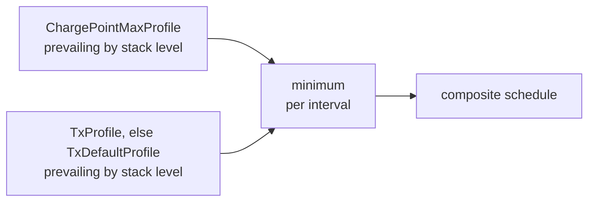

# Module 9: Smart charging

Module 8 handed the CSMS its remote controls: starts and stops, resets, configuration, reservations. All of those act on one station at a time, and none of them says anything about power. This module adds that dimension. Module 1 made the money case: on larger sites the operator pays capacity charges keyed to peak draw, so the most expensive kilowatts are the ones everyone pulls at once. Module 2 showed the physical lever and promised that when smart charging throttles a car, the instruction arrives as a narrower pulse on the control pilot line. Smart charging in OCPP 1.6 is the machinery between those two facts: the way a backend turns a site constraint into a schedule the station enforces on copper.

## What you'll learn

- Where smart charging lives in OCPP 1.6: an optional feature profile with three messages
- The three profile purposes, and how stack levels arbitrate when profiles overlap
- The anatomy of a charging profile: schedules, periods, and limits in amps or watts
- How limits combine into one composite schedule, and how the CSMS can ask to see it
- What happens offline, across reboots, and on the pilot line where enforcement lands
- The load management patterns 1.6 supports, where OSCP fits, and what 2.0.1 changes

## An optional feature profile with three messages

OCPP 1.6 groups everything beyond its required Core into optional feature profiles, and smart charging is one of them; a station declares support through the SupportedFeatureProfiles configuration key from Module 8 (OCPP 1.6 edition 2, section 3.3). The profile table's own description is modest: "Support for basic Smart Charging, for instance using control pilot" (OCPP 1.6 edition 2, section 3.3). Modest is accurate. The whole feature is three messages, all flowing from the CSMS to the station: SetChargingProfile, ClearChargingProfile, and GetCompositeSchedule. Everything interesting rides in the data structure they carry.

The normative section states the goal: let the backend influence the charging power or current of a specific EV, or the total consumption of a whole charge point or a group, because something upstream, a grid connection or a building's wiring, has a limit (OCPP 1.6 edition 2, section 3.13). A station without the feature answers SetChargingProfile with the CALLERROR NotSupported you know from Module 6 (OCPP 1.6 errata sheet, section 3.39).

## Three purposes and a stack

Every charging profile declares a purpose, and 1.6 defines exactly three; the next four paragraphs all come from the spec's purposes section (OCPP 1.6 edition 2, section 3.13.1).

**ChargePointMaxProfile** caps the whole station: the power or current available to all its connectors combined. It can only be set at connectorId 0, and it exists for load balancing, where the station as a whole must stay under a supply limit.

**TxDefaultProfile** is standing policy for new transactions. Sent to connectorId 0 it applies to every connector; sent to a specific connector it replaces the default just there. An erratum adds that a new default also picks up transactions already running with no profile or with the old one (OCPP 1.6 errata sheet, section 3.8).

**TxProfile** targets one transaction, overrules the default for that transaction's duration, and should be deleted when the transaction stops. It may only be set at a connectorId above 0, and if no transaction is active there, the station discards it and returns an error status.

The final constraint on a session is the merge of the ChargePointMaxProfile with the TxProfile, or with the TxDefaultProfile when no TxProfile exists.

Within a single purpose, profiles stack, which is how calendars get built: the spec's example is a weekly recurring default plus extra defaults carving out holidays. Each profile carries a stackLevel, an integer starting at 0, and among the profiles of one purpose valid at a given moment, the highest stack level wins. Same purpose plus same stack level cannot coexist; a duplicate replaces the old profile. Two notes worth keeping: a replacement whose validFrom lies in the future leaves a gap, so a start time in the past is recommended, and a highest-level profile without a duration never yields to the levels below it (this paragraph: OCPP 1.6 edition 2, sections 3.13.2 and 7.8).

## Inside a charging profile

The ChargingProfile structure is where this becomes concrete (OCPP 1.6 edition 2, section 7.8). A profile has an integer chargingProfileId, the purpose and stackLevel just covered, an optional validity window (validFrom and validTo; leaving them out means valid on receipt, until replaced), an optional transactionId that only belongs on a TxProfile, and exactly one chargingSchedule.

It also declares a chargingProfileKind, how its schedule anchors to time: Absolute pins the periods to a fixed point in time, Recurring restarts the schedule daily or weekly per its recurrencyKind, and Relative anchors it to a start point the station determines from context, typically the start of a transaction (OCPP 1.6 edition 2, sections 7.9 and 7.37).

The schedule itself is a list of periods plus framing (OCPP 1.6 edition 2, sections 7.13 and 7.14). A chargingRateUnit says whether limits are in amps or watts. An optional startSchedule pins the schedule to clock time; an optional duration bounds it, and without one the last period's limit holds, indefinitely or until the transaction ends. Each chargingSchedulePeriod gives a startPeriod in seconds from the schedule's start (the first must be 0), a limit with at most one decimal, and an optional numberPhases defaulting to 3.

Unit choice carries semantics that bite. A limit in watts is the total allowed charging power; for AC, the station derives per-phase current from the area's nominal voltage, 230 or 110, not the measured one. A limit in amps is per phase, not a sum across phases (OCPP 1.6 edition 2, section 7.12). Watts tend to suit DC, amps AC. Phase count deserves respect too: switching the phase count mid-session can physically damage some EVs, so support for 3-to-1 switching is advertised separately through the ConnectorSwitch3to1PhaseSupported key (OCPP 1.6 edition 2, section 3.13.7).

Here is a complete SetChargingProfile, authored for this module and checked field by field against the official JSON schema, framed as an OCPP-J CALL the way Module 6 taught. It limits a running transaction to 16 A for its first two hours, then 8 A:

```json
[2, "19223201", "SetChargingProfile", {
  "connectorId": 1,
  "csChargingProfiles": {
    "chargingProfileId": 42,
    "transactionId": 1553,
    "stackLevel": 0,
    "chargingProfilePurpose": "TxProfile",
    "chargingProfileKind": "Relative",
    "chargingSchedule": {
      "chargingRateUnit": "A",
      "chargingSchedulePeriod": [
        { "startPeriod": 0, "limit": 16.0 },
        { "startPeriod": 7200, "limit": 8.0 }
      ]
    }
  }
}]
```

Reading it back: transactionId is present because a TxProfile targets one specific transaction (OCPP 1.6 edition 2, section 5.16). Relative means the periods run from the start of charging, so no startSchedule. The first startPeriod is 0, as it must be. The 16 A is per phase, three phases assumed with numberPhases omitted. No duration, so the second period's 8 A holds until the transaction ends (OCPP 1.6 edition 2, sections 7.9, 7.12, 7.13, and 7.14). The station answers `[3, "19223201", {"status": "Accepted"}]`, the status one of Accepted, Rejected, or NotSupported (OCPP 1.6 edition 2, section 7.11).

A smart charging station also publishes its ceilings as four required read-only configuration keys: ChargeProfileMaxStackLevel, ChargingScheduleMaxPeriods, MaxChargingProfilesInstalled, and ChargingScheduleAllowedChargingRateUnit; a CSMS that ignores them builds profiles the station rejects (OCPP 1.6 edition 2, sections 3.13.5 and 9.4). One trap: the last key reports Current and Power, while profiles say A and W, a mismatch the errata sheet acknowledges as confusing (OCPP 1.6 errata sheet, section 3.88).

## Setting, clearing, and the schedule that results

SetChargingProfile arrives in four situations: at the start of a transaction, inside a RemoteStartTransaction request, during a transaction, and outside any transaction, for default profiles or profiles destined for a local controller; when a profile applies to a specific transaction, the request carries that transactionId (OCPP 1.6 edition 2, section 5.16).

The remote start path from Module 8 has a wrinkle. A profile inside RemoteStartTransaction must be a TxProfile without a transactionId, because none exists yet; the CSMS assigns one in the StartTransaction response. A later SetChargingProfile carrying that transactionId replaces the remote-start profile at the same stack level, or stacks at a different one (OCPP 1.6 edition 2, section 5.16.2). This is also the only way to hand a station a transaction profile in advance: setting a TxProfile with no active transaction is explicitly disallowed (OCPP 1.6 edition 2, section 5.16.4).

Replacement follows identity. A new profile with an existing chargingProfileId, or an existing purpose plus stack level combination, replaces the old one; anything else is added, and the station re-evaluates its collection to decide what is active (OCPP 1.6 edition 2, sections 5.16.3 and 5.16.4). The response is a bare status, and the spec warns that Accepted promises an effort, not an outcome: other constraints may keep the schedule from being followed to the letter (OCPP 1.6 edition 2, section 6.44).

ClearChargingProfile removes profiles by id or by criteria: connectorId, purpose, stack level, in any combination. The errata sheet pins down the matching: criteria combine as a logical AND, a request with no fields clears everything, and a given id makes the other fields irrelevant (OCPP 1.6 errata sheet, sections 3.25 and 3.26). The response is Accepted, or Unknown when nothing matched (OCPP 1.6 edition 2, section 7.21).

What does the station enforce once profiles pile up? For each purpose it finds the prevailing profile by stack level, then combines the purposes by taking the minimum limit for every stretch of time. Schedules need not align, so the result can have intervals of varying length, and the combined value is never higher than the lowest value in anything merged. That result is the composite schedule, and it is what the car experiences. One caution: a ChargePointMaxProfile caps all connectors combined, so two cars on a station capped at 32 A share 32 A, not 32 each (this paragraph: OCPP 1.6 edition 2, section 3.13.3).



GetCompositeSchedule lets the CSMS see the result. The request names a connectorId, a duration in seconds, and optionally forces the reporting unit; the station calculates from the moment of receipt up to that duration ahead, folding in local limits, and connectorId 0 returns the total draw the station expects from the grid (OCPP 1.6 edition 2, sections 5.7 and 6.21). The answer is a snapshot, indicative only: local balancing may reshuffle it the instant another connector frees up, and an unknown connectorId gets Rejected (OCPP 1.6 edition 2, sections 5.7 and 7.26).

## From profile to pulse, and life offline

Nothing in a charging profile touches the car directly. The spec's smart charging use cases annotate the final step plainly: whenever the maximum current needs to change, the charge point implements the profile through the control pilot signal (OCPP 1.6 edition 2, section 3.13.4). That closes the loop Module 2 opened. The profile's limit becomes a duty cycle on the pilot line, the pulse-to-amps mapping lives in IEC 61851-1, and the car obeys an analog wire while the backend speaks JSON. The same section names the limitation honestly: over the bare pilot, the EV cannot communicate its needs back, the gap ISO 15118 fills in Module 12.

Because enforcement is local, losing the backend does not mean losing control, and the spec is normative about the fallback ladder (OCPP 1.6 edition 2, section 3.13.6). A station that received a TxProfile before going offline keeps using it for the rest of that transaction. One that went offline earlier uses whatever it holds, combined by the usual rules. With no profiles at all, it charges unconstrained. The errata sheet adds durability: installed profiles survive reboots and power cycles (OCPP 1.6 errata sheet, section 3.37). A charging profile is standing policy, not a live command stream, and that is what makes the feature trustworthy on flaky connections.

## Load management, three ways

The spec's informative use cases sketch three deployment patterns (OCPP 1.6 edition 2, section 3.13.4).

Load balancing never leaves the station: it is configured with a fixed ceiling, typically its grid connection's maximum, and divides that budget across its own connectors as cars come and go. The schedule's optional minChargingRate field exists for this pattern, a hint that charging below some rate is inefficient and the balancer should choose another strategy (OCPP 1.6 edition 2, sections 3.13.4 and 7.13).

Central smart charging moves the brain to the backend. The CSMS receives a capacity forecast from the grid operator or another source; how it arrives is out of the spec's scope. It then computes per-transaction schedules, typically answering a StartTransaction by installing a TxProfile for that session.

Local smart charging inserts a local controller: a logical component, in practice a separate box or a designated master charge point, that speaks OCPP, proxies the group's traffic, and may have no connectors of its own. The classic setting is a parking garage whose grid connection is smaller than the sum of its stations' ratings; the group cap arrives as a ChargePointMaxProfile at connectorId 0, preconfigured or set by the CSMS.

Where does the forecast number come from? OCPP 1.6 leaves that door deliberately open. Module 4 placed OSCP, the Open Smart Charging Protocol, on the map as OCA's channel between a CSMS and the party managing the grid connection; this is where it plugs in, one established way for the capacity budget to reach the backend. Its internals are beyond this handbook; the OCA page linked below is the entry point.

## What 2.0.1 changes

Module 11 treats OCPP 2.0.1 properly; here is just enough to keep your vocabulary portable. Charge Point becomes Charging Station, connectors become EVSEs, and ChargePointMaxProfile becomes ChargingStationMaxProfile, set at evseId 0; a profile installed at EVSE 0 is active on every EVSE (OCPP 2.0.1 Part 2, functional block K, sections 3.2 and 3.4). A fourth purpose appears, ChargingStationExternalConstraints, for limits imposed by something other than the CSMS: a grid operator signal over IEC 61850, IEC 60870-5-104, DNP3, or OpenADR, or a building energy manager speaking Modbus or EEBUS. The station files such limits under that purpose and reports the resulting changes upstream with NotifyChargingLimitRequest (OCPP 2.0.1 Part 2, functional block K, sections 2.4 and 3.2). The combination rule also becomes explicit: the lowest limit across purposes wins, and a valid TxProfile excludes the TxDefaultProfile from the calculation entirely (OCPP 2.0.1 Part 2, functional block K, section 3.5). The block runs to seventeen use cases, K01 through K17, including three for ISO 15118-based charging, two of them renegotiation, where Module 12 picks up (OCPP 2.0.1 Part 2, functional block K).

## Key takeaways

- Smart charging in 1.6 is an optional feature profile of three CSMS-initiated messages; the intelligence lives in the ChargingProfile structure they carry.
- Three purposes divide the work: ChargePointMaxProfile caps the whole station, TxDefaultProfile is standing policy for transactions, and TxProfile overrides the default for one transaction. Within a purpose, the highest valid stack level wins.
- A profile's schedule is a list of periods with limits in amps (per phase) or watts (total); the first period starts at second 0, and without a duration the last limit holds.
- The station enforces the minimum across purposes at every moment: the composite schedule. GetCompositeSchedule returns a snapshot of it, indicative only.
- Enforcement is local and durable. Profiles keep working offline, survive reboots, and reach the car as a pilot duty cycle, the Module 2 mechanism.
- 2.0.1 keeps the model, renames its pieces for stations and EVSEs, adds an external-constraints purpose, and makes the combination rules explicit.

## Try it

> No hardware needed. Register on the Open Charge Alliance protocols page (free) and download OCPP 1.6 edition 2 with its errata sheet, then read section 3.13. Take this module's worked example and compute the composite schedule by hand for a station that also holds a flat ChargePointMaxProfile of 20 A: what limit does the car see at minute 0, at minute 90, and at hour 3? You should get 16, 16, and 8 A: the composite takes the minimum, and the second period starts at 7200 seconds. Then rewrite the example as a TxDefaultProfile that recurs daily, and check every field you touched against the SetChargingProfile JSON schema in the spec bundle.

## Further reading

- [Open Charge Point Protocol at the Open Charge Alliance](https://openchargealliance.org/protocols/open-charge-point-protocol/), the registration-gated download for OCPP 1.6 edition 2, its errata sheet, and the JSON schemas this module's example was checked against.
- [Open Smart Charging Protocol at the Open Charge Alliance](https://openchargealliance.org/protocols/open-smart-charging-protocol/), the entry point for the CSMS-to-grid capacity channel mentioned above.
- [Open Charge Alliance](https://openchargealliance.org/), the alliance's home page, where new editions are announced.

---

Previous: [Module 8: CSMS-initiated operations](08-csms-initiated-operations.md) | [Contents](../README.md) | Next: [Module 10: Security](10-security.md)
