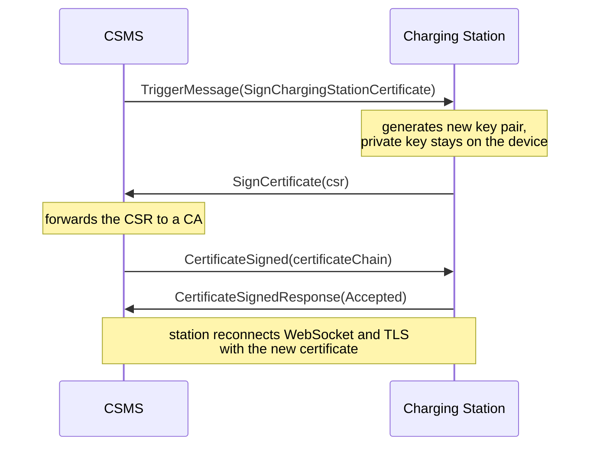

# Module 10: Security

Module 9 handed the CSMS real authority over the physical world: one message can cap a site's current or stop a session mid-charge. Authority like that is only as trustworthy as the channel it arrives on. When a station accepts a charging profile, how does it know the sender is its CSMS and not someone else on the network path? When a CSMS bills a session, how does it know the station that reported it is the station it claims to be?

For most of OCPP's deployed life, the honest answers were thinner than you might expect. The 1.6 application specification says nothing about security at all, and the transport specification secured the pipe and no more. This module covers that baseline, the threat model, and the security architecture 2.0.1 builds in natively: three security profiles, certificate management over OCPP itself, signed firmware, and a security event log.

## What you'll learn

- Why the 1.6 core specification contains no security chapter, and what OCPP-J covered instead
- What the designers were defending against: spoofed stations, stolen credentials, tampered firmware
- The three security profiles of 2.0.1 and exactly which party each one authenticates
- How stations renew their own certificates and receive trusted roots over ordinary OCPP messages
- How a signed firmware update differs from a plain one on the wire
- What the security event log records and how a CSMS retrieves it
- What real fleets deploy today, and the whitepaper path that retrofits 1.6

## The 1.6 baseline: a silent spec and a secured pipe

The OCPP 1.6 core specification has chapters for operations, messages, and types, and none for security. The topic is not tucked away somewhere either: a full-text search finds no occurrence of "security", "TLS", or "encrypt" anywhere in its 116 pages (OCPP 1.6 edition 2, table of contents and full text). Everything 1.6 deployments had came from the JSON transport specification.

That transport spec gives security one short chapter with two acceptable postures: rely on network-level security, meaning a private network or VPN between station and backend, or run OCPP-J over TLS. One of the two must always be in place, and a Central System SHOULD NOT listen for unencrypted OCPP-J connections from the open internet (OCPP-J 1.6 specification, section 6). With TLS, the server may present a signed certificate so the charge point can verify it reached the right Central System (OCPP-J 1.6 specification, section 6.2.1).

Station identity works through HTTP Basic authentication: the username is the charge point identity from the connection URL, and the password is a 20-byte key stored on the station. The key can be set remotely through ChangeConfiguration under the key AuthorizationKey, written as 40 hexadecimal characters, and the station should not report it back in GetConfiguration; the recommended onboarding flow uses the Pending registration status from Module 7 to hold a new station until a unique key is set (OCPP-J 1.6 specification, section 6.2.2). The spec is candid about scope: this authenticates the two endpoints and encrypts the channel; it does not protect meter values end to end, authenticate the driver, or defend the cabinet against physical tampering (OCPP-J 1.6 specification, section 6.2.3).

## What the designers were defending against

The 1.6J text explains why unique per-station credentials matter, and its worry list is a sober little threat model. With a shared or guessable credential, anyone who can reach the CSMS endpoint can impersonate a station: report a connector as occupied or reserved when it is free, mark a running session as stopped so it goes unbilled, flood the backend with fabricated transactions and errors, or open sessions against another driver's token (OCPP-J 1.6 specification, section 6.2.2, paraphrased). The same section notes the plainest risk of all: Basic authentication over an unencrypted link exposes the credentials to anyone observing the traffic, and observation then becomes impersonation.

OCPP 2.0.1 formalizes this into four security objectives: a communication channel with integrity and confidentiality from strong cryptography, mutual authentication of Charging Station and CSMS, a firmware update process whose source and integrity can be verified, and logging of security events for monitoring (OCPP 2.0.1 Part 2, Functional Block A, section 1.1). The design considerations are equally deliberate: standard web technologies only, no application-layer cryptography, security built on TLS and public-key certificates in the X.509 format, and no user accounts or roles on the station itself, with access control recommended at the CSMS instead (OCPP 2.0.1 Part 2, Functional Block A, section 1.2). Physical attacks and local maintenance interfaces stay out of scope, though tampering at least gets a standardized event name, as you will see below.

## The three security profiles

Rather than a single mandated configuration, 2.0.1 defines three named bundles called security profiles, each answering the same two questions: how does each party prove who it is, and is the channel encrypted (OCPP 2.0.1 Part 2, Functional Block A, section 1.3)?

| Profile | Name | Station proves identity by | CSMS proves identity by | Channel |
| --- | --- | --- | --- | --- |
| 1 | Unsecured Transport with Basic Authentication | HTTP Basic authentication | nothing | unencrypted |
| 2 | TLS with Basic Authentication | HTTP Basic authentication | TLS server certificate | TLS |
| 3 | TLS with Client Side Certificates | TLS client certificate | TLS server certificate | TLS |

Profile 1 deserves a careful reading, because it is weaker than its position in the list suggests. The station authenticates with a password; nothing authenticates the CSMS, and nothing encrypts the link, so the station trusts whatever answers at the URL. The spec permits this profile only on trusted networks, giving a VPN between CSMS and station as its example, and recommends a TLS profile for field operation (OCPP 2.0.1 Part 2, Functional Block A, section 1.3; A00.FR.201, A00.FR.206). Profile 2 keeps the password for the station and adds TLS with a server certificate, so the station now verifies the CSMS and the channel is encrypted. Profile 3 drops passwords entirely: both ends present certificates, which is what the phrase mutual TLS means, and the station's certificate carries its serial number and the operator's name, one unique certificate per station (OCPP 2.0.1 Part 2, A00.FR.404, A00.FR.405, A00.FR.427).

The mechanics around profiles are strict. A station runs exactly one profile at a time, a CSMS terminates connection attempts made with a different profile than configured, and a profile must be configured before OCPP communication is possible at all; running with no profile is not a valid 2.0.1 implementation (OCPP 2.0.1 Part 2, A00.FR.001, A00.FR.002, A00.FR.004; Functional Block A, section 1.3). Movement between profiles is deliberately one-way: the only sanctioned downgrade is from 3 to 2, and only when the station implements a variable named AllowSecurityProfileDowngrade and it is true; there is no OCPP path back down to profile 1 (OCPP 2.0.1 Part 2, A00.FR.005). Upgrading is its own use case: the CSMS gives a connection profile with the higher security profile top priority and resets the station when idle; once the station connects on the new profile, it deletes the lower-security profiles and the CSMS never accepts them again (OCPP 2.0.1 Part 2, use case A05).

A few wire details are worth knowing. The Basic authentication username SHALL equal the station identity from the connection URL, which is why that identity may not contain a colon, and the password is a random string of 16 to 64 characters sent as plain UTF-8, a deliberate change from 1.6J's binary key (OCPP 2.0.1 Part 2, A00.FR.204, A00.FR.205); the credentials ride on the WebSocket upgrade request itself (OCPP 2.0.1 Part 2, Table 15 remark). On the TLS side, version 1.2 is the floor, and a peer offering only older versions gets disconnected while the station raises an InvalidTLSVersion security event (OCPP 2.0.1 Part 2, A00.FR.313 through A00.FR.316). One caveat causes real field trouble: a station whose clock is wrong cannot validate a server certificate's validity window, so time from NTP, the mobile network, or installer tooling is a prerequisite for TLS at all (OCPP 2.0.1 Part 2, Functional Block A, section 1.3).

## Certificates as day-to-day operations

Certificates expire, get replaced, and occasionally go wrong, so 2.0.1 makes their whole lifecycle an OCPP conversation rather than a truck roll. Two separate certificate hierarchies exist: the charging station operator's hierarchy, covering CSMS and station certificates, and the manufacturer's hierarchy, covering firmware signing (OCPP 2.0.1 Part 2, Functional Block A, section 1.4.2). Trusted roots reach the station through InstallCertificate, whose certificate type is one of CSMSRootCertificate, ManufacturerRootCertificate, V2GRootCertificate, or MORootCertificate (OCPP 2.0.1 part 3 schema, InstallCertificateRequest). Notably, the browser model of shipping a large bundle of well-known certificate authorities is explicitly not recommended for charging stations; only the operator's own roots belong there (OCPP 2.0.1 Part 2, Functional Block A, section 1.4.2 note).

Renewal is where the design earns its keep. When the CSMS wants a station to get a new certificate, it sends TriggerMessage asking for SignChargingStationCertificate. The station generates a fresh key pair, and the private key never leaves the device; what travels is a certificate signing request, a file derived from the new public key that a certificate authority can turn into a signed certificate. The CSMS forwards that request to a CA, and the spec recommends the CSMS not act as its own CA, then delivers the result with CertificateSigned. The station verifies it, answers Accepted, and switches over by reconnecting its WebSocket and TLS session (OCPP 2.0.1 Part 2, use case A02; A02.FR.04, A02.FR.05).



The station can also start this flow itself: when its certificate is a month from expiring, it initiates the same signing request without being asked (OCPP 2.0.1 Part 2, use case A03). Even expiry is handled gracefully: a station with an expired certificate should still attempt the connection and let the CSMS decide, and the CSMS may accept it into the Pending state and renew it on the spot (OCPP 2.0.1 Part 2, A00.FR.429, A00.FR.430). For housekeeping, GetInstalledCertificateIds lists what a station holds and DeleteCertificate removes a specific entry (OCPP 2.0.1 Part 2, use cases M03 and M04). Keep the two delivery messages straight, because implementations mix them up: CertificateSigned carries the station's own signed certificate, while InstallCertificate carries roots (OCPP 2.0.1 Part 2, use case A02 and use case M05 remarks).

Revocation, usually the miserable part of any certificate scheme, is handled pragmatically. CSMS certificates simply live less than 24 hours and are reissued continuously, so a station never needs revocation lists or online status checks for them; station and firmware-signing certificates are verified online at the CSMS side, and a station talks to a CA only through its CSMS (OCPP 2.0.1 Part 2, Functional Block A, section 1.5). Passwords get lifecycle treatment too: the CSMS rotates a station's Basic authentication password by writing the BasicAuthPassword variable, which is write-only so no configuration dump can leak it; the station reconnects with the new value, the CSMS is told to store only salted hashes and keep passwords out of logs, and factory credentials are unique per station, generated from a cryptographic random source, and replaced right after installation (OCPP 2.0.1 Part 2, use case A01; Part 2 Appendices, section 3.1.15; Functional Block A, section 1.6).

## Signed firmware updates

Firmware is the most consequential payload a CSMS ever delivers, because whoever controls the firmware controls the station. The secure path in 2.0.1 is not a separate message but the ordinary UpdateFirmware request carrying two extra optional fields inside its firmware object: signingCertificate and signature; their presence is what makes an update a signed one (OCPP 2.0.1 part 3 schema, UpdateFirmwareRequest; OCPP 2.0.1 Part 2, use case L01).

The verification happens twice. Before downloading, the station validates the signing certificate against its Manufacturer root; a bad certificate produces an UpdateFirmware response of InvalidCertificate plus an InvalidFirmwareSigningCertificate security event. After downloading, the station checks the signature over the entire firmware file; a bad or missing signature produces a FirmwareStatusNotification of InvalidSignature plus the matching security event, while success is reported as SignatureVerified before installation begins (OCPP 2.0.1 Part 2, use case L01). The status enumeration tells the story of what the secure path adds over a plain download: SignatureVerified, InvalidSignature, and InstallVerificationFailed exist alongside the ordinary downloading and installing states (OCPP 2.0.1 part 3 schema, FirmwareStatusNotificationRequest). Two recommendations round it out: firmware SHOULD travel encrypted, and the manufacturer's signing certificate SHOULD come from a third-party CA, so a manufacturer cannot later disown an image it signed (OCPP 2.0.1 Part 2, L01.FR.08; A00.FR.604). An unsigned update path still exists as its own use case, for whatever a fleet's policy allows (OCPP 2.0.1 Part 2, use case L02).

## The security log and a frame on the wire

Stations detect security-relevant occurrences on their own: a failed authentication, an invalid certificate, a cleared log, a tamper switch. In 2.0.1, every implemented security event is written to a local security log, and events marked critical are additionally pushed to the CSMS with SecurityEventNotification, queued with guaranteed delivery if the station happens to be offline (OCPP 2.0.1 Part 2, use case A04; A04.FR.02, A04.FR.04). The event names are standardized in an appendix so that fleets speak one vocabulary: TamperDetectionActivated, InvalidTLSVersion, SecurityLogWasCleared, AttemptedReplayAttacks, and FailedToAuthenticateAtCsms are among them, and when an occurrence matches a listed event, the standardized name must be used instead of a proprietary one (OCPP 2.0.1 Part 2 Appendices, Appendix 1).

On the wire, the push is as small as OCPP messages get. Here is a station reporting that it could not validate its CSMS's certificate, framed as an OCPP-J CALL, message type 2, over a connection negotiated with the ocpp2.0.1 subprotocol (OCPP 2.0.1 Part 4, sections 3.1.2 and 4.1.3):

```json
[2, "62e41f2a-0001-4c5d-9c3e-0a1b2c3d4e5f", "SecurityEventNotification",
  {"type": "InvalidCsmsCertificate",
   "timestamp": "2026-07-28T09:14:07Z",
   "techInfo": "certificate chain validation failed"}]
```

The CSMS confirms with a CALLRESULT whose payload is deliberately empty:

```json
[3, "62e41f2a-0001-4c5d-9c3e-0a1b2c3d4e5f", {}]
```

Only type and timestamp are required; techInfo is optional context, capped at 255 characters (OCPP 2.0.1 part 3 schema, SecurityEventNotificationRequest). When the CSMS wants the full picture rather than individual events, it pulls the log: GetLog names SecurityLog as the log type and provides an upload URL, the station answers Accepted with a filename, uploads the file, and streams progress through LogStatusNotification with statuses such as Uploading, Uploaded, and UploadFailure; the format of the log file itself is not prescribed (OCPP 2.0.1 Part 2, use case N01; OCPP 2.0.1 part 3 schemas, GetLogRequest and LogStatusNotificationRequest).

## What the field actually runs

Now the honest part. Plaintext ws:// on a private network is not a corner cut; it is a spec-sanctioned pattern on trusted links, from 1.6J's blessing of network-level security to profile 1's own VPN example, and the 2.0.1 text itself mentions a CSMS reached through a private mobile APN plus VPN as a real topology (OCPP-J 1.6 specification, section 6.1; OCPP 2.0.1 Part 2, Functional Block A, section 1.3; A00.FR.511 note). Many 1.6 fleets run exactly this way. That reality is also why the tracing workflow later in this handbook exists at all: on a plaintext link, or one where a proxy terminates the connection, a WebSocket-aware proxy can decode every frame in flight as a diagnostic capture point, which Module 14 builds on; I build one such tool, the capture proxy in OCPP DebugKit Studio, and any WebSocket proxy or logging middleware fills the same role.

For a 1.6 fleet that wants more than a secured pipe, OCA publishes the OCPP 1.6 Security Whitepaper, currently in its fourth edition, which takes the security design OCPP 2.0 introduced and specifies a standard way to run it on 1.6-J fleets: secure connection setup, security events and logging, and secure firmware updates (OCA whitepapers page; registration required for the download). The direction of travel matters for your mental model: this security design was built for OCPP 2.0, offered backward to 1.6 fleets through the whitepaper, and is native in 2.0.1 as the functional block this module has been reading, listed in the introduction as part of what 2.0.1 improves over 1.6 (OCPP 2.0.1 Part 2, Functional Block A; OCPP 2.0.1 Part 0, section 2.3). The spec's own migration use case even describes its starting point as an OCPP 1.6 station without security profiles, which is as clear a statement of the history as you will find inside a standard (OCPP 2.0.1 Part 2, use case A05, paraphrased).

## Key takeaways

- The 1.6 core specification contains no security chapter at all; only the OCPP-J transport spec covered the pipe, with TLS and HTTP Basic authentication.
- OCPP 2.0.1 makes security a native functional block with four objectives: a protected channel, mutual authentication, verifiable firmware, and an event log.
- The three security profiles: 1 is Basic authentication alone on a trusted network, 2 is Basic authentication inside TLS with a server certificate, 3 is mutual TLS. Profiles 1 and 2 both use passwords; only profile 3 uses client certificates.
- Profile changes are one-way by design: upgrades delete the lower profiles, and the only permitted downgrade is 3 to 2 behind an explicit variable.
- Certificate issuance, renewal, and root distribution all run over OCPP itself; short-lived CSMS certificates stand in for revocation checking on the station side.
- A signed firmware update is the ordinary UpdateFirmware message plus a signing certificate and a signature, verified against the manufacturer hierarchy both before and after download.
- Security events carry standardized names; critical ones are pushed with guaranteed delivery, all are logged locally, and the CSMS retrieves the log with GetLog.

## Try it

> No charger required. Run `openssl s_client -connect openchargealliance.org:443 -showcerts` against any HTTPS host and read what a TLS server actually presents: the certificate chain, the subject and issuer names, the validity dates. This is precisely what a charging station on profile 2 or 3 must evaluate before it will speak a word of OCPP, and those validity dates explain the spec's warning about clocks, since a station with the wrong time will reject a perfectly good certificate. Then run `echo -n 'cp001:a-sixteen-char-pw' | base64` and look at the output: that string is the entire content of a Basic authentication header, which is why the profiles that use it either require an already-encrypted channel or a genuinely private network.

## Further reading

- [OCA protocols page](https://openchargealliance.org/protocols/open-charge-point-protocol/), where the OCPP specifications are available after free registration.
- [OCA whitepapers index](https://openchargealliance.org/whitepapers/), listing the OCPP 1.6 Security Whitepaper alongside a Security Operations Guide.
- [OCPP 1.6 Security Whitepaper, 4th edition](https://openchargealliance.org/ocpp-info-whitepapers/ocpp-1-6-security-whitepaper-4th-edition/), the standardized path for adding 2.0-era security to 1.6-J fleets.
- [RFC 5246](https://datatracker.ietf.org/doc/html/rfc5246), the TLS 1.2 specification, the floor version OCPP security profiles accept.

---

Previous: [Module 9: Smart charging](09-smart-charging.md) | [Contents](../README.md) | Next: [Module 11: OCPP 2.0.1 and beyond](11-ocpp-201-and-beyond.md)
