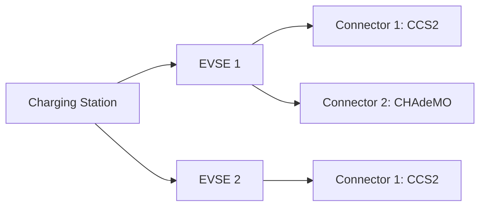

# Module 11: OCPP 2.0.1 and beyond

Module 10 closed on a telling arrangement: OCPP 1.6 got its security model from a whitepaper published years after the protocol, while 2.0.1 carries the same model as a native chapter. Security was not the only late addition. Years of fleet operation exposed limits no errata sheet could fix: configuration without structure, one transaction scattered across four message types, no way for a backend to ask a station what it physically is. OCPP 2.0.1 is the rebuild that answers those limits. This module covers what changed, what migration involves, and what the newer OCPP 2.1 stacks on top.

## What you'll learn

- Why OCA rebuilt the protocol instead of patching 1.6, and where the ".1" came from
- The device model: components and variables instead of flat configuration keys
- TransactionEvent, one message replacing the Start, Stop, and MeterValues split
- The three-tier addressing of stations, EVSEs, and connectors
- Where security, ISO 15118, and smart charging plug into the new specification
- How version negotiation works, and what migration genuinely requires
- What OCPP 2.1 adds, and how mature it is

## Why 2.0.1 exists

Fairness to 1.6 first. It works, and it is the version you are most likely to meet in the field. What fleet operation exposed are design limits, not bugs: untyped string configuration with no discovery (Module 8), one transaction's data split across StartTransaction, MeterValues, StopTransaction, and StatusNotification (Module 7), and security as an optional retrofit (Module 10).

The version number carries some history. OCPP 2.0 shipped in April 2018, but fixes to its machine-readable schemas could not stay backward compatible, so OCA released the corrected protocol as 2.0.1 in March 2020 and advises against implementing 2.0 at all (OCPP 2.0.1 Part 0, section 1.1 and Version History). The current release is edition 4, dated December 2025, merging accumulated errata (OCPP 2.0.1 Part 0, Version History).

Set against those pains, the headline changes read like a direct answer (OCPP 2.0.1 Part 0, chapter 2): device management with inventory reporting and configurable monitoring, one message for transactions, native security, and smart charging that accepts input from external energy systems and, through ISO 15118, from the EV itself. Smaller items land too: WebSocket compression to cut data cost (section 2.2.2), payment terminal and smartphone authorization, display messages, driver language preference, and cost information around the transaction (section 2.6).

Two changes are easy to skim past. SOAP is gone: OCA members judged it too heavy for constrained stations on cellular links, so 2.0.1 speaks JSON over WebSocket only (OCPP 2.0.1 Part 0, section 2.7.2). And many messages were renamed to say what they do; the spec's own example is RemoteStartTransaction becoming RequestStartTransaction, because it always was a request that could be refused (OCPP 2.0.1 Part 0, section 2.8.1). A short map, checked against the official schema files:

| OCPP 1.6 | OCPP 2.0.1 |
| --- | --- |
| StartTransaction, StopTransaction, MeterValues (during a transaction) | TransactionEvent |
| RemoteStartTransaction | RequestStartTransaction |
| RemoteStopTransaction | RequestStopTransaction |
| GetConfiguration, ChangeConfiguration | GetVariables, SetVariables |
| GetDiagnostics | GetLog (the nearest equivalent, covering log retrieval) |
| BootNotification, Heartbeat, Reset, and many others | unchanged |

The document set grew more organized too: seven parts covering introduction, architecture, the specification with appendices, JSON schemas, the transport guide, certification profiles, and test cases, with the specification arranged as functional blocks lettered A through P, each a group of use cases with numbered requirements (OCPP 2.0.1 Part 0, sections 3.1 and 3.2). A citation like E07.FR.02 means block E, use case 07, requirement 02. Module 16 makes a skill of navigating this.

## The device model: stations that describe themselves

Configuration in 1.6, as Module 8 showed, means GetConfiguration and ChangeConfiguration moving flat string keys (OCPP 1.6 edition 2, sections 5.3 and 5.8): no declared types, no units, no way to learn what a station is made of.

2.0.1 replaces that with the device model, a generalized way for any station to report how it is built so any CSMS can manage it without knowing the design in advance (OCPP 2.0.1 Part 1, chapter 4). A station presents itself as components: physical devices, logical functions, or data entities. ChargingStation, EVSE, and Connector are the three tiers, themselves components; anything else defaults to the station tier and is pinned to an EVSE or connector by carrying their ids, with standardized names in the Part 2 appendices and custom names for vendor extras (OCPP 2.0.1 Part 1, sections 4.1 and 4.5).

Components hold no data themselves; everything lives in variables, which can be read, written, and monitored (OCPP 2.0.1 Part 1, section 4.1). A variable has characteristics, read-only metadata such as unit, data type, and physical limits, and attributes: an Actual value, an optional Target, and MinSet and MaxSet bounds. The spec's own illustration is a cooling fan whose Actual speed is read-only, whose Target is writable, and whose settable range is narrower than what the hardware could do (OCPP 2.0.1 Part 1, section 4.3). Configuration, telemetry, and capability description share one addressable structure.

Monitoring rides that structure too: a variable can carry monitors, upper and lower thresholds, deltas, and periodic reports, each with a severity, so the CSMS chooses what it wants to hear about (OCPP 2.0.1 Part 1, section 4.4). Manufacturers decide how much detail to expose (OCPP 2.0.1 Part 0, section 2.1), but the floor is fixed: every station must implement GetVariables, SetVariables, and GetBaseReport, the latter supporting at least a configuration inventory and a full inventory (OCPP 2.0.1 Part 1, section 4.6). The inventory streams back as sequence-numbered NotifyReport messages, flagged when more parts follow (OCPP 2.0.1 Part 3 schemas, NotifyReportRequest.json).

## One message for the whole transaction

In 1.6 one session reaches the CSMS in fragments. 2.0.1 replaces all transaction reporting with one message, TransactionEvent, sent as Started, Updated, or Ended, leaving StatusNotification only connector availability (OCPP 2.0.1 Part 0, section 2.2.1). At most one transaction runs per EVSE at a time (OCPP 2.0.1 Part 2, E chapter 1), and the station, not the CSMS, generates the transaction id, unique over the station's lifetime, UUID recommended (OCPP 2.0.1 Part 2, E section 1.2).

Even the boundaries became configurable: TxStartPoint and TxStopPoint variables define which physical milestone opens and closes the recorded transaction, the EV connecting, authorization, or the power path closing, among others, and the fixed 1.6 behavior maps to one particular setting (OCPP 2.0.1 Part 2, E section 1.1 and Table 60).

Here is a minimal session as constructed OCPP-J frames, the framing Module 6 taught:

```json
[2, "80001", "TransactionEvent", {
  "eventType": "Started",
  "timestamp": "2026-03-14T09:12:41Z",
  "triggerReason": "Authorized",
  "seqNo": 0,
  "transactionInfo": {
    "transactionId": "e1f3a2c8-70d4-4c2e-9f6b-2b8d1a5e0c47",
    "chargingState": "EVConnected"
  },
  "evse": { "id": 1, "connectorId": 1 },
  "idToken": { "idToken": "04AA31BC229080", "type": "ISO14443" }
}]
```

```json
[2, "80002", "TransactionEvent", {
  "eventType": "Updated",
  "timestamp": "2026-03-14T09:13:02Z",
  "triggerReason": "ChargingStateChanged",
  "seqNo": 1,
  "transactionInfo": {
    "transactionId": "e1f3a2c8-70d4-4c2e-9f6b-2b8d1a5e0c47",
    "chargingState": "Charging"
  }
}]
```

```json
[2, "80008", "TransactionEvent", {
  "eventType": "Ended",
  "timestamp": "2026-03-14T10:41:19Z",
  "triggerReason": "EVCommunicationLost",
  "seqNo": 7,
  "transactionInfo": {
    "transactionId": "e1f3a2c8-70d4-4c2e-9f6b-2b8d1a5e0c47",
    "stoppedReason": "EVDisconnected"
  }
}]
```

Notice the details doing work. The evse field appears only in the first event, the id token only where authorization happens, and periodic meter samples ride further Updated events whose measurands and intervals come from device model variables; repeated fields are deliberately dropped to save data (OCPP 2.0.1 Part 2, E section 1.5). Five meter events, seqNo 2 through 6, are omitted above, and that is what seqNo exists for: it normally starts at 0 (a continuously increasing counter is also allowed) and must increase by one per message, so the CSMS confirms it holds the complete record by finding the start, the end, and every integer between (OCPP 2.0.1 Part 2, E sections 1.3.2 and 1.3.2.1). The response can be as small as `[3, "80001", {}]`; TransactionEventResponse has no required fields (OCPP 2.0.1 Part 3 schemas, TransactionEventResponse.json).

Offline behavior finally has teeth. A station that loses its connection must queue every TransactionEvent it would have sent and deliver them after reconnecting, marked with an offline flag (OCPP 2.0.1 Part 2, use cases E11 and E12); combined with sequence numbers, a CSMS can tell a complete story that arrived late from one with holes. Authorization is decoupled too: a transaction can exist without it, and it can arrive before or during the transaction, think of a free charger with a start button (OCPP 2.0.1 Part 2, C section 1.6).

## Stations, EVSEs, and connectors

1.6 addressed everything through one flat connector number per charge point, with 0 meaning the whole box (OCPP 1.6 edition 2, section 3.8). 2.0.1 makes the middle layer explicit: a Charging Station contains one or more EVSEs, an EVSE supplies energy to one EV at a time, and each EVSE has one or more physical connectors (OCPP 2.0.1 Part 1, chapter 2).



The dual-cable fast charger from Module 2 finally has an honest address: one EVSE, two connectors, one delivering at a time. Numbering is normative: EVSE ids run from 1, sequential with no gaps, and evseId 0 addresses the whole station; connector ids run from 1 within each EVSE (OCPP 2.0.1 Part 1, sections 7.1 and 7.2). The model is logical: per the spec's own note, twenty EVSEs behind one modem may present as one Charging Station (OCPP 2.0.1 Part 1, chapter 2).

Connector status shrank because of this. StatusNotification now reports one of five states, Available, Occupied, Reserved, Unavailable, or Faulted, addressed by evseId and connectorId (OCPP 2.0.1 Part 3 schemas, StatusNotificationRequest.json). The nine-state model from Module 7 did not vanish; its transaction-related states moved into TransactionEvent's chargingState field (OCPP 2.0.1 Part 0, section 2.2.1). Occupancy is a property of a connector; charging is a property of a transaction.

## Security, Plug and Charge, and smarter charging

Three more areas get a short treatment here because other modules own their depth.

Security is functional block A of the specification itself: three profiles, from Basic authentication on trusted private networks, through TLS with a server-side certificate, to mutual TLS with client certificates, of which a station runs exactly one at a time (OCPP 2.0.1 Part 2, A section 1.3 and A00.FR.001), plus certificate lifecycle messages, security event notification, and log retrieval. The content matches the 1.6 whitepaper Module 10 covered; it just stopped being optional reading.

ISO 15118 gets first-class integration points: a station can forward the EV's certificate installation requests to the CSMS inside Get15118EVCertificate messages, authorize a driver by the contract certificate in the car instead of a card, carry certificate hash data inside Authorize, and check certificate status on the EV's behalf (OCPP 2.0.1 Part 2, M chapters 1 and 2). Functional block M exists largely to make Plug and Charge operable; Module 12 unpacks the certificates and trust roles behind that sentence.

Smart charging keeps the machinery Module 9 taught. The three profile purposes survive, the top one renamed to ChargingStationMaxProfile, and a genuinely new fourth appears: ChargingStationExternalConstraints, for limits imposed from outside OCPP, for instance by a local energy management system speaking Modbus or EEBUS; the station folds the external signal in as a profile and reports the resulting limit change upstream with NotifyChargingLimit (OCPP 2.0.1 Part 2, K sections 2.4 and 3.2). New use cases also tie smart charging into the EV's own schedule negotiation over ISO 15118 (OCPP 2.0.1 Part 0, section 3.3).

## Migration: two dialects, one handshake

How does a fleet get from 1.6 to 2.0.1? The protocol's own answer lives in the WebSocket handshake: a station lists every OCPP version it speaks in the Sec-WebSocket-Protocol header, in preference order, and the CSMS picks one or rejects the connection; the spec's own example offers "ocpp2.0.1, ocpp1.6" (OCPP 2.0.1 Part 4, sections 3.1.2 through 3.2). A version number baked into the URL path decides nothing; negotiation does (OCPP 2.0.1 Part 4, section 3.1.2). The URL convention, endpoint plus station identity, carries over from 1.6J (OCPP 2.0.1 Part 4, section 3.1.1).

Everything beyond the handshake is work. 2.0.1 is not backward compatible with 1.6 or 1.5 (OCPP 2.0.1 Part 0, chapter 2), so a CSMS serving a mixed fleet implements two dialects and keeps both correct; nothing in either specification converts one into the other, and a 1.6 SOAP fleet has a longer road still, since the transport itself is gone (OCPP 2.0.1 Part 0, section 2.7.2). Expect coexistence rather than a switchover, and weigh "2.0.1 ready" claims with Module 3's certified-versus-correct distinction.

Regulation supplies pull. In the United States, the NEVI minimum standards require charger-to-network communication per OCPP 2.0.1, as Module 3 covered, with the standing caveat that the program has been in policy flux since 2025, so check the current rule text. Certification exists as the bundle's own Part 5 profiles (OCPP 2.0.1 Part 0, section 3.1), and Part 0 sketches an informative minimum feature set for a basic station, from boot and authorization through the variable operations and TransactionEvent to rejecting DataTransfer requests it does not understand (OCPP 2.0.1 Part 0, chapter 4).

## OCPP 2.1, honestly

The next version is already published, and its design choice matters more than its feature list: 2.1 is an extension of 2.0.1, its schemas are the 2.0.1 schemas with optional fields added, and with two narrow exceptions existing 2.0.1 application logic keeps working (OCPP 2.1 Part 0, section 1.1). That is the compatibility discipline 2.0 lacked, applied one version later.

Its headline additions are about energy rather than charging sessions (OCPP 2.1 Part 0, chapter 2). Bidirectional power transfer arrives as functional block Q: the EV as something that can export power, V2X, steered through charging profiles. Block R covers DER control, treating stations and the EVs behind them as distributed energy resources subject to grid codes, with IEC 61850 and IEEE 2030.5 on the grid side and ISO 15118-20 on the vehicle side. Block S standardizes battery swapping (OCPP 2.1 Part 0, section 3.2). Alongside those: ad hoc payment through terminals and dynamic QR codes, prepaid cards, transactions bounded by cost, energy, time, or state of charge, resumption after a reset, new profile purposes for priority charging and local generation, event streams over a new unconfirmed message type called SEND, and multi-language display messages (OCPP 2.1 Part 0, chapter 2).

Maturity deserves plain words. Edition 1 appeared in January 2025, edition 2 in December 2025, and errata sheets are already flowing (OCPP 2.1 Part 0, Version History). It is real and readable today, but I am not aware of deployment figures worth repeating, and this handbook will not invent any. If your work touches V2X or grid services, read 2.1's introduction and follow OCA's announcements; for everything else, 1.6 is what you will mostly meet and 2.0.1 is where certification and regulation point.

## Key takeaways

- OCPP 2.0.1 replaced 2.0 outright after schema-breaking fixes; OCA advises against implementing 2.0, so in practice "OCPP 2" means 2.0.1.
- The device model turns configuration into structure: components on three tiers, variables with types, limits, and monitors, and a mandatory inventory report.
- TransactionEvent collapses Start, Stop, and transaction MeterValues into Started, Updated, and Ended events, with station-generated ids and sequence numbers that make gaps detectable.
- Addressing became a three-tier model, and connector status shrank to five values because session state now travels with the transaction, not the socket.
- Security, ISO 15118 integration, and an external-constraints profile purpose are native parts of the 2.0.1 specification, not add-ons.
- Version choice happens in WebSocket subprotocol negotiation; a mixed fleet means two incompatible dialects, and no spec text converts between them.
- OCPP 2.1 extends 2.0.1 compatibly toward V2X, DER control, and payment; it is published, early, and worth watching rather than assuming.

## Try it

> Register on the Open Charge Alliance protocols page (free registration) and download the OCPP 2.0.1 bundle. Find TransactionEventRequest.json in part 3 and check this module's three constructed frames against it: confirm which fields are required, find the full lists of trigger reasons and stopped reasons, and note which optional fields the frames omit. Then take the six-frame 1.6 session you built in Module 7 and rewrite it on paper as TransactionEvents. Deciding what belongs in Started versus Updated, and which seqNo each frame gets, teaches the 2.0.1 transaction model faster than rereading anything.

## Further reading

- [Open Charge Alliance, OCPP downloads](https://openchargealliance.org/protocols/open-charge-point-protocol/), the source for the 2.0.1 and 2.1 bundles; registration is free, and they include the schemas this module cites.
- [Open Charge Alliance](https://openchargealliance.org/), for announcements of new editions.
- [23 CFR Part 680](https://www.ecfr.gov/current/title-23/chapter-I/subchapter-G/part-680) on the eCFR, the current text of the US NEVI minimum standards that reference OCPP 2.0.1.

---

Previous: [Module 10: Security](10-security.md) | [Contents](../README.md) | Next: [Module 12: ISO 15118 and Plug and Charge](12-iso-15118-and-plug-and-charge.md)
