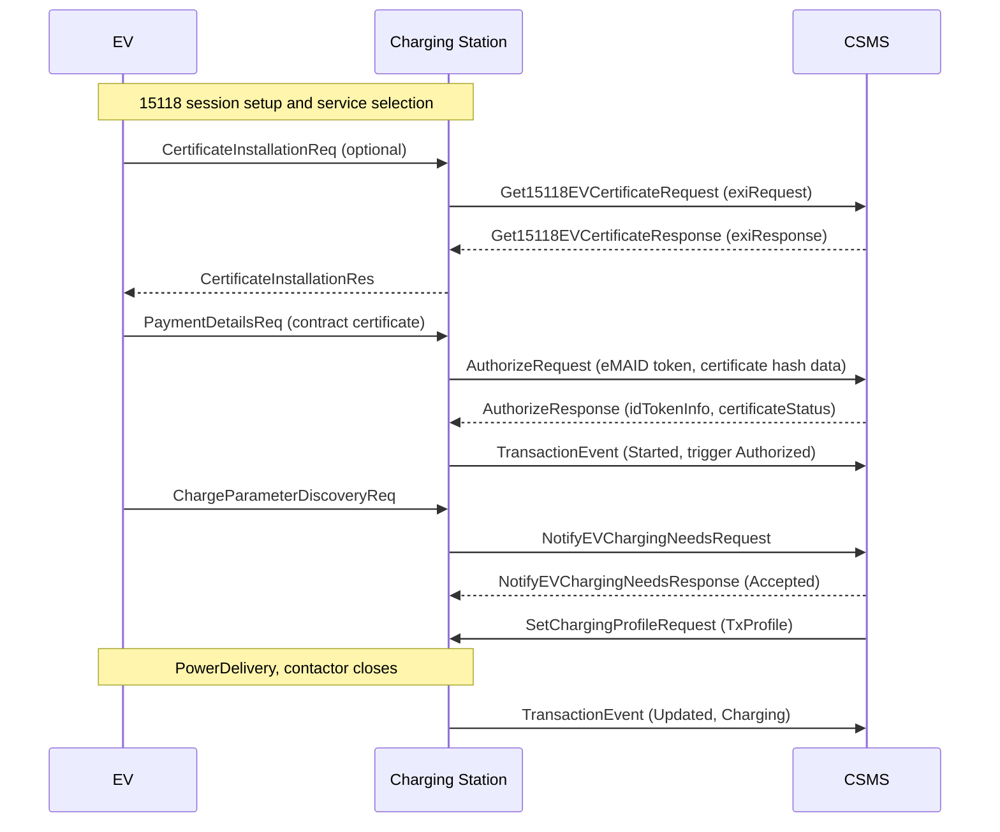

# Module 12: ISO 15118 and Plug and Charge

Module 11 ended with a list of ISO 15118 hooks in OCPP 2.0.1: certificate messages, an eMAID token type, a message that reports what a car needs. This module is about the protocol on the other side of those hooks. Through everything so far, the vehicle has been nearly mute. In Module 2 it spoke in resistor values and pulse widths: connected, ready, drawing this many amps. Identity, price, and schedule all lived between the station and the backend, and the driver carried the identity in a card or an app. ISO 15118 gives the car itself a digital voice, and Plug and Charge is the headline act that voice makes possible.

A sourcing note before we start. The ISO texts are paid documents, so this module stays conceptual and teaches 15118 the way a working OCPP engineer usually meets it: through the integration chapters of OCPP 2.0.1, which are free after registration and which specify exactly how a 15118 session maps onto backend messages. Where I state what an ISO part covers, that comes from the public catalog abstracts.

## What you'll learn

- What ISO 15118 is, how its parts divide the work, and where it sits on the pilot line
- What high-level communication adds: identification, negotiation, and eventually bidirectional power
- How Plug and Charge works, and why the certificate machinery is the commercially hard part
- How a 15118 session maps onto OCPP 2.0.1 messages, with a worked Authorize exchange
- EIM and Autocharge, the identification paths that do not need certificates
- What 15118-20 adds and where OCPP support for it stands

## The standard in parts

ISO 15118 is a joint ISO and IEC standard, as Module 3 noted, and work on the series started in 2009 with the aim of a high-level communication interface working in conjunction with IEC 61851 (OCPP 2.0.1 Part 2, functional block M, chapter 1). The phrase "high-level communication" is doing real work there. OCPP's own terminology defines it as bidirectional digital communication, protocol and messages plus the physical and data link layers, per the ISO 15118 series (OCPP 2.0.1 Part 2, section 2.2). Physically, it is the arrangement Module 2 promised: a digital channel carried as a high-frequency signal on the same control pilot wire, layered on top of the analog IEC 61851 floor, never replacing it.

The two endpoints get names you will meet constantly. The controller in the car is the EVCC, the EV Communication Controller; its counterpart in the charging equipment is the SECC, the Supply Equipment Communication Controller (OCPP 2.0.1 Part 2, section 2.3). The series itself splits the work across parts:

| Part | Published | What it covers |
| --- | --- | --- |
| ISO 15118-1 | 2019 (edition 2) | general information and use case definitions |
| ISO 15118-2 | 2014 | the network and application protocol: messages, XML/EXI encoding, V2GTP, TLS, TCP, IPv6 |
| ISO 15118-3 | 2015 | physical and data link layer requirements for the wired interface |
| ISO 15118-20 | 2022 | second generation network and application layer, including bidirectional power transfer |

Those scopes and dates are from the ISO catalog pages linked at the end. Two details worth pulling out. Part 3 covers only IEC 61851 mode 3 and mode 4 equipment fitted with a high-level communication module, which is to say dedicated AC and DC hardware, not a household socket. And 15118-2's message set moves energy in one direction, from EVSE to EV; making the current flow backward is what the -20 generation exists for.

## What the digital channel buys

Once car and station share a proper protocol instead of a pulse width, three families of capability open up. The first is identification: authorization for charging can come either through External Identification Means, EIM, such as an RFID card, or through the Plug and Charge mechanism using a contract certificate stored in the vehicle (OCPP 2.0.1 Part 2, functional block M, chapter 1). The second is smart charging with the car as a participant: 15118 exchanges charging schedules, so the EV can state its needs and plans instead of silently obeying a current limit. OCPP 2.0.1's own introduction names exactly these two, Plug and Charge and smart charging including input from the EV, as what its 15118 support adds (OCPP 2.0.1 Part 0, section 2.5). The third, bidirectional power transfer, is sketched in the 15118-1 use cases but only becomes a specified message flow in -20.

The use cases OCPP considers relevant give a feel for the surface area: certificate installation and update, authorization, load leveling, and the charging loop itself, including a vehicle-to-grid support case (OCPP 2.0.1 Part 2, functional block M, chapter 3, Table 115). There is even a use case for the CSMS remotely stopping a 15118 session (OCPP 2.0.1 Part 2, use case F04).

Keep the scale honest, though. The same chapter that introduces all this expects that for years to come most EVs will support only the IEC 61851 pilot signal, which is why OCPP keeps smart charging fully functional on the analog floor alone (OCPP 2.0.1 Part 2, functional block M, chapter 1).

## Plug and Charge and the certificate machinery

The pitch is simple: the customer plugs in, and authentication, authorization, load control, and billing all happen with no further interaction, secured by digital signatures and X.509 certificates in a PKI (OCPP 2.0.1 Part 2, functional block M, section 2.1). The car carries a contract certificate, issued by a Mobility Operator, the MO, which is the 15118 name for the contract-holding party Module 4 called an eMSP. Together with that certificate the MO issues an eMAID, an e-mobility account identifier naming the contract, and the certificate's signature protects the eMAID against tampering (same section). Present the certificate, prove you hold its key, and the billing relationship is established. No card, no app.

Getting the messages right is the easy half. The hard half is trust. Four PKIs need to be in place for Plug and Charge to work: one for the charging station operator, one for the Certificate Provisioning Service (CPS) that delivers contract certificates into vehicles, one for the MO, and one for the vehicle manufacturer, the OEM (OCPP 2.0.1 Part 2, functional block M, section 2.1). A V2G Root CA anchors the operator and CPS hierarchies, while the OEM and MO may run their own roots or derive theirs from a V2G root (same section). Read that again as an organizational statement rather than a technical one: carmakers, charge point operators, contract providers, and provisioning services, industries that do not share ownership or incentives, must all participate in one interlocking certificate hierarchy before a single plug-in payment works. The specification shows the structural burden plainly; commercial root programs exist to coordinate it, and coordination of that shape is slow. That, more than any protocol detail, is why Plug and Charge has taken years to spread.

Provisioning is its own defined process: the EV can request or update its contract certificate during a session. When the car sends a 15118 CertificateInstallationReq, the station forwards it to the CSMS wrapped in Get15118EVCertificateRequest with action Install, or Update for the renewal case, and the CSMS passes it onward to a party such as a contract certificate pool (OCPP 2.0.1 Part 2, use cases M01 and M02). The payload field is instructive: exiRequest is the car's raw EXI message, Base64 encoded, up to 5600 characters (OCPP 2.0.1 Part 2, messages section 1.16). OCPP is a courier here. It never parses the certificate installation data; it moves an opaque 15118 payload between car and backend. The 15118 side allows 5 seconds for this round trip (M01 remarks), which sets the tone for everything else.

Tight timeouts are also why revocation checking works the way it does. A station cannot verify two things on its own: whether an eMAID is actually authorized, which only the MO can say, and whether each certificate in a chain has been revoked (OCPP 2.0.1 Part 2, functional block M, section 2.1). Revocation status comes via OCSP, the Online Certificate Status Protocol, but the 15118 timeouts are too strict for a live OCSP round trip at plug-in. So OCPP requires the station to cache OCSP results ahead of time, refreshing at least once a week and after certificate updates, one status request per sub-CA (OCPP 2.0.1 Part 2, use case M06).

The station holds certificates of its own. Its 15118-side TLS certificate, which OCPP calls the V2GChargingStationCertificate, must derive from a V2G root and, per ISO 15118, should be valid for only two to three months (OCPP 2.0.1 Part 2, functional block M, sections 2.1 and 2.2). Alongside it sit the V2G root certificate and, for contracts not derived from a V2G root, MO root certificates. The dependency is absolute: if the EV does not know the station's V2G root, no 15118 connection is possible at all (same section 2.2). The station's 15118 certificate is provisioned through the same certificate signing request flow used for its OCPP-side certificate, which Module 10 covered (OCPP 2.0.1 Part 2, use case M05 remarks). One related note from the spec: it strongly recommends running OCPP itself on one of the TLS security profiles, since carrying certificate material over an unsecured backend link undermines the 15118 security model (OCPP 2.0.1 Part 2, functional block M, chapter 1).

## A Plug and Charge session on the wire

Here is the whole shape of a session, paraphrasing the sequence OCPP 2.0.1 itself illustrates (OCPP 2.0.1 Part 2, functional block M, chapter 1, Figure 120). The left-hand conversation is ISO 15118 between car and station; everything to the right is ordinary OCPP.



The authorization step is use case C07 (OCPP 2.0.1 Part 2, use case C07). When the EV presents its contract certificate, the station sends an AuthorizeRequest whose idToken carries the eMAID, plus the hash data the CSMS needs for an OCSP check of the contract certificate chain. The CSMS verifies validity using real-time or cached OCSP data. If the station lacks the root needed to validate the chain locally, and the configuration variable CentralContractValidationAllowed permits it, the station passes the entire PEM-encoded chain in the request's certificate field for the CSMS to validate instead. On the wire, a minimal exchange looks like this:

```json
[2, "801", "Authorize", {
  "idToken": {
    "idToken": "DE8AACA2B3C4D5",
    "type": "eMAID"
  },
  "iso15118CertificateHashData": [{
    "hashAlgorithm": "SHA256",
    "issuerNameHash": "b0c1e28e3c9f5f1a7d42a6520a3b7f0c9d8e1f2a3b4c5d6e7f8091a2b3c4d5e6",
    "issuerKeyHash": "2f6a1c0d9e8b7a6f5e4d3c2b1a09f8e7d6c5b4a392817061504f3e2d1c0b0a91",
    "serialNumber": "4d2af0a9c3e1",
    "responderURL": "https://ocsp.mo.example.com"
  }]
}]
```

```json
[3, "801", {
  "idTokenInfo": { "status": "Accepted" },
  "certificateStatus": "Accepted"
}]
```

The frame shapes are the same CALL and CALLRESULT arrays Module 6 taught for 1.6 (OCPP 2.0.1 Part 4, sections 4.2.1 to 4.2.3). The response carries two verdicts on purpose: certificateStatus judges the certificate chain, with outcomes including CertificateExpired, CertificateRevoked, CertChainError, and ContractCancelled for an invalid or blocked eMAID, while idTokenInfo.status judges the account itself, and charging proceeds only when the token status is Accepted (OCPP 2.0.1 Part 2, use case C07 and enumerations section 3.4). Offline behavior is spelled out too: with ContractValidationOffline enabled the station validates the chain locally and falls back to the local list and cache mechanisms from earlier modules, and without it there is no offline Plug and Charge at all (C07 requirements). Contrast all this with 1.6, where an Authorize request is a single idTag string of at most 20 characters with no token type. There is no native Plug and Charge path in OCPP 1.6; this is a 2.0.1 capability.

Smart charging negotiation rides the same pattern. When the EV asks for charging parameters, the station reports the car's stated needs, AC or DC parameters included, to the CSMS in NotifyEVChargingNeedsRequest, and the CSMS answers by installing a TxProfile via SetChargingProfileRequest, which the station translates into the 15118 schedule format for the car (OCPP 2.0.1 Part 2, use case K15). The CSMS should respond within 60 seconds, because that is as far as the 15118 discovery timeout can stretch (K15 requirements). If the EV proposes its own charging profile, the station must check it against the CSMS schedule and forward it upstream (K15 requirements). Renegotiation exists in both directions, CSMS-initiated and EV-initiated (OCPP 2.0.1 Part 2, use cases K16 and K17). One terminology trap to file away: what 15118 calls a ChargingProfile is the EV's plan, closest to an OCPP ChargingSchedule, while a 15118 SASchedule corresponds roughly to the OCPP ChargingProfile (OCPP 2.0.1 Part 2, section 2.2, Table 3). Same words, swapped meanings, and cross-team conversations regularly trip over it.

## When there is no certificate: EIM and Autocharge

EIM, External Identification Means, is 15118's name for every identification method that is not Plug and Charge: cards, apps, whatever the earlier authorization modules described. Use case C08 covers authorization over a 15118 session using EIM, and the spec is refreshingly blunt that nothing much changes: all the usual identification flows apply, and "The only difference is the availability of 15118 communication" (OCPP 2.0.1 Part 2, use case C08). EIM is also the designed fallback. When a station is offline and cannot check certificate status, the spec recommends omitting the contract payment option from the 15118 service discovery and reverting to EIM (OCPP 2.0.1 Part 2, use case C07 remarks).

Autocharge deserves a mention because the market uses the word loosely. OCPP 2.0.1's token type list includes MacAddress, the EVCC's MAC address used as an identifier, and the spec's own description names Autocharge (OCPP 2.0.1 Part 2, enumerations section 3.43). That is identification by hardware address: no certificates, no signatures, none of the cryptographic guarantees of Plug and Charge, just a recognizable car. Simpler to deploy, weaker in kind. Keep the two distinct when someone says "the car authorizes itself."

## 15118-20 and where OCPP stands

Everything above describes the -2 generation, and OCPP 2.0.1 is explicitly written against it: Get15118EVCertificate is based on the 15118-2 certificate installation messages, and the reference session sequence is titled against 15118-2 (OCPP 2.0.1 Part 2, messages section 1.16 and functional block M, chapter 1). ISO 15118-20, published in 2022 at 561 pages, defines the second generation: messages and sequences for bidirectional power transfer, wireless communication requirements, automatic connection devices, and information services, per its catalog abstract. An Amendment 1 arrived in 2026 covering an AC DER service, an MCS service, and security improvements, again per the catalog page.

OCPP support for -20 lands in version 2.1, whose introduction names ISO 15118-20 support, extensive bidirectional power transfer, and control of stations and EVs as distributed energy resources among its most important new features (OCPP 2.1 Part 0, chapter 2). The certificate and authorization use cases gain -20 flows, new smart charging use cases cover the -20 scheduled and dynamic control modes, and two new functional blocks appear: one for bidirectional power transfer and one for DER control, the latter designed to work with IEC 61850 and IEEE 2030.5 on the grid side and 15118-20 Amendment 1 on the vehicle side (OCPP 2.1 Part 0, chapters 2 and 3). Module 11's caution stands: 2.1 is early, and this paragraph is a map, not a deployment report.

## AC, DC, and the field today

The certificate machinery itself does not care which current flows: the spec notes its illustrative sequence happens to be AC precisely because certificate handling is the same either way (OCPP 2.0.1 Part 2, functional block M, chapter 1). ISO 15118-3 covers both dedicated AC and DC equipment, provided a high-level communication module is present. In the field, though, the picture is lopsided. Module 4 already observed that the second, digital conversation on the pilot line is a newer-DC-hardware phenomenon, and Plug and Charge deployments today are found mostly on DC fast charging, with AC deployments rarer. Treat that as a market observation to check against current sources, not a rule from any standard. The spec's own expectation that most EVs will speak only the analog pilot for years points the same direction. The analog floor from Module 2 is still where most sessions live; 15118 is the ceiling being built above it, one certificate program at a time.

## Key takeaways

- ISO 15118 is the digital conversation between the EVCC in the car and the SECC in the station, carried on the same pilot line as, and layered above, the analog IEC 61851 signaling. The -2 generation is what today's integrations target; -20 is the second generation.
- Plug and Charge is authorization by contract certificate: the car presents a certificate binding it to a Mobility Operator contract, identified by an eMAID, and signatures replace cards and apps.
- The hard part is trust, not messages: four PKIs (operator, CPS, MO, OEM) must interlock across industries, with the operator and CPS hierarchies anchored by a V2G root, and stations must pre-cache OCSP status because 15118 timeouts are too short for live checks.
- OCPP 2.0.1 acts as the courier and the judge: it forwards opaque EXI certificate payloads it never parses, and it carries the eMAID as a first-class token type through the C07 authorization flow with separate verdicts for the certificate chain and the account.
- The EV becomes a smart charging participant: charging needs flow up as NotifyEVChargingNeeds and a TxProfile comes back within a 60 second window, with renegotiation possible from either side.
- EIM is the designed fallback whenever certificates cannot be checked, and Autocharge, identification by MAC address, is a separate, weaker mechanism despite the similar pitch.
- OCPP 1.6 has no native Plug and Charge path; this is a 2.0.1 capability, and 15118-20 support arrives with OCPP 2.1.

## Try it

> Register for free on the Open Charge Alliance protocols page and download the OCPP 2.0.1 bundle. Open Part 2 and find functional block M, Certificate Management, where the ISO 15118 certificate chapters live. Read section 2.1 on the four PKIs, then find Figure 120 and trace each message in the sequence, sorting them into the two conversations: 15118 between EV and station on one side, OCPP between station and CSMS on the other. Finish in the appendices at the ISO15118Ctrlr component, and match each variable to a behavior from this module: PnCEnabled to the C07 flow, CentralContractValidationAllowed to the pass-the-chain-upstream path, ContractValidationOffline to the offline rules. No hardware needed, and you will have read the same pages an implementer reads.

## Further reading

- [Open Charge Alliance protocols page](https://openchargealliance.org/protocols/open-charge-point-protocol/), where the OCPP 2.0.1 bundle is available after free registration; functional block M and use cases C07, C08, and K15 are this module's primary sources.
- The ISO catalog entries for ISO 15118-1:2019 (general information and use cases), ISO 15118-2:2014 (the network and application protocol OCPP 2.0.1 integrates), ISO 15118-3:2015 (physical and data link layers), and ISO 15118-20:2022 (the second generation, including bidirectional power transfer). Search iso.org for each part number; the texts are paid, and the catalog pages carry the abstracts.

---

Previous: [Module 11: OCPP 2.0.1 and beyond](11-ocpp-201-and-beyond.md) | [Contents](../README.md) | Next: [Module 13: Why chargers break: failure patterns](13-why-chargers-break.md)
