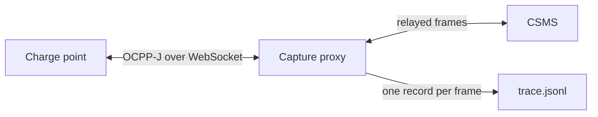

# Module 14: Tracing and observability

Module 13 defined sixteen failure patterns, and every one of them came down to what the wire looks like: a Faulted status arriving mid-session, a CALL that never gets its response, a meter reading that runs backwards. That framing quietly assumed you have the wire in front of you. This module is about earning that assumption. It covers how OCPP traffic gets captured, why two recordings of the same session can disagree, and what shape a recording should take so that tools, colleagues, and bug reports can all point at the same facts.

## What you'll learn

- Why a frame-level trace is stronger evidence than any log file
- The available capture points (station, backend, proxy in the middle) and the different truth each one sees
- Why timestamps and ordering are a trace's weakest point, and what honest tooling does about it
- The interchange problem: what it costs when every tool records in its own private format
- How Open OCPP Trace v1.1 structures one record per frame, and the conditional rules its schema enforces
- How reference fixtures and a conformance runner make a format trustworthy
- The producer and consumer tools that exist today, plus the no-tools path with jq

## Why traces beat logs

A log line is a program's opinion about what happened. It paraphrases, it truncates, it omits the fields the developer did not think mattered, and it disappears entirely when the code path that writes it is the code path that failed. A trace is different in kind: it records the frames themselves, the exact JSON arrays that crossed the WebSocket. When a station and a backend disagree about a session, their logs will each support their own side. The frames settle it.

This is why the strongest traces keep the verbatim frame text alongside any parsed view of it. A byte-exact copy is the only lossless representation: it can be hashed, deduplicated, and re-parsed later, and it keeps the malformed frames that break the OCPP schema, which are frequently the exact frames you care about. Any parsed, decomposed view is a derived artifact. Useful, but derived.

One structural fact drives everything else in this module. An OCPP-J frame carries no timestamp of its own: the three envelope shapes from Module 6 have no time field. Some payloads contain timestamps, but those are the sender's application clock making a claim, not a record of when the frame crossed the wire. Wire time has to come from whoever captured the frame, which means every trace is really two things glued together: the frames, and somebody's clock.

## Capture points, and the truth each one sees

There are four realistic places to capture OCPP traffic: the station's own logs, the CSMS's logs, a WebSocket proxy sitting between them, and a raw network capture. A fifth, manual reconstruction from support tickets and screenshots, is common in practice and worst in quality. Each point sees a different truth. An endpoint records what it believes it sent and received, on its own clock, filtered through its own logging code. A proxy sees what actually passed between the two parties, but it adds a network hop and stamps frames with a third clock that belongs to neither endpoint.



The proxy topology is the cleanest man-in-the-middle view, and a simulated or well-instrumented charge point can also write its trace directly at the endpoint, with no proxy involved. What matters is knowing which view you are holding, because the capture layer leaves fingerprints. Real capture files show the symptoms: some timestamps in ISO 8601, others in epoch milliseconds, some missing; entries out of order because a log buffer flushed late; a response stamped with the same timestamp as its call because one log write covered both.

Ordering deserves particular suspicion. An analyzer can detect that timestamps run backwards, but it cannot honestly correct clock skew between a station and a backend it never observed. The defensible behavior, and the one I hold tooling to, is to preserve capture order, flag the inversions, and refuse to silently reorder. A tool that quietly sorts by timestamp is manufacturing a sequence of events that may never have happened.

## The interchange problem

Until recently, every tool in this niche recorded traffic in its own private shape. I can document the fragmentation from projects I know from the inside. OCPP DebugKit, the trace analysis toolkit and Studio desktop debugger I maintain, accepts three input shapes of its own: a JSON object carrying metadata plus events, a bare JSONL stream of timestamped events, and a degenerate array form. shiv3's charge point simulator has a JSON log-line format that is not the same as its trace output. Studio's live capture writes the toolkit's native event JSONL directly. Three collaborating projects, four formats, and that is before you count any commercial CSMS's export dump or any station vendor's log syntax.

The cost lands on everyone. A trace captured by one tool cannot be opened in another without a converter, so with N producers and M consumers you are staring at N times M converters that nobody wants to write or maintain. Bug reports between companies degrade into screenshots because there is no file both sides can load. Anyone building an analyzer spends their effort on parsers instead of analysis. None of this is unique to charging; any protocol niche without a shared capture format pays the same tax.

## Open OCPP Trace: one record per frame

The response to that fragmentation is Open OCPP Trace, a small neutral interchange format that I helped design. It grew out of a public design thread on the simulator's issue tracker (shiv3/ocpp-cp-simulator issue 188), and its goal is exactly the decoupling the previous section asked for: producers and consumers agree on the records, not on each other's internal models. The format deliberately lives in its own repository, github.com/open-ocpp-trace/specification, on the reasoning that a contract shared by competing tools should not sit under any one tool's roof or follow any one project's release schedule. The spec text is CC-BY-4.0 and the schema, fixtures, and conformance code are Apache-2.0. One honest caveat on where things stand: the machine-readable schema, the fixtures, and the conformance rules live in the specification repo today, while the prose description of the record shape still lives in the simulator's docs until it migrates.

Mechanically, the format is boring on purpose. A trace is JSONL: one JSON record per line, one record per OCPP-J frame, in capture order. A JSON array of records is also legal for embedding. Five fields are required on every record: `schemaVersion`, `timestamp`, `transport` (`json` or `soap`), `direction` (`cp-to-csms` or `csms-to-cp`), and `messageType` (`CALL`, `CALLRESULT`, or `CALLERROR`). Everything else is optional: `ocppVersion`, `chargePointId`, `connectorId`, `messageId`, `action`, `payload`, the verbatim `raw` string, a structured `error` object, and a `meta` object for extensions. Two conditional rules carry real weight: a CALL record must include `action`, a CALLERROR must include `error`, and `error` is forbidden on anything that is not a CALLERROR.

Here is a boot exchange as two constructed records, line-wrapped only by your screen:

```json
{"schemaVersion":"1.1","timestamp":"2026-03-02T08:14:07.412Z","ocppVersion":"1.6","transport":"json","chargePointId":"cp001","direction":"cp-to-csms","messageType":"CALL","messageId":"42","action":"BootNotification","payload":{"chargePointVendor":"VendorX","chargePointModel":"VX-22"},"raw":"[2,\"42\",\"BootNotification\",{\"chargePointVendor\":\"VendorX\",\"chargePointModel\":\"VX-22\"}]"}
{"schemaVersion":"1.1","timestamp":"2026-03-02T08:14:07.688Z","ocppVersion":"1.6","transport":"json","chargePointId":"cp001","direction":"csms-to-cp","messageType":"CALLRESULT","messageId":"42","payload":{"currentTime":"2026-03-02T08:14:07Z","interval":300,"status":"Accepted"},"raw":"[3,\"42\",{\"currentTime\":\"2026-03-02T08:14:07Z\",\"interval\":300,\"status\":\"Accepted\"}]"}
```

Notice what the second record does not carry: an `action`. A CALLRESULT is anonymous on the wire, exactly as Module 6 explained, so the format treats `action` on responses as derived data. A consumer back-fills it by correlating `messageId` 42 to the earlier CALL, and if a producer does write `action` on a response, it must equal the correlated CALL's action. Notice also that both records keep `raw`, the verbatim frame, next to the decomposed fields; when the two disagree, the verbatim frame is the authority.

Versioning follows rules worth stealing for any format you ever design. New optional fields bump the minor version, and consumers must ignore unknown fields, so a v1.1 reader survives a v1.2 file. Changing a field's meaning, or removing one, is a new major version. Producer extensions go in `meta`, never in undeclared top-level fields. A published version is immutable: any change that alters conformant output is a new version, not an edit. The changelog so far is short: v1.0 was the proof of concept, and v1.1 added `raw`, pinned down the derived `action` semantics, and wrote the versioning rules themselves down. The format also has a known hole, stated openly in its own docs: because `messageType` is required, a frame that does not parse as an OCPP-J array at all cannot yet be represented, and that remains an open question in the spec repo.

## Fixtures and conformance: how a format earns trust

A schema alone proves little, because two implementations can both validate against it and still disagree about what a trace means. The specification repo's answer is a corpus: 16 fixture directories, each holding a `trace.jsonl` and an `expected.json` that pins the consumer view a correct reader must derive. The names will look familiar after Module 13: normal-session, failed-auth, connector-fault, station-offline, meter-value-gap, unresponsive-csms, and so on through the failure families, plus an orphan-response fixture where capture started mid-session. All the data is synthetic, seeded from the DebugKit scenario suite and converted record by record. The responses deliberately omit `action`, so a consumer cannot pass by copying fields; it has to do the correlation.

Conformance is stated as short rule lists rather than prose sprawl. A producer must emit schema-valid records, include verbatim `raw` whenever the original bytes were available (and it must decode to the same frame the record decomposes), put `action` on every CALL, and confine extensions to `meta`. A consumer must accept any schema-valid record while ignoring unknown fields, and must derive each fixture's expected view exactly. The correlation rule is precise: a response matches the most recent preceding CALL with the same `messageId`, the opposite direction, and no prior match; a response with no such CALL is an orphan, and a CALL with no response by end of trace is unanswered. A self-check runs in CI on every push, so a fixture and its expected view cannot silently diverge. The corpus is honest about its gaps too: no CALLERROR records yet, no messageId reuse, no multi-charge-point traces, no OCPP 2.0.1 sessions, no SOAP, no malformed frames.

## What a good trace enables

Once sessions exist as portable files, workflows appear that logs never supported. You can replay a trace deterministically, stepping forward and backward through a failure without hardware. You can diff two traces, say the same station before and after a firmware update, and see behavior change as a delta rather than a hunch. You can anonymize a trace and attach it to a bug report that a stranger at another company can load into their own tooling. And you can put traces in CI: run a producer, validate its output against the schema and fixtures, and fail the build when conformance breaks. Module 3 argued that certification proves conformance in a lab, not correctness in the field. The trace file is the artifact that closes that gap, because it carries the field's actual behavior back to a desk where someone can study it.

## The tools that exist today

The honest inventory is short, which is itself useful information about how young this corner of the industry is. On the producer side, shiv3's simulator, which returns in the capstone module, writes the format directly: its `--trace-output` flag appends one record per wire message in its REPL, JSON, and daemon modes, with SOAP transport not captured yet. On the consumer side, the DebugKit toolkit reads the format by auto-detection, derives the conformance consumer view, and writes the format back out; its `convert` command turns any trace it can parse into v1.1 records, and events the format cannot represent are skipped with a warning rather than invented. The browser inspector at ocppdebugkit.com runs the same parser client-side, so a trace dropped into it never leaves your machine. One precision worth stating because I maintain both tools: Studio's `capture` command is a live WebSocket proxy that records in DebugKit's own native JSONL, not in Open OCPP Trace; the path to the interchange format is to capture with Studio and then run the toolkit's `convert` on the result. Both directions of the toolkit's support are checked in CI against the specification's fixtures.

None of this requires my tools or anyone else's. Any WebSocket proxy or logging middleware can capture the traffic, and because the format is plain JSONL, any JSONL-aware tooling consumes it. Here is a complete no-tools analyzer, counting error frames in a trace:

```bash
jq -s 'map(select(.messageType=="CALLERROR")) | length' trace.jsonl
```

Against the public normal-session fixture this returns 0, and swapping `CALLERROR` for `CALL` returns 11, matching the counts pinned in that fixture's `expected.json`. A proxy to capture and jq to query is a legitimate observability stack, and everything else is convenience on top.

## Key takeaways

- A log is a program's opinion; a trace is the frames themselves. Keeping the verbatim frame text is the only lossless choice, and it preserves exactly the malformed frames you most need.
- OCPP-J envelopes carry no timestamps, so wire time always comes from the capture layer, and every capture point (station, backend, proxy) sees a different truth on a different clock.
- Honest tooling preserves capture order and flags timestamp inversions; silently reordering by timestamp fabricates history.
- Tool-private dump formats create a producers-times-consumers converter problem; a neutral interchange format collapses it to one format per side.
- Open OCPP Trace v1.1 is JSONL with one record per frame, five required fields, derived `action` on responses, extensions confined to `meta`, and immutable published versions.
- Trust comes from the corpus: 16 synthetic fixtures with pinned expected views, four producer rules, two consumer rules, and a CI self-check, with coverage gaps listed openly.
- The format works without any particular tool: any proxy can produce it, and jq alone can consume it.

## Try it

> Open the Open OCPP Trace specification repo on GitHub (linked below) and read `schema/trace-v1.schema.json`; it is 52 lines, and you now know every field in it. Then open `fixtures/normal-session/trace.jsonl` and look at the CALLRESULT records: none carries an `action`. Pick three of them and work out each one's action by matching its `messageId` to an earlier CALL, then check your answers against `expected.json` in the same directory, which lists each record's derived action and the index of the CALL it correlates with. If you have jq installed, download the trace file and reproduce the counts: 22 records, 11 calls, 11 results, 0 errors.

## Further reading

- [Open OCPP Trace specification](https://github.com/open-ocpp-trace/specification), the schema, fixtures, and conformance rules for the interchange format.
- [Trace format prose specification](https://github.com/shiv3/ocpp-cp-simulator/blob/main/docs/trace-format.md), the record-shape and versioning text, currently hosted in the simulator's docs.
- [OCPP DebugKit toolkit](https://github.com/ocpp-debugkit/toolkit), the trace analysis library and CLI used in this module, which reads and writes the format.
- [OCPP DebugKit Studio](https://github.com/ocpp-debugkit/studio), the desktop debugger whose capture proxy records live sessions.
- [JSON Lines](https://jsonlines.org/), the one-record-per-line convention the trace format builds on.
- [jq manual](https://jqlang.org/manual/), the reference for the query language used in the no-tools path.

---

Previous: [Module 13: Why chargers break: failure patterns](13-why-chargers-break.md) | [Contents](../README.md) | Next: [Module 15: The open-source ecosystem](15-the-open-source-ecosystem.md)
