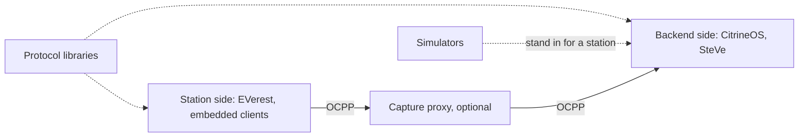

# Module 15: The open-source ecosystem

Module 14 ended on an argument about neutrality: capture and analysis tools work better when they agree on a format instead of a vendor. That argument only pays off if there are independent tools worth connecting, and there are. Nearly every layer of the stack this handbook has covered exists as open source you can read tonight: complete backends, full station firmware, protocol libraries in half a dozen languages, simulators, and debugging tools. A mature implementation is the fastest teacher after the specification itself, because the code shows what the field actually does with the ambiguities. This module is a guided map of that code.

A word on method, because a chapter like this ages. Every project here was verified live while writing: the repository exists, carries the license I name, and showed the activity I describe as of mid-2026. Projects stall, move, and get renamed, so treat this as a dated snapshot and check before you build on anything. I describe size in rough words rather than star counts, which go stale the day they are printed, and I list projects alphabetically within each section, because this is a map, not a ranking. Where a project is mine, or built by people I work with, the entry says so.

## What you'll learn

- Which open CSMS platforms exist, and how SteVe and CitrineOS split the 1.6 and 2.0.1 eras between them
- What runs on the station side, from a full Linux firmware framework to a client that fits on a microcontroller
- The protocol libraries available per language, and the signals that tell you whether a project is alive
- Five simulators that stand in for a charge point, and what each is for
- Where capture and analysis tools fit, and why OCTT sits beside the open ecosystem rather than inside it
- Why a project's license is part of the technical decision
- How to pick a starting point for your role: operating chargers, building one, or building tools

## Backends: the open CSMS platforms

First, orientation. Here is where each category in this module sits on the link you have been studying since Module 4: libraries feed both ends, simulators stand in for the station, and capture tools sit on the wire.

Two open platforms anchor the backend side, and they split neatly along the version divide from Module 11.

[CitrineOS](https://github.com/citrineos/citrineos-core) is the modern one. Initiated by S44 and hosted by LF Energy, the Linux Foundation's umbrella for open-source energy projects, it is a TypeScript CSMS built around OCPP 2.0.1 from the start, with schema validation of both 1.6 and 2.0.1 messages, message routing, an operator web interface, and a generated OpenAPI description of its own APIs. LF Energy pitches it at OCPP 2.0.1 and NEVI-compliant charge management, which ties it directly to the regulatory pull from Module 3, and the project's main repository README describes testing through OCA's OCTT. Apache-2.0 licensed, it is the natural place to see what a 2.0.1-first backend architecture looks like.

[SteVe](https://github.com/steve-community/steve) is the long-standing reference. It began at RWTH Aachen University in 2013, takes its name from the German Steckdosenverwaltung (socket administration), and has served since as an open platform for running, testing, and studying charge point management. It is a Java application backed by MySQL or MariaDB, covers OCPP 1.2 through 1.6 in both SOAP and JSON transports, and implements the 1.6 Security Whitepaper in full: the whitepaper's security profiles, certificate management, security events, and signed firmware updates (Module 10). It does not speak OCPP 2.x at all, which is itself a lesson in how much of the deployed world still runs 1.6. It is GPL-3.0 licensed, with a large following for this niche.

Its README also carries the tidiest real-world demonstration of Module 3's certified-versus-correct distinction that I know of. A commercial backend incorporates SteVe's OCPP implementation unmodified and has passed OCA certification, and the README states plainly that the certificate applies to that certified product and version, not to SteVe as a standalone open-source distribution. The same code is certified in one wrapper and uncertified in another, because certification attaches to a product, a version, and a test run, never to code in the abstract.

## Station-side stacks, from Linux firmware to microcontrollers

[EVerest](https://github.com/EVerest/EVerest) covers the other side of the cable. Also hosted by LF Energy and initiated by PIONIX, it is a modular framework for the software that runs on the charging station itself: OCPP 1.6, 2.0.1 and 2.1 toward the backend; ISO 15118-2, -3 and -20, DIN SPEC 70121 and IEC 61851 toward the vehicle; hardware drivers for power meters, RFID readers and DC power supplies; energy management; and Yocto support for embedded Linux images. Its modules communicate over an internal MQTT bus, so a manufacturer can swap one part without forking the rest. It aims at the whole station box from Module 4's map, AC and DC alike. Apache-2.0.

[MicroOCPP](https://github.com/matth-x/MicroOcpp) answers a narrower question: what if the charger cannot run Linux at all? It is a C/C++ OCPP client for microcontrollers, MIT licensed, running on Espressif, Arduino, NXP and STM platforms, with published benchmarks on the order of a hundred kilobytes of flash on an ESP32. It implements all OCPP 1.6 feature profiles plus the basic 2.0.1 use cases, its README claims interoperation with fifteen or more commercial central systems, and it serves as the OCPP layer in OpenEVSE firmware. It grew out of an earlier project called ArduinoOcpp, is widely used for its niche, and comes with a companion simulator you will meet below.

[OpenOCPP](https://github.com/ChargeLab/OpenOCPP), from ChargeLab, is a second embedded option: multi-platform OCPP 1.6 and 2.0.1 software for charging stations, Apache-2.0. Mind the name. It is unrelated to c-jimenez/open-ocpp, a C++ library in the next section, and unrelated to the Open OCPP Trace format from Module 14 (the interchange format I helped design). Three projects, three meanings, one crowded name.

One practical note for anyone starting on this side: OCA itself has pointed builders at these stacks. Its 2025 OCPP Grand Challenge event bundled free OCTT access for participants and named MicroOCPP and OpenOCPP as suggested foundations. That was a time-boxed event, not a standing program, but it is telling that the protocol's own steward treats the open embedded stacks as legitimate starting points; check the OCA site for current programs.

## Protocol libraries by language

When you build tooling, a station, or a backend of your own, you rarely want to reimplement framing, schema validation, and request dispatch; Module 6 showed how much care that layer demands. Mature libraries exist across the mainstream languages.

| Project | Language | OCPP versions | License | Note |
| --- | --- | --- | --- | --- |
| [Java-OCA-OCPP](https://github.com/ChargeTimeEU/Java-OCA-OCPP) | Java | 1.6 (JSON and SOAP), 2.0.1, 2.1 | MIT | a library for building either side of the link |
| [ocpp](https://github.com/mobilityhouse/ocpp) | Python | 1.6, 2.0.1 | MIT | widely used; clean maintainer succession |
| [ocpp-go](https://github.com/lorenzodonini/ocpp-go) | Go | 1.6, 2.0.1 | MIT | JSON transport only; release cadence has slowed |
| [ocpp-rpc](https://github.com/mikuso/ocpp-rpc) | Node.js | 1.6, 2.0.1, 2.1 (JSON) | MIT | the RPC layer, with reconnects and security profiles 1 to 3 |
| [open-ocpp](https://github.com/c-jimenez/open-ocpp) | C++ | 1.6, 2.0.1 | LGPL-2.1 | not the same project as ChargeLab's OpenOCPP |
| [rust-ocpp](https://github.com/tommymalmqvist/rust-ocpp) | Rust | 1.6, 2.0.1; 2.1 in progress | Apache-2.0 | message types validated against the official schemas |

Judging whether a project is alive is a skill, and two entries here teach it. The Python library shows the healthiest signal a project can give: its founding maintainers handed it to a named successor team at the end of 2024 and development carried on. A clean succession is stronger evidence of institutional health than any commit streak. The Go library is the established option in its language, but its release cadence has slowed; it remains widely referenced, and you should look at recent activity yourself before betting a product on it.

Scope matters as much as liveness: rust-ocpp is a message-type library rather than a full client or server, and ocpp-rpc covers the RPC and transport layer defined in the OCPP-J specifications, leaving application logic to you. Read what a library says it is before assuming what it does.

## Simulators: charge points without the hardware

A simulator is a charge point with the hardware deleted. It speaks real OCPP to a real backend, but the connector, the meter, and the car are software, which makes it the cheapest way to learn the protocol and the standard way to develop a CSMS. Five maintained options, alphabetically by repository name.

[e-mobility-charging-stations-simulator](https://github.com/SAP/e-mobility-charging-stations-simulator), maintained by SAP, is a Node.js OCPP-J charging stations simulator with configuration sections for 1.6 and the 2.0.x line. Apache-2.0.

[MicroOcppSimulator](https://github.com/matth-x/MicroOcppSimulator) wraps the MicroOCPP client in WebAssembly and runs it in the browser with mocked hardware, a small GUI, and a hosted demo. Its value is fidelity: you exercise the same client library that runs on real embedded hardware. GPL-3.0.

[ocpp-cp-simulator](https://github.com/shiv3/ocpp-cp-simulator), by shiv3, is an OCPP 1.6J charge point simulator with three faces: a browser UI, a headless CLI, and a control API for scripting, plus a Docker image. Disclosure: I collaborate with its author. This simulator writes the Open OCPP Trace format directly: its `--trace-output` flag writes every session as v1.1 JSONL, which is why Module 17's capstone builds on it. It is a young project; weigh my involvement when you weigh the recommendation. Apache-2.0.

[ocpp-emulator](https://github.com/monta-app/ocpp-emulator), from Monta, is a desktop application built with Kotlin Multiplatform and Compose, aiming at OCPP 1.6 and 2.0.1, with the 2.0.1 side not yet complete by its own README. The point-and-click GUI suits demos and manual testing. Apache-2.0.

[ocpp-virtual-charge-point](https://github.com/solidstudiosh/ocpp-virtual-charge-point), from Solidstudio, is a terminal-based Node.js simulator with schema validation and run modes for 1.6 and 2.0.1, at the simple-and-scriptable end of the range. Apache-2.0.

## Capture, analysis, and the official test tool

Module 13 gave you a failure taxonomy and Module 14 gave you trace files; the tools in this section put both to work. This is also the corner of the map where my own projects live, so read it with the disclosures in view.

OCPP DebugKit, which I maintain, is a pair. The [toolkit](https://github.com/ocpp-debugkit/toolkit), a TypeScript library and CLI published on npm as `@ocpp-debugkit/toolkit`, parses traces, renders timelines, runs the sixteen detection rules from Module 13, evaluates scenarios, replays sessions deterministically, and generates reports, with all processing local. [Studio](https://github.com/ocpp-debugkit/studio), a native desktop application, places a live WebSocket proxy between a charge point and a CSMS, decodes frames as they pass, applies the same sixteen-rule taxonomy, and records to the trace format. A conformance contract in CI holds the two implementations to the same behavior. Both are Apache-2.0, and both are deliberately not a CSMS, not a simulator, and not a certification tool.

None of this requires my tools. Any WebSocket logging proxy or middleware can capture the frames, and once traffic sits in JSONL, jq and ordinary shell tools take you a long way; Module 14's one-line CALLERROR count is the proof. The format is the load-bearing part, and it lives in its own neutral repository, the [Open OCPP Trace specification](https://github.com/open-ocpp-trace/specification), with the schema, sixteen reference fixtures with expected results, and a conformance runner any tool can test against. Analyzers are replaceable by design.

One tool in this space is deliberately not open source: OCTT, the OCPP Compliance Testing Tool. It is OCA's official instrument for testing OCPP 1.6 and 2.0.1 implementations of charging stations and CSMS, cloud-hosted and subscription-based, with its current generation launched in October 2022; it is the machinery behind the certification program from Module 3. The full suites run to hundreds of test cases per role, and a fourteen-day free trial exposes a reduced subset, enough to feel what conformance testing measures; coverage for 2.1 is listed as in progress. OCTT stands beside the open ecosystem rather than inside it. The open tools help you build and debug, and OCTT decides whether the certification logo goes on the product.

## The directory, and how to choose

Snapshot chapters rot, so end with the thing that does not: [juherr/awesome-ev-charging](https://github.com/juherr/awesome-ev-charging), a curated index of specifications, tools, and resources across OCPP, OCPI, ISO 15118, OICP, eMIP, and Eichrecht territory. Its useful property is an enforced liveness policy: the tools listing features actively maintained projects, a scripted pipeline refreshes project metadata, and dormant projects move to a separate legacy file. Disclosure: my toolkit and shiv3's simulator are both listed there, and I collaborate with its maintainer on the trace format work, so weigh that; the list's pruning policy, not my endorsement, is what keeps it useful. When this module and that list disagree about what is alive, trust the list.

So where do you start? If your work is on the backend side, joining a CPO or building CSMS software, read SteVe to learn how 1.6 behaves in a mature implementation and CitrineOS to see a 2.0.1-first architecture, then pair either with a simulator from this module and you have a complete protocol lab with no hardware. If you are building a charger, the split is by operating system: EVerest if the hardware runs Linux and you want the vehicle side included, MicroOCPP or OpenOCPP on microcontrollers, and OCTT time in the budget before any conformance claim. If you are building tools, take a protocol library in your language plus a simulator and you hold both ends of the wire; the trace format gives you an interchange target, and its fixtures give you test data with known expected results.

Licenses belong in the decision too, and the spread here is instructive: Apache-2.0 and MIT dominate, SteVe is GPL-3.0, open-ocpp is LGPL-2.1, and the awesome list itself is CC0. Permissive licenses ask little. GPL and LGPL carry obligations that activate when you distribute software or link it into a product, which is exactly what a firmware builder does. None of this is a reason to avoid a project, but it is a reason to read the license before the code, with proper advice where money is involved.

## Key takeaways

- Every layer of the stack has a serious open implementation: CitrineOS and SteVe behind the wire, EVerest and the embedded clients on the station, libraries across six languages, five maintained simulators, and open capture and analysis tools.
- The two open backends split along the version divide: SteVe covers the deployed 1.6 world, CitrineOS the 2.0.1-and-regulation world, which mirrors the migration reality from Module 11.
- Certification attaches to a product, a version, and a test run, never to code: SteVe's own README documents a certified commercial product embedding its uncertified open code unmodified.
- Judge liveness before you build: recent activity, maintainer succession, and honest scope statements are the signals that matter, and they change, so verify at the moment of decision.
- OCTT is official, closed, and complementary: the open tools build and debug, OCTT certifies.
- A project's license is part of the engineering decision, especially for anyone who will distribute firmware or software built on it.
- juherr/awesome-ev-charging is the maintained index of this space; when a static chapter and a pruned list disagree, trust the list.

## Try it

> Practice the verification habit this module preaches. Pick the language you know best, open the matching library from the table, and answer three questions from the repository alone: when was the last release or commit, who maintains it now, and which OCPP versions does it claim in its own README rather than in third-party posts. Then open juherr/awesome-ev-charging, find that library plus one project this module did not cover, and look at the legacy file to see what got pruned and why. A round of this and you will never again depend on anyone's snapshot of this ecosystem, including mine.

## Further reading

- [juherr/awesome-ev-charging](https://github.com/juherr/awesome-ev-charging), the maintained index of tools and specifications across OCPP, OCPI, ISO 15118, and roaming, with dormant projects pruned to a legacy file.
- [LF Energy: EVerest](https://lfenergy.org/projects/everest/), the foundation's page for the station-side firmware stack.
- [LF Energy: CitrineOS](https://lfenergy.org/projects/citrineos/), the foundation's page for the 2.0.1-first open CSMS.
- [Open Charge Alliance: test tool](https://openchargealliance.org/test-tool/), what OCTT covers, current trial terms, and the state of 2.1 support.
- [Open OCPP Trace specification](https://github.com/open-ocpp-trace/specification), the neutral trace format repository with schema, fixtures, and conformance runner.

---

Previous: [Module 14: Tracing and observability](14-tracing-and-observability.md) | [Contents](../README.md) | Next: [Module 16: Reading specifications and tracking the frontier](16-reading-specifications.md)
