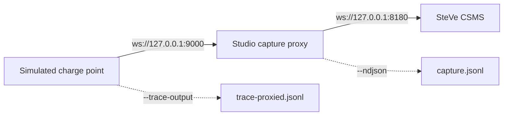

# Module 17: Capstone: end to end with open tools

Module 16 closed with an implicit promise: that you can now sit down with primary sources and work things out for yourself. This module asks you to prove it with running software instead of documents. You will stand up a real CSMS, connect a simulated charge point to it, drive a complete OCPP 1.6J transaction from a command line, capture the traffic two independent ways, run detection rules over the result, and finish by validating your own trace against a published conformance schema. Every tool involved is open source, and every one of them appeared earlier in the handbook.

There is no hardware to wire and nothing to buy. You need a machine that can run Docker, plus the Bun and Node.js runtimes, and macOS or Linux for one stage. Every command below is stated the way the tools' own documentation gives it, and where a stage has a sharp edge I say so, because finding sharp edges is half of what this handbook has been training you to do.

## What you'll learn

- How to stand up SteVe, an open-source CSMS, with Docker, and why registration comes before connection
- How to run a simulated charge point against it and drive a full transaction lifecycle from a REPL
- How to capture the same session independently with a WebSocket proxy in the middle
- How the two trace formats this lab produces differ, and which field is the ground truth
- How to analyze both artifacts with detection rules, and how to do it with nothing but jq
- How to validate your own trace against the Open OCPP Trace schema and correlation rules
- Where seventeen modules leave you, and what to do next

## The lab at a glance

Four tools carry this lab, and you should know where I stand with each before you install anything. SteVe, the CSMS, is a third-party open-source project with no connection to me. The charge point is shiv3's ocpp-cp-simulator; I collaborated with its maintainer on the trace format it emits, and the format's design started in that project's issue tracker. The capture proxy and the analyzer are OCPP DebugKit Studio and the DebugKit toolkit, both of which I maintain. The conformance corpus at the end belongs to the Open OCPP Trace specification, a format I helped design. None of these is the only way to do its job: any backend from Module 15 could stand in for SteVe, any WebSocket proxy or logging middleware can capture frames, and any JSONL tooling can analyze the output. Stage 5 shows a jq one-liner doing exactly that.

The topology is the one Module 14 drew in the abstract, now with real ports:



Two trace files fall out of one session: the simulator's own record of what it sent and received, and the proxy's independent record of what actually crossed the wire. They are in different formats, deliberately, because comparing them is part of the lesson.

## Stage 1: a CSMS of your own

SteVe has been running since 2013, when it started at RWTH Aachen University; the name compresses the German Steckdosenverwaltung, which means socket administration. It is GPL licensed and speaks every OCPP 1.x variant from the old SOAP transports through 1.6J with the security extensions. For this lab it is the documented Docker route:

```bash
git clone https://github.com/steve-community/steve.git
cd steve
docker compose up -d
```

The compose file builds the project inside the container, so the web interface is not immediate on first start. When it comes up, it is at `http://localhost:8180/steve/manager`, and the Docker profile's default credentials are user `admin`, password `1234`, defined in `src/main/resources/application-docker.properties`. The README tells you to change them for any real deployment, and it means it. For a lab on localhost the defaults are fine.

Before any charge point can talk to SteVe, SteVe has to know it exists. The Docker profile ships with `auto.register.unknown.stations` set to false, and the configuration file's own comment warns that enabling it would accept any sender that knows the URL. This is not an inconvenience; it is the authorization model from Module 7 working as intended. So register first: in the manager interface, go to Data Management, then Charge Points, then Add, and enter `CP001` as the ChargeBox ID. While you are there, add an OCPP tag with ID `TAG001` as well, because SteVe checks Authorize requests against its tag list and an unknown tag comes back Invalid, which you may recall is detection rule territory from Module 13.

SteVe's OCPP-J endpoint is `ws://localhost:8180/steve/websocket/CentralSystemService`, with the charge point identity appended as the final path segment, exactly the URL convention Module 6 described.

## Stages 2 and 3: a charge point in software

The simulator's headless CLI runs on the Bun runtime. The CLI is released on its own `cli-v` tags, separate from the project's desktop application, so install from the pinned release asset:

```bash
bun install -g https://github.com/shiv3/ocpp-cp-simulator/releases/download/cli-v0.3.1/ocpp-cp-simulator.tgz
```

That gives you an `ocpp-cp-sim` command. Point it at SteVe:

```bash
ocpp-cp-sim \
  --ws-url ws://localhost:8180/steve/websocket/CentralSystemService/ \
  --cp-id CP001 \
  --trace-output trace.jsonl
```

Here is the first sharp edge. The simulator appends the value of `--cp-id` verbatim to the URL path, so the base URL must end with a trailing slash. Leave it off and the identity fuses into the last path segment, producing `...CentralSystemServiceCP001`, which SteVe does not recognize. One character, one failed handshake: a very Module 6 kind of bug.

The `--trace-output` flag appends every wire frame as one JSONL record in Open OCPP Trace v1.1, the interchange format from Module 14. The file grows live as you work.

Starting the simulator drops you into a REPL with an `ocpp>` prompt. Now drive the lifecycle you learned in Module 7, one message at a time:

```text
ocpp> connect
ocpp> authorize TAG001
ocpp> start 1 TAG001
ocpp> meter 1 1500
ocpp> send-meter 1
ocpp> stop 1
ocpp> exit
```

`connect` opens the WebSocket and sends BootNotification. `authorize TAG001` sends an Authorize request, which succeeds because you registered that tag in Stage 1. `start 1 TAG001` begins a transaction on connector 1; the transaction id you get back was assigned by SteVe, as Module 7 explained. `meter 1 1500` sets the simulated meter register in watt-hours and `send-meter 1` reports it as MeterValues. `stop 1` ends the transaction. Along the way, `status` shows the charge point and connector state, and `heartbeat start <seconds>` turns on periodic heartbeats if you want the dashboard to stay fresh. Speaking of which: reload the SteVe interface and find your charge point, its status, and the completed transaction. You have just operated both ends of the link this handbook is about.

## Stage 4: the proxy in the middle

So far every byte of evidence comes from one witness: the simulator's own trace. Module 14 made the case that the station's view, the backend's view, and a capture in the middle are three different truths. This stage adds the middle one.

Studio is a native desktop OCPP debugger, and the same binary works as a headless CLI. On macOS (Apple silicon) the documented install is a one-liner:

```bash
curl -fsSL https://raw.githubusercontent.com/ocpp-debugkit/studio/main/scripts/install-macos.sh | bash
```

On Linux, download the `.tar.gz` from the project's releases page, extract it, and run the `studio` binary; it needs GTK 4 (`libgtk-4`, `libwebkitgtk-6.0`). Then start the capture proxy in one terminal:

```bash
studio capture --listen 127.0.0.1:9000 --upstream ws://127.0.0.1:8180 --ndjson > capture.jsonl
```

Three constraints, stated plainly in the tool's own docs. The proxy speaks plaintext `ws://` only; TLS is not supported yet. Hosts must be IP addresses, not names, so write `127.0.0.1` rather than `localhost`. And each invocation handles exactly one charge-point-to-CSMS session, then exits. Notice also what you do not have to configure: the proxy mirrors the charge point's request path when it dials upstream, so `--upstream` needs only a host and port, and SteVe still sees the full `/steve/websocket/CentralSystemService/CP001` path.

Now run the simulator again, pointed at the proxy instead of SteVe:

```bash
ocpp-cp-sim \
  --ws-url ws://127.0.0.1:9000/steve/websocket/CentralSystemService/ \
  --cp-id CP001 \
  --trace-output trace-proxied.jsonl
```

Note the fresh filename, and here is the second sharp edge: `--trace-output` appends, it never truncates. Reuse Stage 3's `trace.jsonl` here and the file quietly accumulates both sessions, two BootNotifications and all, which would corrupt every comparison this lab makes from now on, and would itself read as a repeated-boot pattern to the Module 13 rules. Drive the same REPL session as Stage 3. Every frame passes through the proxy on its way to SteVe and back, and with `--ndjson` the captured stream goes to stdout (redirected into `capture.jsonl` here) while the summary goes to stderr. When you disconnect, the proxy exits and runs its detection pass over what it saw.

## Stage 5: reading what you captured

You now hold two artifacts from the same session, and they are not in the same format:

| Artifact | Producer | Format |
| --- | --- | --- |
| `trace-proxied.jsonl` | simulator `--trace-output` | Open OCPP Trace v1.1: decomposed fields (`direction`, `messageType`, `messageId`, `action`, `payload`) plus the verbatim `raw` frame |
| `capture.jsonl` | Studio `capture --ndjson` | DebugKit-native JSONL: `timestamp`, `direction`, and the raw OCPP-J array as `message` |

This distinction matters. Open OCPP Trace v1.1 is the vendor-neutral interchange format, and its `raw` field is the only lossless record of the frame; everything else is decomposition for convenience. The Studio capture is the toolkit's older native format. Module 14 covered why a neutral format exists at all; this table is what the difference looks like on your own disk.

The toolkit reads both. Install it and inspect each file; the parser auto-detects the format:

```bash
npm install -g @ocpp-debugkit/toolkit
ocpp-debugkit inspect trace-proxied.jsonl
ocpp-debugkit inspect capture.jsonl
ocpp-debugkit report trace-proxied.jsonl -f html -o report.html
```

`inspect` parses the trace and runs the 16 detection rules from Module 13 (4 critical, 10 warning, 2 info) over it. On a clean run like the one you just drove, you should see zero findings or close to it, and that is the point: you now know what healthy looks like, so anything the rules flag on a real trace stands out against a baseline you have personally produced. `report` writes the same analysis as a shareable document.

No part of this requires my tooling. The traces are JSON Lines, so any JSON tool works. Counting error frames in the v1.1 trace takes one line of jq:

```bash
jq -s 'map(select(.messageType=="CALLERROR")) | length' trace-proxied.jsonl
```

On a clean session that prints 0. The transferable skill is reading frames, not operating a particular analyzer.

## Stage 6: proving the trace conforms

The last stage closes the loop with the Open OCPP Trace specification repository itself. Its layout mirrors the discipline Module 16 taught: a versioned JSON Schema in `schema/`, sixteen fixture directories in `fixtures/` (each a `trace.jsonl` plus the `expected.json` consumer view a correct reader must derive), and a conformance runner in `conformance/` that keeps the corpus honest. The runner validates every fixture record against the schema, checks that each record's `raw` field decodes to the same frame the record decomposes, recomputes each fixture's consumer view under the correlation rule, and requires an exact match with `expected.json`. The correlation rule is the one your tools have been applying all along: a response pairs with the most recent preceding CALL that has the same message id, the opposite direction, and no prior match.

Run the corpus self-check first:

```bash
git clone https://github.com/open-ocpp-trace/specification.git
cd specification
npm ci
npm test
```

To turn the runner on your own session, one honest caveat: it has no single-file mode. It walks every directory under `fixtures/` and expects both files in each. So the way to validate your own trace is to make it a fixture: create `fixtures/my-session/`, copy your `trace-proxied.jsonl` in under the required name `trace.jsonl`, and write an `expected.json` for it by hand, then run `npm test` again. Writing the expected view yourself is not busywork; it forces you to apply the correlation rule to your own frames and declare, in advance, which calls were answered and which were not. If your declaration is wrong, the runner tells you. The simulator's trace is already v1.1 and drops straight in. The Studio capture needs converting first:

```bash
ocpp-debugkit convert capture.jsonl -o capture-v11.jsonl
```

For a sense of what a passing fixture looks like, read `fixtures/normal-session/`: 22 records, 11 calls, 11 results, no errors, covering boot, authorize, start, meter, and stop. If your own trace resembles it, you have independently reproduced the corpus's reference session on your own machine, with a real CSMS in the loop.

## Where you are now

Take stock of what just happened. You configured a backend, authenticated a station and a token, drove the full transaction lifecycle, captured wire traffic at two points, analyzed it against a failure taxonomy, and validated it against a public schema. Nothing in this lab was new. The URL convention and frame shapes came from Module 6, the lifecycle from Module 7, the backend's side of the link from Module 8, the failure rules from Module 13, the capture points and the trace format from Module 14, every tool from Module 15, and the habit of trusting documentation over folklore from Module 16. Part I told you why any of it earns money and Part II told you where this one link sits among the others. The capstone is just those modules, executed.

From here, three directions are worth your time. First, break the lab on purpose: kill the simulator mid-transaction without sending stop, re-run the analysis, and watch the station-offline pattern from Module 13 appear in a trace you made yourself. Second, go deeper into the specifications: you have the reading skills from Module 16, OCPP 2.0.1 is where regulation is pulling, and 2.1 is where the frontier is. Third, contribute: report errata to the OCA when you find a genuine ambiguity, open well-written issues on the projects you just ran, and remember from Module 15 that independent implementations are how protocols stay honest. The industry this handbook described in Module 1 runs on a small set of shared agreements, and the people who maintain them are findable, readable, and short-handed.

## Key takeaways

- The entire charging chain runs on one machine with open tools: SteVe as the CSMS, a simulated charge point, a capture proxy, an analyzer, and a conformance corpus.
- SteVe rejects unknown stations and unknown tags by default; registering the ChargeBox ID and the OCPP tag first is the authorization model working, not busywork.
- The simulator appends the charge point id verbatim to the URL path, so the base URL must end with a trailing slash; one missing character breaks the handshake.
- One session yields two independent witnesses: the endpoint's own v1.1 trace and the proxy's native-format capture, and the differences between capture points are themselves evidence.
- Analysis is tool-neutral: the 16 detection rules give you a curated taxonomy, but a jq one-liner over JSONL answers real questions too.
- Conformance closes the loop: your own trace, schema-validated and correlation-checked by the same runner that guards the published fixtures.
- A clean baseline you produced yourself is the best instrument for recognizing a broken trace later.

## Try it

> If you cannot run Docker today, do the part of the lab that needs nothing but Node.js. Clone the Open OCPP Trace specification repository, run `npm ci` and `npm test`, and watch the corpus self-check validate all sixteen fixtures. Then open `fixtures/normal-session/trace.jsonl` in an editor and read its 22 records top to bottom: boot, authorize, start, meter, stop. That file is the shape your own trace from this module should resemble, and reading one healthy session by eye, frame by frame, is the fastest way to recognize an unhealthy one for the rest of your career.

## Further reading

- [SteVe](https://github.com/steve-community/steve), the open-source OCPP central system used as this lab's CSMS.
- [ocpp-cp-simulator](https://github.com/shiv3/ocpp-cp-simulator), the browser and CLI charge point simulator; its `docs/cli.md` covers every REPL command.
- [OCPP DebugKit Studio](https://github.com/ocpp-debugkit/studio), the native debugger whose headless CLI provided the capture proxy.
- [OCPP DebugKit toolkit](https://github.com/ocpp-debugkit/toolkit), the trace analyzer and its 16 documented detection rules.
- [Open OCPP Trace specification](https://github.com/open-ocpp-trace/specification), the interchange format, fixtures, and conformance runner from Stage 6.
- [Open Charge Alliance protocols page](https://openchargealliance.org/protocols/open-charge-point-protocol/), where the OCPP specifications themselves are available after registration.

---

Previous: [Module 16: Reading specifications](16-reading-specifications.md) | [Contents](../README.md)
